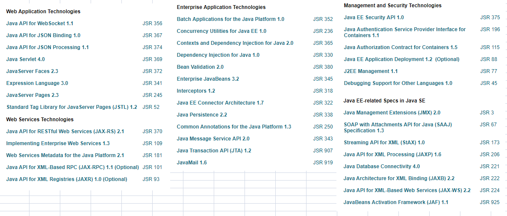

#   Java资源-v.0.0.3

-   版本：8

##  定义

Java™编程语言是一种通用的，并发的，强类型的，基于类的面向对象语言。它通常编译为Java虚拟机规范中定义的字节码指令集和二进制格式。

通用的高级Java编程语言是一个功能强大的软件平台。

----

##  内容
-   标准规范
    -   Java语言规范
    -   JVM规范
-   规范提案(Jcp)
    -   JSR-xx
-   Java基础版(Java SE)
    -   
-   Java企业版(Java EE)
    -   
-   企业版规范实现
    -   GlassFish
    -   Tomcat
    -   Jersey

----

##  网站
-   [官网](http://www.oracle.com/technetwork/java/index.html)
-   [Java SE 首页](http://www.oracle.com/technetwork/java/javase/overview/index.html)
-   [Java EE 首页](http://www.oracle.com/technetwork/java/javaee/overview/index.html)
-   [Jcp](https://jcp.org/en/home/index)
-   [Java SE 教程](https://docs.oracle.com/javase/tutorial/index.html)
-   [Java SE API](https://docs.oracle.com/javase/8/docs/api/)
-   [Java EE 资源](https://javaee.github.io/)
-   [Java EE 教程及示例](https://javaee.github.io/tutorial/)
-   [Java EE API](https://javaee.github.io/javaee-spec/javadocs/)
-   [开发工具：IDEA](http://www.jetbrains.com/idea/)
-   [开发工具：Eclipse](http://www.eclipse.org/)
-   [Maven](http://maven.apache.org)
-   [Tomcat](https://tomcat.apache.org/)
-   [Jersey](https://jersey.github.io/)

----

##  书籍
-   Java核心技术(10) 卷1：基础知识
-   Java编程的逻辑
-   Java程序设计：基础、编程抽象与算法策略
-   Java核心技术(10) 卷Ⅱ：高级特性
-   Java编程思想
-   Java技术手册
-   深入理解Java7
-   Java8实战
-   Java程序员修炼之道
-   Java语言程序设计(基础篇 原书第10版)
-   Java语言规范：基于Java SE8
-   Effective-Java

----