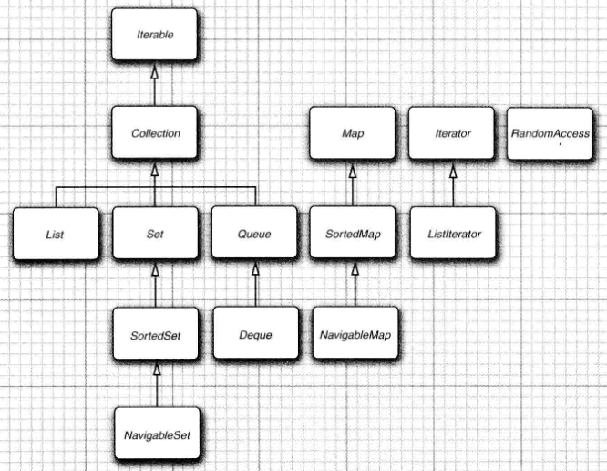
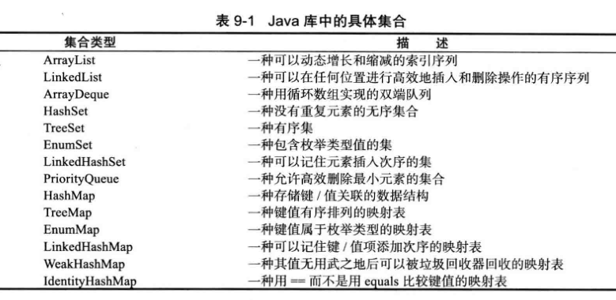

#   集合

跳过关于数据结构理论部分，仅介绍如何使用标准库中的集合类。

##  Java集合框架

介绍Java集合框架的基本设计，展示使用它们的方法，并解释一些颇具争议的特性背后的考虑。

### 将集合的接口与实现分离

Java集合类库也将接口与实现分离。

队列接口指出可以在队列的尾部添加元素，在队列的头部删除元素，并且可以查找队列中元素的个数。当需要收集对象，并按照"先进先出"的规则检索对象时就应该使用队列。

当在程序中使用队列时，一旦构建了集合就不需要知道究竟使用了那种实现。因此，只有在构建集合对象时，使用具体的类才有意义。可以使用接口类型存放集合的引用。

```
Queue<Customer> expresslane = new CircularArrayQueue<>(100);
expessLane.add(new Customer("Harry"));
```

利用这种方式，一旦改变了想法，可以轻松的使用另外一种不同的实现。只需要对程序的一个地方做出修改，即调用构造器的地方。如果觉得LinkedListQueue 是个更好的选择，就将代码修改为：

```
Queue<Custoaer> expressLane = new LinkedListQueue<>();
expressLane.add(new Custonier("Harry"));
```

一组名字以Abstract开头的类，是为类库实现者而设计的。

### Collection接口

Java类库中，集合类的基本接口是Collection接口，继承Iterable接口，具有迭代功能。

一个具体的集合类可以扩展AbstractCollection类，contains方法已由AbstractCollection超类提供了。如果子类有更加有效的方式实现contains方法，也可以由子类提供。

### 集合框架中的接口



----

##  具体的集合



### 链表

在数组中间位置添加/删除一个元素要付出很大的代价，其原因是数组中处于被添加/删除元素之后的所有元素都要想数组的前端/后端移动。

链表解决了上述问题，链表将每个对象存放在独立的节点中，每个节点还存放着序列中下一个结点的引用。

在Java中，所有链表实际上都是双向链接的，即每个结点还存放着指向前驱结点的引用。

从链表中间删除一个元素是一个很轻松的操作，即需要更新被删除元素附近的链接。

如果某个迭代器修改集合时，另一个迭代器对其进行遍历，就会抛出一个ConcurrentModificationException 异常

### 数组列表

ArrayList封装了一个动态再分配的对象数组

### 散列集

如果不在意元素的顺序，可以有几种能够快速查找元素的数据结构。其缺点是无法控制元素出现的次序，他们将按照有利于其操作目的的原则组织数据。

### 树集

树集是一个有序集合。可以以任意顺序将元素插入到集合中，在对集合进行遍历时，每个值将自动地按照排序后的顺序呈现。

### 队列与双端队列

队列可以有效的在尾部添加一个元素，在头部删除一个元素。有两个端头的队列，即双端队列。可以有效的在头部和尾部同时添加或删除元素，不支持在队列中间添加元素。

### 优先级队列

优先级队列中的元素可以按照任意的顺序插入，却总是按照排序的顺序进行检索。

无论何时调用remove方法，总会获得当前优先级队列中最小的元素。然而，优先级队列并没有对所有元素进行排序

----

##  映射

知道某些键的信息，并想要查找与之对应的元素。映射数据结构就是为此设计

映射用来存放键/值对，如果提供了键，就能找到值。

### 基本映射操作

Java 类库为映射提供了两个通用的实现：HashMap和TreeMap。 这两个类都实现了Map接口。

散列映射对键进行散列，树映射用键的整体顺序对元素进行排序，并将其组织成搜索树。散列或比较函数只能作用于键。与键关联的值不能进行散列或比较。

### 更新映射项

当某个键不存在时

### 映射视图

有3种视图：键集、值集合（不是一个集）以及键/值对集。

枚举一个映射的所有键：
```
Set<String> keys = map.keySet() ;
for ( String key : keys )
{
do something with key
}

```

想同时查看键和值
```
for (Map.Entry<String,Employee> entry : staff.entrySet())
{
    String k = entry.getKey();
    Employee v = entry.getValue();
    do something with k , v
}
```

使用forEach 方法

```
counts.forEach((k,v)->{
    do something with k , v
});
```

### 链接散列集与映射

LinkedHashSet 和 LinkedHashMap 类用来记住插人元素项的顺序。这样就可以避免在散列表中的项从表面上看是随机排列的。当条目插入到表中时，就会并入到双向链表中。

链接散列映射将用访问顺序，而不是插入顺序，对映射条目进行迭代。

访问顺序对于实现高速缓存的"最近最少使用"原则十分重要。

### 枚举集与映射

EmimSet 是一个枚举类型元素集的高效实现。由于枚举类型只有有限个实例，所以EmimSet内部用位序列实现。如果对应的值在集中，则相应的位被置为1。

EnumMap 是一个键类型为枚举类型的映射。它可以直接且高效地用一个值数组实现。在使用时，需要在构造器中指定键类型：
```
EnumMap < Weekday , Employee personlnCharge = new EnumMapo ( Weekday . cl ass ) ;
```

### 标识散列映射

类IdentityHashMap有特殊的作用

在这个类中，键的散列值是用System.identityHashCode方法计算的。这是 Object.hashCode方法根据对象的内存地址来计算散列码时所使用的方式。而且，在对两个对象进行比较时，IdentityHashMap类使用==，而不是 equals。

也就是说，不同的键对象，即使内容相同，也被视为是不同的对象。

----

##  视图与包装器

映射类的keySet方法通过使用视图可以获得其他的实现了Collection 接口和 Map 接口的对象

keySet 方法返回一个实现Set接口的类对象，这个类的方法对原映射进行操作，这种集合称为视图。

### 轻量级集合包装器

Arrays 类的静态方法 asList 将返回一个包装了普通 Java 数组的 List 包装器。这个方法可以将数组传递给一个期望得到列表或集合参数的方法

创建一个包含100个字符串的List,每个串都被设置为"DEFAULT"：
```
List<String> settings = Collections.nCopies(100, "DEFAULT");
```

Collections 类包含很多实用方法 ， 这些方法的参数和返回值都是集合

### 子范围

可以使用 subList 方法来获得一个列表的子范围视图
```
List group2 = staff.subList(10, 20);
```

第一个索引包含在内， 第二个索引则不包含在内。

### 不可修改的视图

### 同步视图

----

##  算法

### 排序与混排

### 二分查找

### 简单算法

### 批算法

### 集合与数组的转换


----

##  备
区别：排序、是否重复、访问、添加、删除、修改、优先级
便捷操作：子范围、不可修改、同步


----

