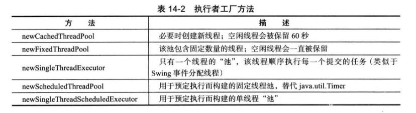
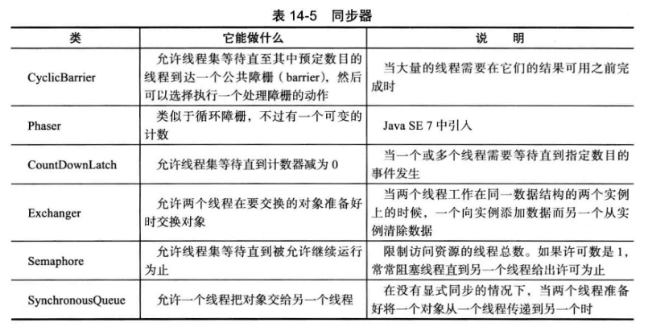

#   并发

多线程程序在较低的层次上扩展了多任务的概念：一个程序同时执行多个任务。通常，每一个任务称为一个线程，他是线程控制的简称。可以同时运行一个以上线程的程序称为多线程程序。

##  什么是线程

##  synchronized 关键字

Java中的每一个对象都有一个内部锁。如果一个方法用synchronized关键字声明，那么对象的锁将保护整个方法。也就是说，要调用该方法，线程必须获得内部的对象锁

内部对象锁只有一个相关条件。wait方法添加一个线程到等待集中

----

JSR 133的Java内存模型和线程规范，该规范大部分很复杂而且技术性强，但是文档中包含了很多解释得很清晰的例子

-   百度网盘：Java目录下
-   [中文版](http://ifeve.com/wp-content/uploads/2014/03/JSR133%E4%B8%AD%E6%96%87%E7%89%881.pdf)

----

仅仅为了读写一个或两个实例域就使用同步 ， 显得开销过大了，volatile 关键字为实例域的同步访问提供了一种免锁机制。

java.util.concurrent.atomic 包中有很多类使用了很高效的机器级指令（而不是使用锁）来保证其他操作的原子性。
-   将一个整数自增或自减

有时可能要避免共享变量，使用ThreadLocal 辅助类为各个线程提供各自的实例 

读/写锁

使用读/写锁的必要步骤：
-   构造一个ReentrantReadWriteLock 对象：
```
private ReentrantReadWriteLock rwl = new ReentrantReadWriteLock();
```
-   抽取读锁和写锁
```
private Lock readLock = rwl.readLock();
private Lock writeLock = rwl.writeLock(); 
```
-   对所有的获取方法加读锁
```
public double getTotalBalanceO
{
    readLock.lock();
    try { . . . }
    finally { readLock.unlock(); }
}
```
-   对所有的修改方法加写锁
```
public void transfer ( . . . )
{
    writeLock.lock();
    try { . . . }
    finally { writeLock.unlock(); }
}
```

----

##  阻塞队列

对于许多多线程问题，可以通过使用一个或多个队列以优雅且安全的方式将其形式化。生产者线程向队列插入元素，消费者线程则取出他们。使用队列，可以安全的从一个线程向另一个线程传递数据。

在协调多个线程之间的合作时，阻塞队列是一个有用的工具。工作者线程可以周期性地将中间结果存储在阻塞队列中。其他的工作者线程移出中间结果并进一步加以修改。队列会自动平衡负载。

top.kaoshanji.example.coreVolume.s1s14.BlockingQueueTest


java.util.concurrent包提供了映射、有序集和队列的高效实现：ConcurrentHashMap 、ConcurrentSkipListMap > ConcurrentSkipListSet 和 ConcurrentLinkedQueue

----

##  Callable 与 Future

top.kaoshanji.example.coreVolume.s1s14.FutureTest

##  执行器

如果程序中创建了大量的生命期很短的线程， 应该使用线程池 （ threadpool ) 。 一个线程池中包含许多准备运行的空闲线程。

执行器 （ Executor ) 类有许多静态工厂方法用来构建线程池 



在使用连接池时应该做的事
-   调用 Executors 类中静态的方法 newCachedThreadPool 或 newFixedThreadPool
-   调用 submit 提交 Runnable 或 Callable 对象
-   如果想要取消一个任务， 或如果提交 Callable 对象 ， 那就要保存好返回的 Future对象
-   当不再提交任何任务时 ， 调用 shutdown

top.kaoshanji.example.coreVolume.s1s14.ThreadPoolTest

----

##  Fork-Join 框架

top.kaoshanji.example.coreVolume.s1s14.ForkJoinTest

##  同步器

java.util.concurrent 包包含了几个能帮助人们管理相互合作的线程集

这些机制具有为线程之间的共用集结点模式（common rendezvous patterns)提供的"预置功能"




----

