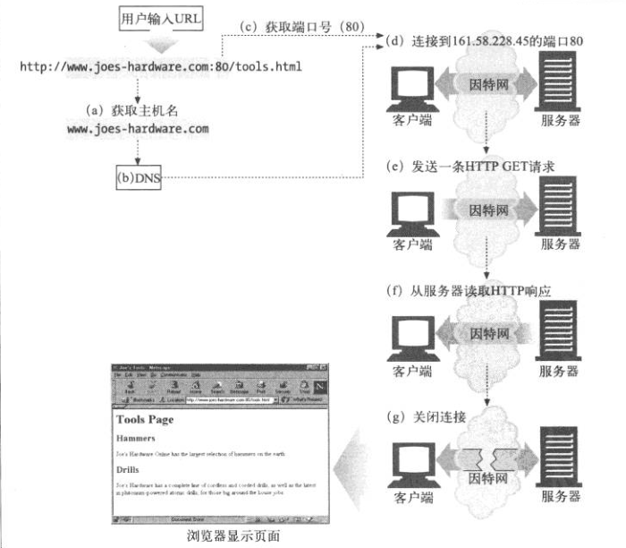
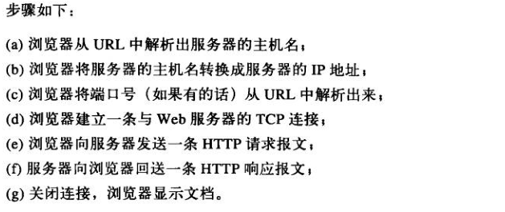

#   Start-v.0.0.4

##  背景

想一想如果现在的生活没有网络会是怎样？是不是有种被世界遗忘各种不适应的感觉？

网络让我们可以购物、了解最新资讯、听歌看视频、打游戏、异地聊天和查资料等等，可以说网络覆盖了我们生活的方方面面，现金都很少见，带上手机只要银行卡里的额度大于0就行，甚至感觉银行卡里的钱都是数字，如果银行卡里的数字像电话号码就好了，你还在打电话吗？

那么，这些又是怎样实现的呢？网络让空间上的距离消失，但是事情还是要工具完成。这里的工具主要由两个事物组成：数据和程序，数据是基本支持，程序完成你的想法。

举个例子：购物

1.  首先在网站上浏览，寻找感兴趣的商品，这些商品的数据是保存在某个地方
2.  你选择了某件商品，加入了购物车，可以继续浏览，或者进入下一步下单。
3.  在这个过程中，你想购买这件商品所以加入了购物车或提交订单，这是程序实现了你的想法

完成以上步骤的所在地是服务器，一种在机房里响声不断被猛吹空调的计算机。他没有界面，不为外人所知也不见阳光，但是在你背后默默完成你的想法，运行上面的操作系统是Linux，了解一下。

`服务器`=数据(资源)中心+程序运行环境

看看这个过程，使用HTTP协议访问该服务器上某个文档，URL是文档地址，来自《HTTP权威指南》

-   
-   

`HTTP协议`：因特网的多媒体信使，在因特网的环境下传递各种类型的数据.
`报文`：请求/响应的数据格式规范。

Java技术是你完成购物流程中技术上重要的参与者，完成步骤`e和f`这两个步骤，上面的过程称为Web应用，HTTP也就是Web基础。

Java是软件开发平台，Java语言运行在服务器上，应用的重点是网络，高效的网络编程是很复杂的，所以这个事情是牛逼的人做，应用开发人员即你我站在巨人的肩膀上，面向业务逻辑编码。

Web应用介绍：[百科](https://baike.baidu.com/item/web/150564)，简而言之，使用HTTP(网络协议)让`浏览器`和服务器交换数据，最终数据是展示在浏览器里，控制浏览器里面的页面是另外一种技术(Html/Css/JavaScript)。当然可以显示很简洁基础：`Hello World!`

