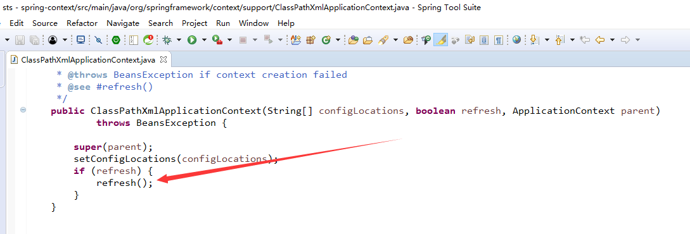

#   IoC容器的初始化

这里谈的是IoC容器初始化过程，这个过程一般不包含Bean依赖注入的实现。在Spring IoC的设计中，Bean定义的载入和依赖注入是两个独立的过程。依赖注入一般发生在应用第一次通过getBean向容器索取Bean的时候，除了Bean定义信息中lazyinit属性。

故事就是从这里开始

这个方法标志着IoC容器的正式启动。具体来说，这个启动包括BeanDefinition的Resource定位、载入和注册三个基本过程

Spring把这三个过程分开，并使用不同的模块来完成，如使用相应的ResourceLoader、BeanDefinitionReader等模块。

----

##  三步完成容器初始化

###  第一步：BeanDefinition的Resource定位

这个Resource定位指的是BeanDefinition的资源定位，他由ResourceLoader通过统一的Resource接口来完成，这个Resource对各种形式的BeanDefinition的使用都提供了统一接口

在文件系统中的Bean定义信息可以使用FileSystemResource来进行抽象；在类路径中的Bean定义信息可以使用ClassPathResource来使用

这个定位过程类似于容器寻找数据的过程

###  第二步：BeanDefinition载入和解析

把用户定义好的Bean表示成IoC容器内部的数据结构，而这个容器内部的数据结构就是BeanDefinition

BeanDefinition实际上就是POJO对象在IoC容器中的抽象，通过这个BeanDefinition定义的数据结构，是IoC容器能够方便的对POJO对象也就是Bean进行管理

### 第三步：向IoC容器注册BeanDefinition

这步是通过调用BeanDefinitionRegistry接口的实现来完成

这个注册过程把载入过程中解析得到的BeanDefinition向IoC容器进行注册

在IoC容器内部将BeanDefinition注入到一个HashMap中去，IoC容器就是通过这个HashMap来持有这些BeanDefinition数据的

----

##  BeanDefinition的Resource定位

----

##  BeanDefinition载入和解析

----

##  向IoC容器注册BeanDefinition

----
