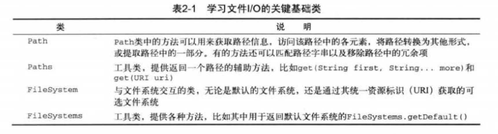
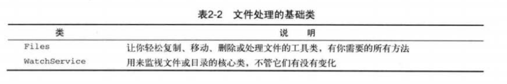
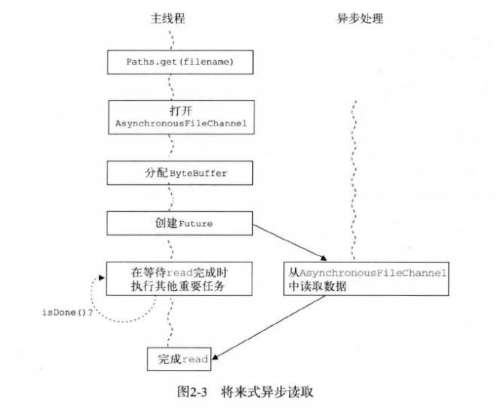
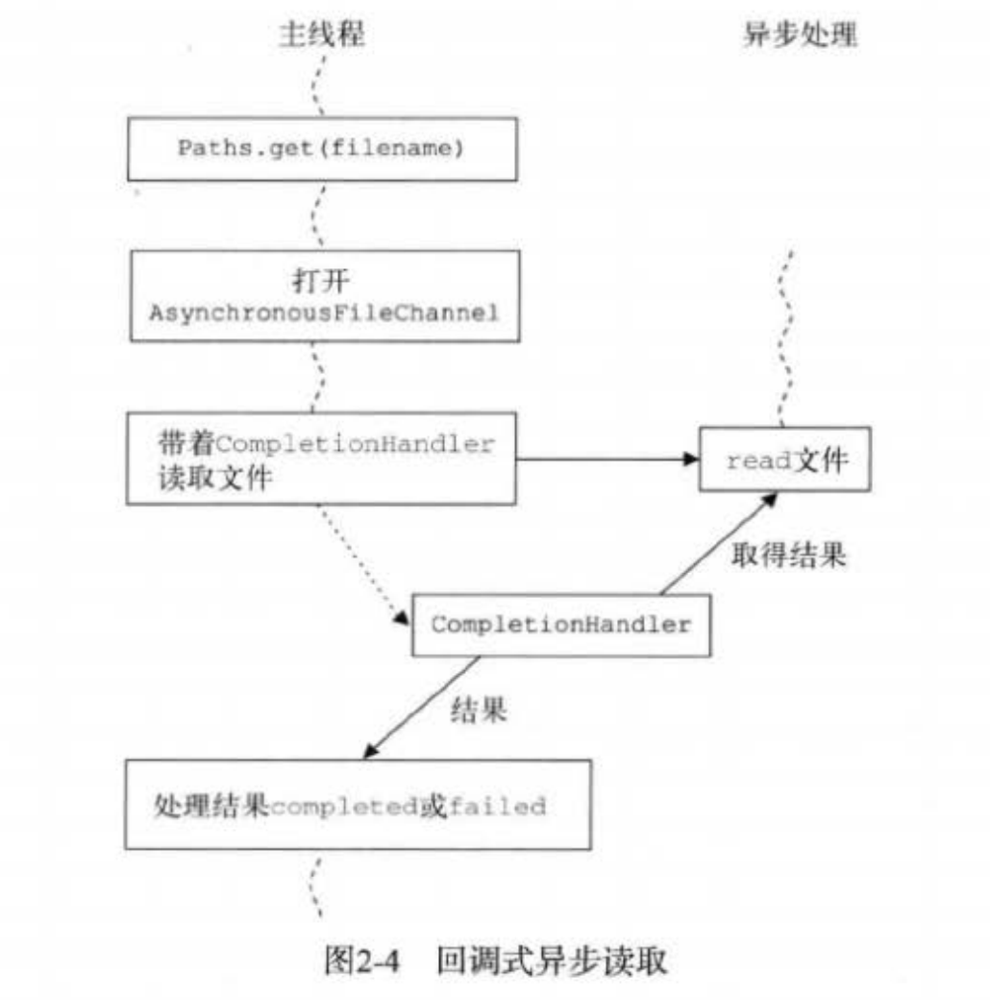

#   新I/O

被称为"再次更新的I/O"或NIO.2，NIO.2是一组新的类和方法，主要存在于java.nio包内。
-   完全取代了java.io.File与文件系统地交互
-   新的异步处理类，无需手动配置线程池和其他底层并发控制，便可在后台线程中执行文件和网络I/O操作
-   引入新的 Network-Channel 构造方法，简化套接字与通道的编码工作

##  Java I/O简史

1.  Java 1.0 到 1.3

在Java早期版本(1.0-1.3)中没有完整的I/O支持。
-   问题
    -   没有数据缓冲区或通道的概念
    -   I/O操作会被阻塞
    -   支持的字符集编码有限
    -   不支持正则表达式

2.  在Java 1.4中引入的 NIO

Java开始实现对非阻塞I/O的支持，其中有两次主要改进：
-   在Java 1.4 中引入非阻塞I/O
-   在Java 7 中对非阻塞I/O进行修改
-   问题
    -   对文件系统中的文件和目录处理支持力度不够
    -   在不同的平台对文件名处理不一致
    -   没有同意的文件属性模型
    -   遍历目录困难
    -   不能使用平台/操作系统地特性
    -   不支持文件系统地非阻塞操作

3.  下一代 I/O-NIO.2

-   主要目标
    -   一个能批量获取文件属性的文件系统接口，去掉和特定文件系统相关的API，还有一个用于引入标准文件系统实现的服务提供者接口
    -   提供一个套接字和文件都能进行异步(与轮询、非阻塞相对)I/O操作的API
    -   完成套接字--通道功能，包括额外对绑定、选项配置和多播数据报的支持

----

##  文件I/O的基石：Path

Path通常代表文件系统中的位置，如果能理解如何创建和处理路径，就能浏览任何类型的文件系统，包裹zip归档文件系统。

NIO.2把位置(由Path表示)的概念和物理文件系统地处理(比如复制一个文件)分的很清楚，物理文件系统地处理通常是由Files辅助类实现的

Path不一定代表真实的文件或目录，可以随心所欲的操作Path，用Files中的功能来检查文件是否存在

-   创建一个Path
-   从Path中获取信息
-   移除冗余项
-   转换Path
-   NIO.2 Path和Java已有的File类

----

##  处理目录和目录树

-   处理目录和目录树：books.developer0814.DirectoryToFile
-   遍历目录树：books.developer0814.FindToFile

----

##  NIO.2的文件系统I/O

-   创建和删除文件
-   文件的复制和移动
-   文件的属性
-   快速读写数据
-   文件修改通知：books.developer0814.FileEvent
-   SeekableButeChannel。。。。

----

##  异步I/O操作

NIO.2另一个新特性是异步能力，这种能力对套接字和文件I/O都适用。异步I/O其实只是一种在读写操作结束前允许进行其他操作的I/O处理
-   异步通道
    -   AsynchronousFileChannel：用于文件I/O
    -   AsynchronousSocketChannel：用于套接字I/O，支持超时
    -   AsynchronousServerSocketChannel：用于套接字接受异步连接

1.  将来式

由主控线程发起I/O操作并轮询等待结果时，使用将来式异步处理

-   异步I/O：将来式：books.developer0814.AsynFileChannel

2.  回调式

在异步事件刚一成功或失败并需要马上采取行动时，使用回调式。

-   异步I/O：回调式：books.developer0814.AsynFileChannelCompletionHandler

----

##  Socket和Channel的整合

java.nio.channels.NetworkChannel代表一个连接到网络套接字通道的映射

-   NetworkChannel：books.developer0814.NetworkChannel

像BitTorrent这样的对等网络程序一般都具备多播的功能，术语多播(或组播)表示一对多的网络通讯，通常用来指代IP多播。其基本前提是将一个包发送到一个组播地址，然后网络对该包进行复制，分发给所有接收端(注册到组播地址中)

-   DatagramChannel：books.developer0814.MultChannel

----