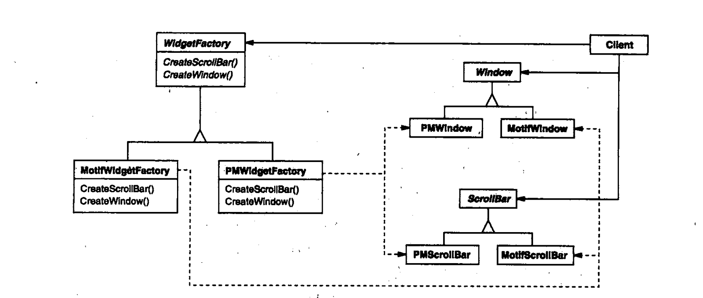
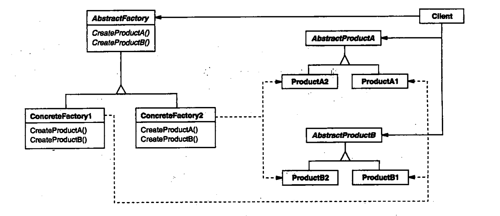
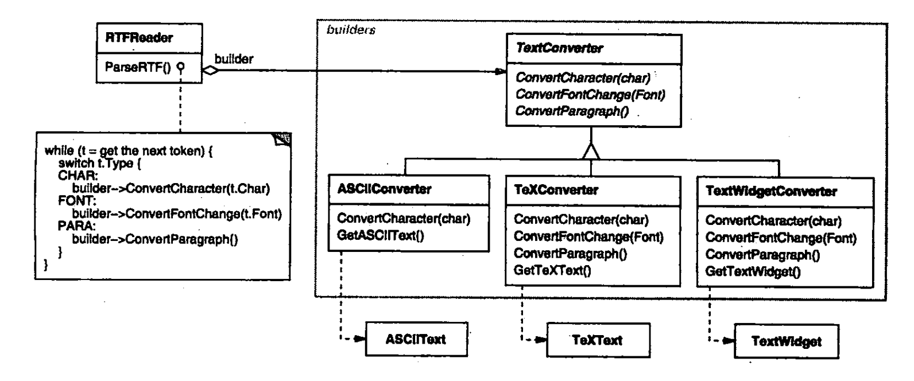
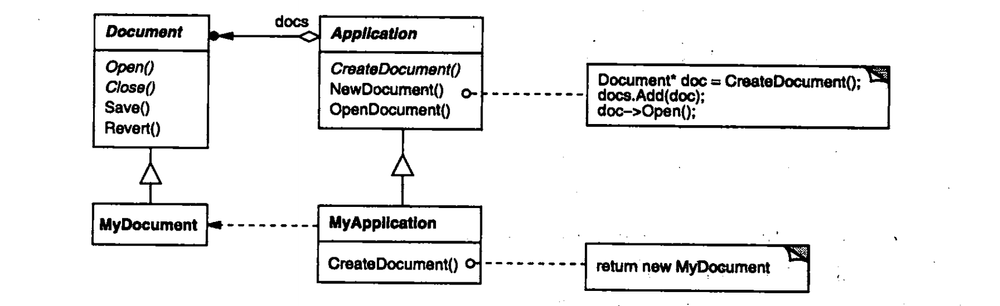
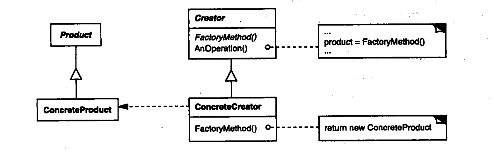
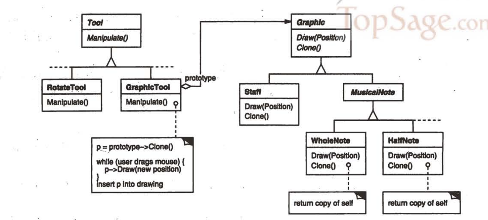
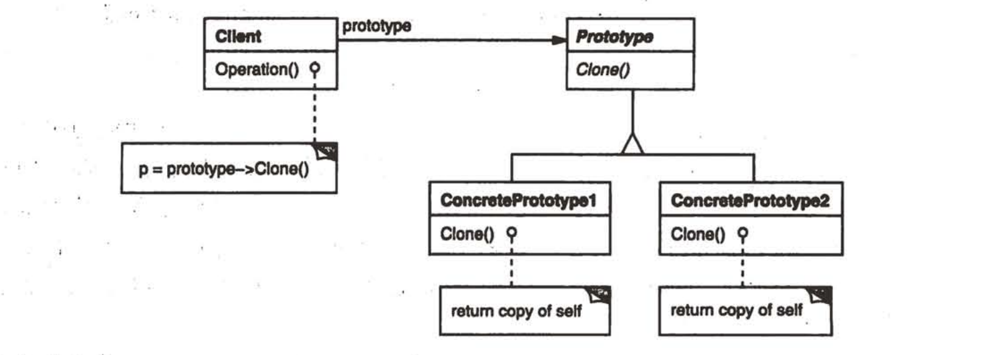

#   创建型模式

创建型模式抽象了实例化过程。他们帮助一个系统独立于如何创建、组合和表示他的那些对象

随着系统演化得越来越依赖于对象复合而不是类继承，创建型模式变得更为重要。

一个类创建型模式使用继承改变被实例化的类，而一个对象创建型模式将实例化委托给另一个对象。

这些模式中有两个不断出现的主旋律。第一，他们都将关于该系统使用那些具体的类的信息封装起来。第二，他们隐藏了这些类的实例是如何被创建和放在一起的。

整个系统关于这些对象所知道的是由抽象类所定义的接口，因此，创建模式在什么时候被创建，谁创建它，他是怎样被创建的，以及何时创建这些方面给予你很大的灵活性。他们允许你用结构和功能差别很大的"产品"对象配置一个系统。配置可以是静态的，也可以是动态的。

----

##  抽象工厂(Abstract Factory)

-   意图

提供一个创建一系列相关或相互依赖对象的接口，而无需指定他们具体的类

-   动机

考虑一个支持多种视感(look-and-feel)标准的用户界面工具包，例如Motif和Presentation Manager。

不同的视感风格为诸如滚动条、窗口和按钮等用户界面"窗口组件"定义不同的外观和行为。

为解决这一问题我们可以定义一个抽象的WidgetFactory类，这个类声明了一个用来创建每一个类基本窗口组件的接口。每一类窗口组件都有一个抽象类，而具体子类则实现了窗口组件对象的特定视感风格。对于每一个抽象窗口组件类，WidgetFactory接口都有一个返回新窗口组件对象的操作。客户调用这些操作以获得窗口组件实例，但客户并不知道他们正在使用的是那些具体类。这样客户就不依赖于一般的视感风格，如下所示：

-   适用性
    -   一个系统要独立于他的产品的创建、组合和表示时
    -   一个系统要由多个产品系列中的一个来配置时
    -   当你要强调一系列相关的产品对象的设计以便进行联合适用时
    -   当你提供一个产品类库，而只想显式他们的接口而不是实现时

-   结构

-   参与者：具体角色
    -   AbstractFactory(WidgetFactory)：声明一个创建抽象产品对象的操作接口
    -   ConcreteFactory(MotifWidgetFactory、PMWidgetFactory)：实现创建具体产品对象的操作
    -   AbstractProduct(Windows、ScrollBar)：为一类产品对象声明一个接口
    -   ConcreteProduct(MotifWindows、MotifScrollBar)
        -   定义一个将被相应的具体工厂创建的产品对象
        -   实现AbstractProduct接口
    -   Client
        -   仅适用由AbstractFactory和AbstractProduct类声明的接口

-   协作
    -   通常在运行时刻创建一个ConcreteFactory类的实例。这一具体的工厂创建具有特定实现的产品对象。为创建不同的产品对象，客户应使用不同的具体工厂
    -   AbstractFactory将产品对象的创建延迟到他的ConcreteFactory子类

-   效果
    -   他分离了具体的类
    -   他使得易于交换产品系列
    -   他有利于产品的一致性
    -   难以支持新种类的产品

-   实现
    -   将工厂作为单间
    -   创建产品
    -   定义可扩展的工厂

----

##  生成器(Builder)

-   意图

将一个复杂对象的构建与他的表示分离，使得同样的构建过程可以创建不同的表示

-   动机

一个RTF文档交换格式的阅读器应能将RTF转换为多种正文格式。该阅读器可以将RTF文档转换成普通ASCII文本或转换成一个能以交互方式编辑的正文窗口组件。但问题在于可能转换的数目是无限的，因此要能够很容易实现新的转换的增加，同时却不改变RTF阅读器

一个解决办法是用一个可以将RTF转换成另一种正文表示的TextConverter对象配置这个RTFReader类。当RTFReader对RTF文档进行语法分析时，他使用TextConverter去做转换。无论何时RTFReader识别一个RTF标记(或是普通正文或是一个RTF控制字)，他都发送一个请求给TextConverter去转换这个标记

TextConverter的子类对不同转换和不同格式进行特殊处理。每种转换器类将创建和装配一个复杂对象的机制隐含在抽象接口的后面。转换器独立于阅读器，阅读器负责对一个RTF文档进行语法分析。每一个转换器类在该模式中被称为生成器，而阅读器则称为导向器。

在上面的例子中，Builder模式将分析文本格式的算法与描述怎样创建和表示一个转化后格式的算法分离开来，使得可以重用RTFReader的语法分析算法，根据RTF文档创建不同的正文表示--仅需使用不同的TextConverter的子类配置该RTFReader即可

-   适用性
    -   当创建复杂对象的算法应该独立于该对象的组成部分以及他们的装配方式时
    -   当构建过程必须允许被构造的对象有不同的表示时

-   结构

-   参与者：具体角色
    -   Builder(TextConverter)：为创建一个Product对象的各个部件指定抽象接口
    -   ConcreteBuilder(ASCIIConverter、TeXConverter)
        -   实现Builder的接口以构造和装配该产品的各个部件
        -   定义并明确他所创建的表示
        -   提供一个检索产品的接口
    -   Director(RTFReader)：构造一个使用Build接口的对象
    -   Product(ASCIIText、TeXText)
        -   表示被构造的复杂对象。ConcreteBuilder创建该产品的内部表示并定义他的装配过程
        -   包含定义组成部件的类，包括将这些部件装配成最终产品的接口

-   效果
    -   他是你可以改变一个产品的内部表示
    -   他将构造代码和表示代码分开
    -   他使你可对构造过程进行更精细的控制
    
-   实现
    -   装配和构造接口
    -   为什么产品没有抽象类
    -   在Builder中却省的方法为空

-   相关模式
    -   Builder模式着重于一步步构造一个复杂对象，而Abstract Factory着重于多个系列的产品对象
    -   Builder在最后一步返回产品，Abstract Factory是立即返回
    -   组成(Composite)通常是用Builder生成

----

##  工厂方法(Factory Method)

-   意图

定义一个用于创建对象的接口，让子类决定将哪一个类实例化，使一个类的实例化延迟到其子类

-   动机

框架使用抽象类定义和维护对象之间的关系，这些对象的创建通常也由框架负责。

这样一个应用框架，他可以向用户显式多个文档。在这个框架中，两个主要的抽象是类Application和Document。这两个类都是抽象的，客户必须通过他们的子类来做与具体应用相关的实现。例如，为创建一个绘图应用，我们定义类DrawingApplication和DrawingDocument。Application类负责管理Document并根据需要创建他们--例如，当用户从菜单中选择Open或New的时候。

因为被实例化的特定Document子类是与特定应用相关的，所以Application类不可能预测到那个Document子类将被实例化---Application类仅知道一个新的文档何时应该被创建，而不知道哪一种Document将被创建。局面是，框架必须实例化类，但是他只知道不能被实例化的抽象类。

工厂方法(Factory Method)模式提供了一个解决方案，他封装了那一个Document子类将被创建的信息并将这些信息从该框架中分离出来。

-   适用型
    -   当一个类不知道他所必须创建的对象的类的时候
    -   当一个类希望由他的子类来指定他所创建的对象的时候
    -   当类将创建对象的职责委托给多个帮助子类中的某一个，并且你希望将那一个帮助子类是代理者这一信息局部化的时候

-   结构

-   参与者
    -   Product(Document)：定义工厂方法所创建的对象的接口
    -   ConcreteProduct(MyDocument)：实现Product接口
    -   Creator(MyApplication)
        -   声明工厂方法，该方法返回一个Product类型的对象。Creator也可以定义一个工厂方法的缺省实现，他返回一个缺省的ConcreteProduct对象
        -   可以调用工厂方法以创建一个Product对象
    -   ConcreteCreator(MyApplication)：重定义工厂方法以返回一个ConcreteProduct实例

-   效果
    -   为子类提供挂钩
    -   连接平行的类层次

-   实现
    -   主要有两种不同的情况
        -   Creator类是一个抽象类并且不提供他锁声明的工厂方法的实现
        -   Creator是一个具体的类而且为工厂方法提供一个缺省的实现
    -   参数化工厂方法
    -   特定语言的变化和问题
    -   使用模板以避免创建子类

-   相关模式
    -   抽象工厂经常用工厂方法来实现
    -   工厂方法通常在模板方法中被调用

----

##  原型(Prototype)

-   意图

用原型实例指定创建对象的种类，并且通过拷贝这个原型来创建新的对象

-   动机

在音乐编辑器中，用于创建一个音乐对象的每一种工具都是一个用不同原型进行初始化的GraphicTool实例。通过克隆一个音乐对象的原型并将这个克隆添加到乐普中，每个GraphicTool实例都会产生一个音乐对象

-   适用型
    -   当一个系统应该独立于他的产品创建、构成和表示时
    -   当要实例化的类是在运行时刻指定时，例如，通过动态加载
    -   为了避免床架一个与产品类层次平行的工厂类层次时
    -   当一个类的实例只能有几个不同状态组合中的一种时，建立相应数目的原型并克隆他们可能比每次用合适的状态手工实例化该类更方便一些

-   结构

-   参与者
    -   Prototype：声明一个克隆自身的接口
    -   ConcretePrototype：实现一个克隆自身的操作
    -   Client：让一个原型克隆自身从而创建一个新的对象

-   效果
    -   运行时刻增加和删除产品
    -   改变值以指定新对象
    -   改变结构以指定新对象
    -   减少子类的构造
    -   用类动态配置应用

-   实现
    -   使用一个原型管理器
    -   实现克隆操作
    -   初始化克隆对象

----

##  单例(Singleton)

-   意图

保证一个类仅有一个实例，并提供一个访问他的全局访问点

-   动机

对一些类来说，只有一个实例是很重要的。

-   适用型
    -   当类只能有一个实例而且客户可以从一个众所周知的访问点访问他时
    -   当这个唯一实例应该是通过子类化可扩展的，并且客户应该无需更改代码就能使用一个扩展的实例时

-   结构

-   参与者
    -   定义一个Instance操作，允许客户访问他的唯一实例，Instance是一个类操作
    -   可能负责创建他自己的唯一实例

-   效果
    -   对唯一实例的受控访问
    -   缩小名空间
    -   允许对操作和表示的精化
    -   允许可变数目的实例
    -   比类操作更灵活

-   实现
    -   保证一个唯一的实例
    -   创建Singleton类的子类

----