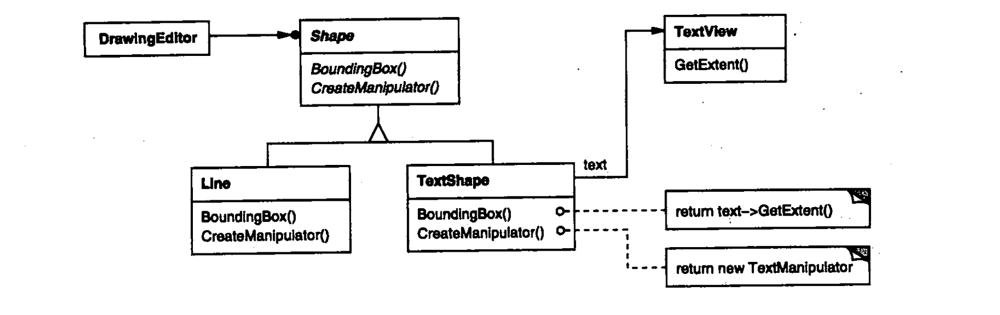
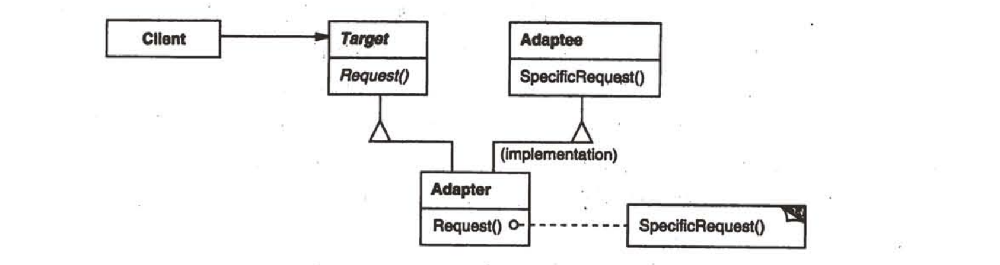
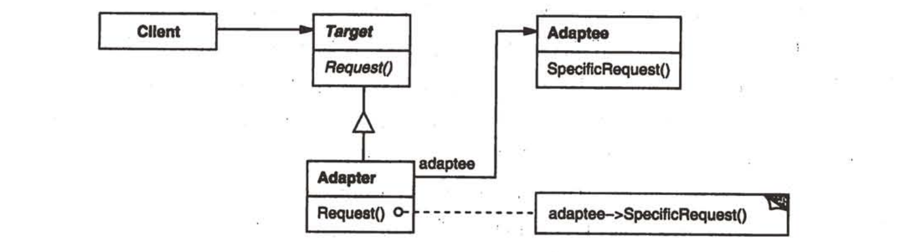
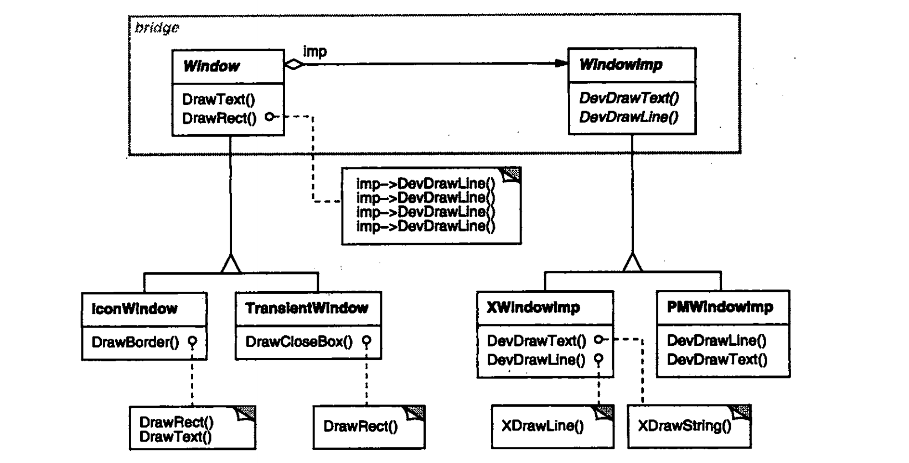
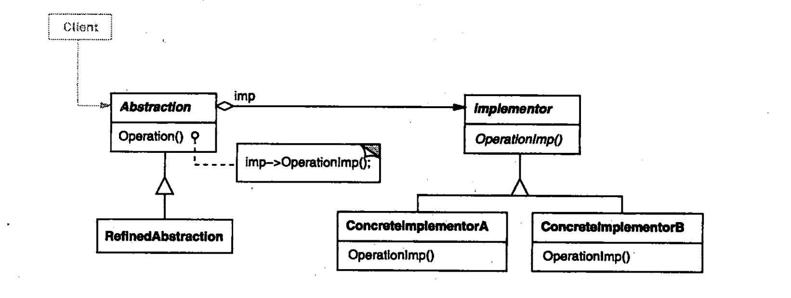
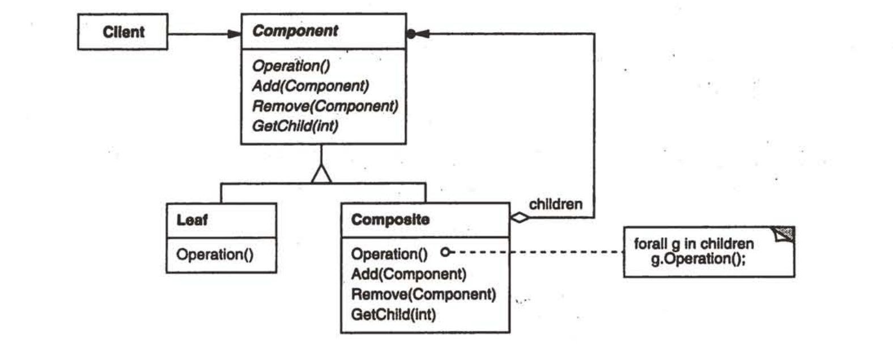
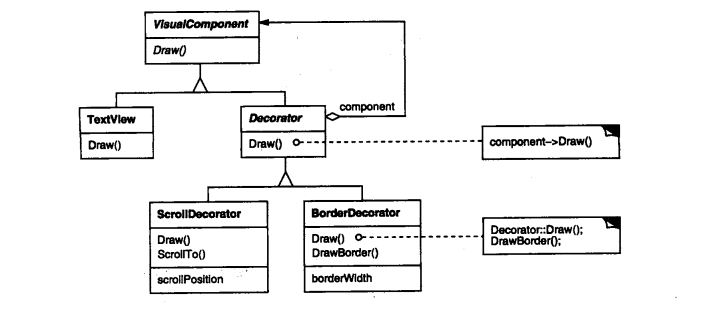
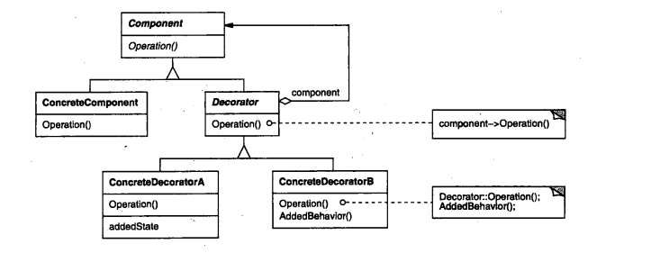
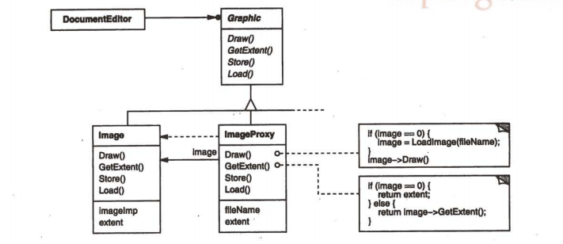
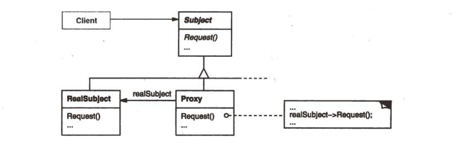

#   结构型模式

结构型模式涉及到如何组合类和对象以获得更大的结构。

结构型对象模式不是对接口和实现进行组合，而是描述了如何对一些对象进行组合，从而实现新功能的一些方法。

-   组成(Composite)模式：结构型对象模式的一个实例。他描述了如何构造一个类层次式结构，这一结构由两种类型的对象(基于对象和组合对象)所对应的类构成，其中的组合对象使得可以组合基于对象以及其他的组合对象，从而形成任意复杂的结构
-   代理(Proxy)模式：Proxy对象作为其他对象的一个方便的替代或占位符。他的使用可以有多种形式。例如他可以在局部空间中代表一个远程地址空间中的对象，也可以表示一个要求被加载的较大的对象，还可以用来保护敏感对象的访问
-   享元(Flyweight)模式：为了共享对象定义了一个结构，至少有两个原因要求对象共享：效率和一致性。Flyweight的对象共享机制主要强调对象的空间效率，使用很多对象的应用必须考虑每一个对象的开销，使用对象共享而不是进行对象复制，可以节省大量的空间资源，不能有与上下文相关的状态，用于生成很多较小的对象
-   外观(Facade)模式：描述了如何用单个对象表示整个子系统。模式中的Facade用来表示一组对象，Facade的职责是将消息转发给他所表示的对象
-   桥接(Bridge)模式：将对象的抽象和其实现分离，使他们都可以独立的变化
-   装饰(Decorator)模式：描述了如何动态的为对象添加职责，采用递归方式组合对象，从而允许你添加任意多的对着职责

----

##  适配器(Adapter)

-   意图

将一个类的接口转换成客户希望的另外一个接口，使得原本由于接口不兼容而不能一起工作的那些类可以一起工作

-   动机

有时，为复用而设计的工具箱类不能被复用的原因仅仅是因为他的借口与专业应用领域所需要的接口不匹配

他说明了在Shape类中声明的BoundingBox请求如何被转换成在TextView类中定义的GetExtent请求。由于TextShape将TextView的接口与Shape的接口进行了匹配，因此绘图编辑器就可以复用原来并不兼容额TextView类

Adapter时常还要负责提供哪些被匹配的类所没有提供的功能

-   适用型
    -   想适用一个已经存在的类，而他的接口不符合你的需求
    -   想创建一个可以复用的类，该类可以与其他不相关的类或可不预见的类协调工作
    -   想适用一些已经存在的子类，但是不可能对每一个都进行子类化以匹配他们的接口

-   结构

类适配器适用多重继承对一个接口与另一个接口进行匹配

对象匹配器依赖于对象组合

-   参与者
    -   Target(Shape)：定义Client使用的与特定领域相关的接口
    -   Client(DrawingEditor)：与符合Target接口的对象协同
    -   Adaptee(TextView)：定义一个已经存在的接口，这个接口需要适配
    -   Adapter(TextShape)：对Adaptee的接口与Target接口进行适配

-   效果
    -   类适配器
        -   用一个具体的Adapter类对Adaptee和Target进行匹配，结果是当我们想要匹配一个类以及所有他的子类时，类Adapter将不能胜任工作
        -   使得Adapter可以重定义Adaptee的部分行为，因为Adapter是Adaptee的子类
        -   仅仅引入一个对象，并不需要额外的指针以间接得到Adaptee
    -   对象适配器
        -   允许一个Adapter与多个Adaptee---即Adapte本身以及他的所有子类同时工作，Adapter也可以一次给所有的Adaptee添加功能
        -   使得重定义Adaptee的行为比较困难，这就需要生产Adaptee的子类并且使得Adapter引用这个子类而不是引用Adaptee本身

-   实现
    -   使用C++实现适配器类
    -   可插入的适配器

-   相关模式
    -   桥接(Bridge)的目的是将接口部分和实现部分分离，从而对他们可以较为容易也相对独立的加以改变，而Adapter则意味着改变一个已有对象的接口
    -   装饰(Decorator)模式增强了其他对象的功能而同时又不改变他的接口，因此装饰(Decorator)对应用程序的透明性比适配器要好。
    -   代理(Proxy)在不改变他的接口的条件下，为另一个对象定义了一个代理

----

##  桥接(Bridge)

-   意图

将抽象部分与他的实现部分分离，使他们都可以独立的变化

-   动机

当一个抽象可能有多个实现时，通常用继承来协调他们，但是此方法有时不够灵活，继承机制将抽象部分与他的实现部分固定在一起，使得难以对抽象部分和实现部分独立的进行修改、扩充和重用。

客户在创建窗口时应该不涉及到其具体实现部分，仅仅是窗口的实现部分依赖于应用运行的平台，这样客户代码在创建窗口时就不应涉及到特定的平台

-   适用性
    -   你不希望在抽象和他的实现部分之间有一个固定的绑定关系
    -   类的抽象以及他的实现都应该可以通过生成子类的方法加以扩充
    -   对一个抽象的实现部分的修改应对客户不产生影响
    -   想对客户完全隐藏抽象的实现部分
    -   想在多个对象间共享实现，但同时要求客户并不知道这一点

-   结构

-   参与者
    -   Abstraction(Window)
        -   定义抽象类的接口
        -   维护一个指向Implementor类型对象的指针
    -   RefinedAbstraction(IconWindow)
        -   扩充由Abstraction定义的接口
    -   Implementor
        -   定义实现类的接口，该接口不一定要与Abstraction的接口完全一致
        -   一般，Implementor接口仅提供基本操作，而Abstraction则定义了基于这些基本操作的较高层次的操作
    -   ConcreteImplementor(XwindowImp,PMWindowImp)
        -   实现Implementor接口并定义他的具体实现

-   效果
    -   分离接口及其实现部分
    -   提高可扩展性
    -   实现细节对客户透明

-   实现
    -   仅有一个Implementor
    -   创建正确的Implementor对象
    -   共享Implementor对象
    -   采用多重继承机制

-   相关模式
    -   抽象工厂(Abstract Factory)可以用来创建和配置一个特定的Bridge模式
    -   适配器(Adapter)模式用来帮助无关的类协同工作，他通常在系统设计完成后才会被使用，然而，桥接(Bridge)则是在系统开始时就被使用，他使得抽象接口和实现部分可以独立进行改变

----

##  组成(Composite)

-   意图

将对象组合成树形结构以表示"部分-整体"的层次结构，使得客户对单个对象和复合对象的使用具有一致性

-   动机

组成(Composite)模式的关键是一个抽象类，他既可以代表图元，又可以代表图元的容器。在图形系统中的这个类就是Graphic，他声明一些与特定图形对象相关的操作，例如Draw，同时他也声明了所有的组合对象共享的一些操作，例如一些操作用于访问和管理他的子部件

-   适用性
    -   想表达对象的部分-整体层次结构
    -   希望用户忽略组合对象与单个对象的不同，用户将统一的使用组合结构中的所有对象

-   结构

-   参与者
    -   Component(Graphic)
        -   为组合中的对象声明接口
        -   在适当的情况下，实现所有类共有接口的缺省行为
        -   声明一个接口用于访问和管理Component的子组件
        -   (可选)在递归结构中定义一个接口，用于访问一个父部件，并在合适的情况下实现它
    -   Leaf(Rectangle、Line、Text)
        -   在组合中表示叶节点对象、叶节点没有子节点
        -   在组合中定义图元对象的行为
    -   Composite(Picture)
        -   定义有子部件的那些部件的行为
        -   存储子部件
        -   在Component接口中实现与子部件有关的操作
    -   Client
        -   通过Component接口操作组合部件的对象

-   效果
    -   定义了包含基本对象和组合对象的类层次结构
    -   简化客户代码
    -   使得更容易增加新类型的组件
    -   使你的设计变得更加一般化

-   实现
    -   显式的父部件引用
    -   共享组件
    -   最大化Component接口
    -   声明管理子部件的操作
    -   Component是否应该实现一个Compinent列表
    -   子部件排序
    -   使用高速缓存存储改善性能
    -   应该有谁删除Component
    -   存储组件最好用哪一种数据结构

-   相关模式
    -   通常子部件-父部件连接用于职责链(Chain of Responsibility)模式
    -   装饰(Decorator)模式经常与组成(Composite)模式一起使用。当装饰和组合一起使用时，他们通常有一个公共的父类，因此装饰必须支持具有Add、Remove和GetChild操作的Component接口
    -   享元(Flyweight)让你共享组件，但不再能引用他们的父部件
    -   迭代器(Iterator)可用来遍历Composite
    -   访问者(Visitor)将本来应该分布在Composite和Leaf类的操作和行为局部化

----

##  装饰(Decorator)

-   意图

动态的给一个对象添加一些额外的职责。就扩展功能而言，比生成子类方式更为灵活

-   动机

有时希望给某个对象而不是整个类添加一些功能，使用继承机制是添加功能的一种有效途径，但是这种方法不灵活。

一种较为灵活的方式是将组件嵌入另一个对象，有这个对象添加边框，称这个嵌入的对象为装饰。

这个装饰与他所装饰的组件接口一致，因此他对使用该组件的客户透明，他将客户请求转发给该组件，并且可能在转发前后执行一些额外的动作。透明性使得你可以递归的嵌套多个装饰，从而可以添加任意多的功能

-   适用性
    -   在不影响其他对象的情况下，以动态、透明的方式给单个对象添加职责
    -   处理那些可以撤销的职责
    -   当不能采用生成子类的方法进行扩充时。一种情况是，可能有大量独立的扩展，为支持每一种组合将产生大量的子类，使得子类数目呈爆炸性增长，另一种情况是因为类定义被隐藏，或类定义不能用于生成子类

-   结构

-   参与者
    -   Component(VisualComponent)：定义一个对象接口，可以给这些对象动态地添加职责
    -   ConcreteComponent(TextView)：定义一个对象，可以给这个对象添加一些职责
    -   Decorator：维持一个指向Component对象的指针，并定义一个与Component接口一致的接口
    -   ConcreteDecorator(BorderDecorator,ScrollDecorator)：向组件添加职责

-   效果
    -   比静态继承更灵活
    -   避免在层次结构高层的类有太多的特征
    -   装饰模式是一个透明的包装
    -   有许多小对象

-   实现
    -   接口的一致性
    -   省略抽象的Decorator类
    -   保持Component类的简单性
    -   改变对象外壳与改变对象内核

-   相关模式
    -   适配器模式：装饰仅改变对象的职责而不改变他的接口，而适配器将给对象一个全新的接口
    -   组合模式：可以将装饰视为一个退化的、仅有一个组件的组合。装饰仅给对象添加一些额外的职责---他的目的不在于对象聚集
    -   策略模式：用一个装饰你可以改变对象的外表，而策略模式使得你可以改变对象的内核，这是改变对象的两种途径

----

##  外观(Facade)

-   意图

为子系统中的一组接口提供一个一致的界面，定义了一个高层接口，这个接口使得这一子系统更加容易使用

-   动机

-   适用性

-   结构

-   参与者

-   效果

-   实现

-   相关模式

----

##  享元(Flyweight)

-   意图

运用共享技术有效的支持大量细粒度的对象

-   动机

-   适用性

-   结构

-   参与者

-   效果

-   实现

-   相关模式

----

##  代理(Proxy)

-   意图

为其他对象提供一个代理以控制对这个对象的访问

-   动机

对一个对象进行访问控制的一个原因是为了只有在我们确实需要这个对象时才对他进行创建和初始化。

对于每一个开销很大的对象，应该根据需要进行创建，当一个图像变为可见时会产生这样的需求。

但是在文档中用什么来代替这个图像呢?我们又如何才能隐藏根据需要创建图像这一事实，从而不会使得编辑器的实现复杂化呢?例如，这种优化不应影响绘制和格式化的代码

解决方案是使用另一个对象，即图像Proxy，替代那个真正的图像。Proxy可以代替一个图像对象，并且在需要时负责实例化这个图像对象。只有当文档编辑器激活图像代理的Draw操作以显示这个图像的时候，图像Proxy才创建真正的图像。Proxy直接将随后的请求转发给这个图像对象，因此在创建这个图像以后，他必须有一个指向这个图像的引用

-   适用性
    -   远程代理：为一个对象在不同的地址空间提供局部代理
    -   虚代理：根据需要创建开销很大的对象
    -   保护代理：控制对原始对象的访问，保护代理用于对象应该有不同的访问权限的时候
    -   智能指引：取代了简单的指针，他在访问对象时执行一些附加操作

-   结构

-   参与者
    -   Proxy(ImageProxy)
        -   保存一个引用使得代理可以访问实体
        -   提供一个与Subiect的接口相同的接口，这样代理就可以用来替代实体
        -   控制对实体的存取，并可能负责创建和删除他
        -   其他功能依赖于代理的类型
            -   远程代理：负责对请求及其参数进行编码，并向不同地址空间中的实体发送已编码的请求
            -   虚代理：可以缓存实体的附加信息，以便延迟对他的访问
            -   保护代理：检查调用者是否具有一个请求所必须的访问权限
    -   Subject(Grapgic)
        -   定义RealSubject和Proxy的共用接口，这样就在任何使用RealSubject的地方都可以使用Proxy
    -   RealSubject(Image)
        -   定义Proxy所代表的实体

-   效果
    -   远程代理：隐藏一个对象存在于不同地址空间的事实
    -   虚代理：可以进行最大化，例如根据要求创建对象
    -   保护代理 和 智能指引：允许在访问一个对象时有一些附加的内务处理

-   相关模式
    -   适配器模式为它所适配的对象提供了一种不同的接口，相反，代理提供了与他的实体相同的接口
    -   装饰模式为对象添加一个或多个功能，而代理则控制对对象的访问

----

