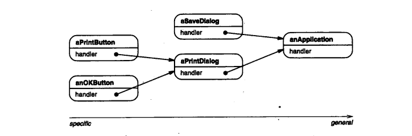
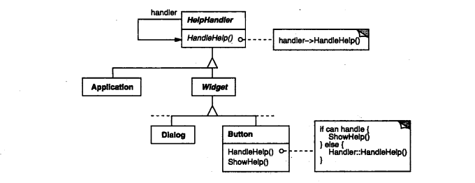
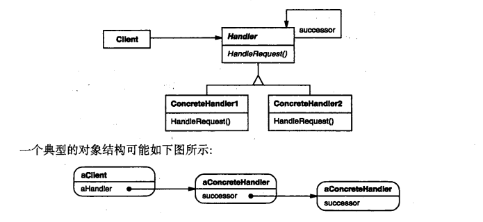
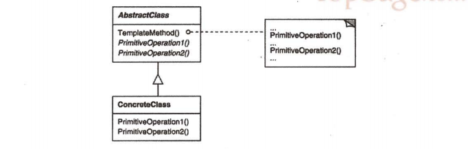

#   行为型模式

##  责任链(Chain of Responsibility)

-   意图

使多个对象都有机会处理请求，从而避免请求的发送者和接收者之间的耦合关系，将这些对象连城一条链，并沿着这条链传递该对象，直到有一个对象处理他为止

-   动机

根据普遍性即从最特殊到最普通的顺序来组织帮助信息。在这些用户界面对象中会有一个对象来处理帮助请求，至于是哪一个对象则取决于上下文以及可用的帮助具体到何种程度

这儿的问题是提交帮助请求的对象(如按钮)并不明确知道谁是最终提供帮助的对象。

责任链模式的想法是，给多个对象处理一个请求的机会，从而解耦发送者和接受者，该请求沿对象链传递直至其中一个对象处理他，如：

从第一个对象开始，链中收到请求的对象要么亲自处理他，要么转发给链中的下一个候选者。提交请求的对象并不明确的知道哪一个对象将会处理他--我们说该请求有一个隐式的接收者

-   适用性
    -   有多个的对象可以处理一个请求，那个对象处理该请求运行时刻自动确定
    -   想在不明确指定接收者的情况下，向多个对象中的一个提交一个请求
    -   可以处理一个请求的对象集合应被动态指定

-   结构

-   参与者
    -   Handler(HelpHandler)
        -   定义一个处理请求的接口
        -   (可选)实现后继链
    -   ConcreteHandler(PrintButton和PrintDialog)
        -   处理他所负责的请求
        -   可访问他的后继者
        -   如果可处理该请求，就处理之，否则将该请求转发给他的后继者
    -   Client
        -   向链上的具体处理者(ConcreteHandler)对象提交请求

-   效果
    -   降低耦合度
    -   增强了给对象指派职责的灵活性
    -   不保证被接受

-   实现
    -   实现后继者链
        -   定义新的连接
        -   使用已有的连接
    -   连接后继者
    -   表示请求
    -   在Smalltalk中自动转发

-   相关模式
    -   责任链常与组合模式一起使用，在这种情况下，一个构件的父构件可作为他的后继

----

##  命令(Command)

-   意图

将一个请求封装为一个对象，从而使你可用不同的请求对客户进行参数化，对请求排队或记录请求日志，以及支持可取消的操作

-   动机

-   适用性

-   结构

-   参与者

-   效果

-   实现

-   相关模式

----

##  解释器(Interpreter)

-   意图

给定一个语言，定义他的文法的一种表示，并定义一个解释器，该解释器使用该表示来解释语言中的句子

-   动机

-   适用性

-   结构

-   参与者

-   效果

-   实现

-   相关模式

----

##  迭代器(Iterator)

-   意图

提供一种方法顺序访问一个聚合对象中各个元素，而又不需要暴露该对象的内部表示

-   动机

-   适用性

-   结构

-   参与者

-   效果

-   实现

-   相关模式

----

##  中介者(Mediator)

-   意图

用一个中介对象来封装一系列的对象交互。中介者使各对象不需要显式的相互引用，从而使其耦合松散，而且可以独立的改变他们之间的交互

-   动机

-   适用性

-   结构

-   参与者

-   效果

-   实现

-   相关模式

----

##  备忘录(Memento)

-   意图

在不破坏封装性的前提下，捕获一个对象的内部状态，并在该对象之外保存这个状态，这样以后就可将该对象恢复到保存的状态

-   动机

-   适用性

-   结构

-   参与者

-   效果

-   实现

-   相关模式

----

##  观察者(Observer)

-   意图

定义对象间的一种一对多的依赖关系，以便当一个对象的状态发生改变时，所有依赖于他的对象都得到通知并自动刷新

-   动机

-   适用性

-   结构

-   参与者

-   效果

-   实现

-   相关模式

----

##  状态(State)

-   意图

允许一个对象在其内部状态改变时改变他的行为。对象看起来似乎修改了他所属的类

-   动机

-   适用性

-   结构

-   参与者

-   效果

-   实现

-   相关模式

----

##  策略(Straregy)

-   意图

定义一系列的算法，把他们一个个封装起来，并且使他们可相互替换，使得算法的变化可独立于使用他的客户

-   动机

-   适用性

-   结构

-   参与者

-   效果

-   实现

-   相关模式

----

##  模板方法(Template Method)

-   意图

定义一个操作中的算法的骨架，而将一些步骤延迟到子类中，使得子类可以不改变一个算法的结构即可重定义该算法的某些特定步骤

-   动机

考虑一个提供Application和Document类的应用框架。Application类负责打开一个已有的以外部形成存储的文档，如一个文件。一旦一个文档中的信息从该文件中读出来，他就由一个Document对象表示

抽象的Application类在他的OpenDocument操作中定义打开和读取一个文档的算法。OpenDocument定义了打开一个文档的每一个主要步骤，他检查该文档是否能被打开，创建与应用相关的Document对象，将他加到他的文档集合中，并且从一个文件中读取该Document

我们称OpenDocument为一个模板方法。一个模板方法用一些抽象的操作定义一个算法，而子类将重定义这些操作以提供具体的行为

通过使用抽象操作定义一个算法中的一些步骤，模板方法确定他们的先后顺序，但他允许Application和Document子类改变这些具体步骤以满足他们各自的需求

-   适用性
    -   一次性实现一个算法的不变的部分，并将可变的行为留给子类来实现
    -   各子类中公共的行为应被提取出来并集中到一个公共父类中以避免代码重复
    -   控制子类扩展

-   结构

-   参与者
    -   AbstractClass(抽象类，如Application)
        -   定义抽象的原语操作，具体的子类将重定义他们以实现一个算法的各步骤
        -   实现一个模板方法，定义一个算法的骨架。该模板方法不仅调用原语操作，也调用定义在AbstractClass或其他对象中的操作

-   效果
    -   模板方法是一种代码复用的基本技术，在类库中尤为重要，他们提取了类库中的公共行为
    -   模板方法导致一种方向的控制结构，这种结构有时被称为"好莱坞法则"，即"别找我们，我们找你"。这指的是一个父类调用一个子类的操作，而不是相反
    -   具体的操作(ConcreteClass或对客户类的操作)
    -   具体的AbstractClass的操作(通常对子类有用的操作)
    -   原语操作(抽象操作)
    -   Factory Method
    -   钩子操作，他提供了缺省的行为，子类可以在必要时进行扩展。一个钩子操作在缺省操作通常是一个空操作

-   实现
    -   尽量减少原语操作
    -   命名约定

-   相关模式
    -   工厂方法模式常被模板方法调用
    -   策略模式：使用继承来改变算法的一部分，策略使用委托来改变整个算法

----

##  访问者(Visitor)

-   意图

表示一个作用于某对象结构中的各元素的操作，他使你可以在不改变各元素的类的前提下定义作用于这些元素的新操作

-   动机

-   适用性

-   结构

-   参与者

-   效果

-   实现

-   相关模式

----