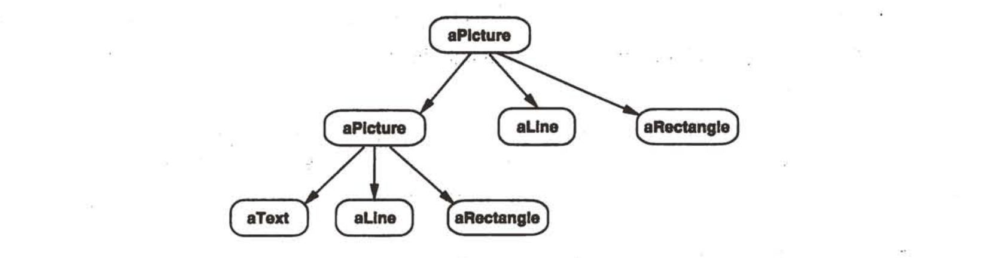

#   设计模式：可复用面向对象软件的基础

5星！不可磨灭！入门还请关注文字概念，具体就不要了

##  阅读指导:章节顺序
-   第1章
-   第3、4、5章
    -   倒着看
    -   先结论
    -   再具体细节
-   第2章

----

##  内容
-   [内容概述](101.md)
-   [创建型模式](201.md)
-   [结构型模式](202.md)
-   [行为型模式](203.md)

----

##  

-   意图

-   动机

-   适用性

-   结构

-   参与者

-   效果

-   实现

-   相关模式

----