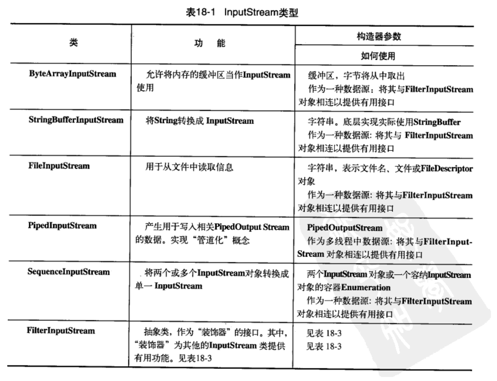
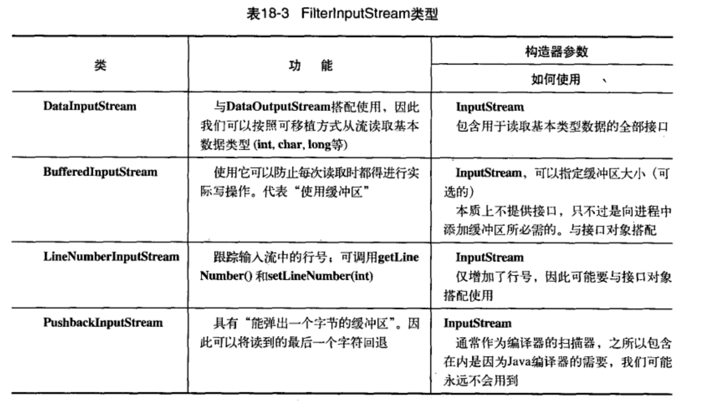
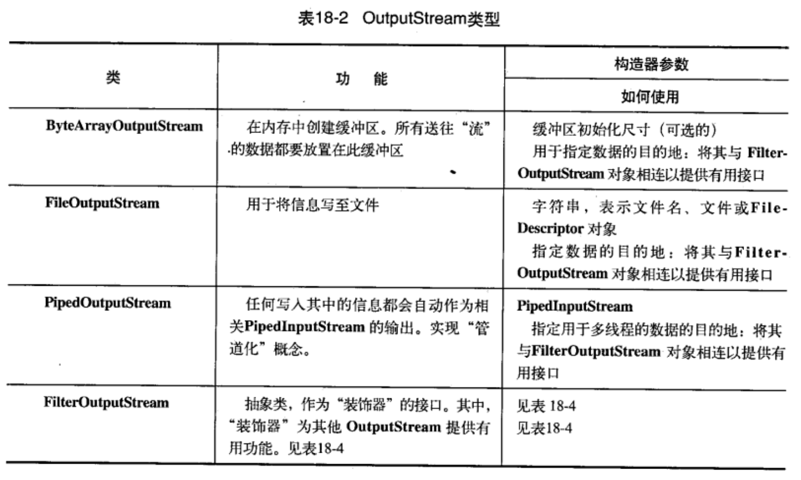
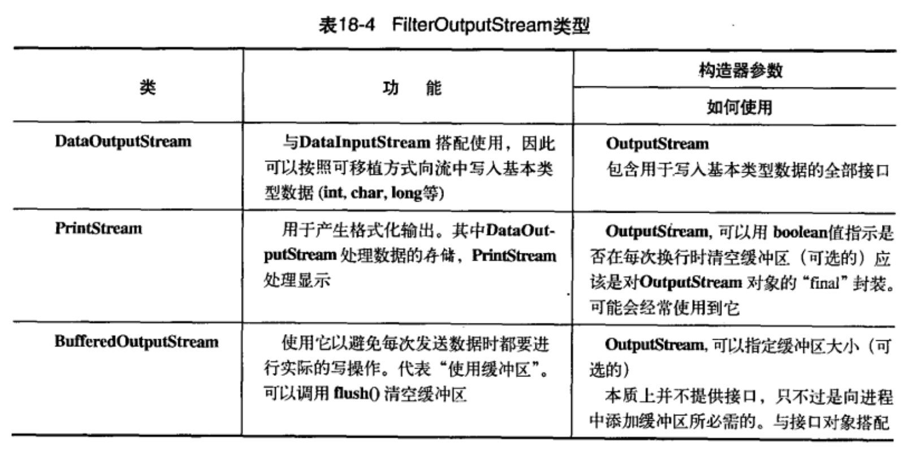

#   Java I/O系统

I/O的难点是要覆盖所有的可能性，不仅存在各种I/O源端和想要与之通信的接收端(文件、控制台、网络链接等)，而且还需要以多种不同的方式与他们进行通信(顺序、随机存取、缓存、二进制、按字符、按行、按字等)。

----

##  File类

File类既能代表一个特定文件的名称，又能代表一个目录下的一组文件的名称

-   目录过滤器：thinking0814.s18.DirList

创建 DirFilter 这个类的目的在于把 accept方法提供给 list()使用，使list()可以回调accept()，进而以决定哪些文件包含在列表中。这种结构常常称为回调，更具体的说，这是一个策略模式的例子，因为 list() 实现了基本的功能，而且按照 FilenameFilter 的形式提供了这个策略，以便完善list()在提供服务时所需的算法。

list()接受FilenameFilter对象作为参数，这意味着可以传递实现了FilenameFilter接口的任何类的对象，用以选择(甚至在运行时)list()方法的行为方式，策略的目的就是提供代码行为的灵活性，list()会为此目录对象下的每个文件名调用 accept()，来判断该文件是否包含在内，判断结果由accept()返回的布尔值表示

-   查找目录下所有符合条件的文件：thinking0814.s18.Directory

----

##  输入和输出

编程语言的I/O类库中常使用流这个抽象概念，他代表任何有能力产出数据的数据源对象或有能力接收数据的接收端对象，"流"屏蔽了实际的I/O设备中处理数据的细节。

很少使用单一的类来创建流对象，而是通过叠合多个对象来提供所期望的功能(这就是装饰器设计模式)。

1.  InputStream类型

InputStream的作用是用来表示那些从不同数据源产生输入的类，这些数据源包括：
-   字节数组
-   String对象
-   文件
-   "管道"，工作方式与实际管道相识，即，从一端输入，从另一端输出
-   一个由其他种类的流组成的序列，以便可以将它们收集合并到一个流内

每一种数据源都有相应的InputStream子类，FilterInputStream也属于一种，为"装饰器"类提供基类

添加属性和有用的接口：装饰器类

2.  OutputStream类型

该类别的类决定了输出所要去往的目标：字节数组、文件或管道

添加属性和有用的接口：装饰器类

3.  Reader和Writer

InputStream和OutputStream以面向字节形式提供功能，Reader和Writer则提供兼容Unicode与面向字符的I/O功能，有时需要把来自"字节"层次结构中的类和"字符"层次结构中的类结合起来使用，为了实现这个目的，要用到"适配器"类：`InputStreamReader`可以把`InputStream`转换为Reader，而`OutputStreamWriter`可以把`OutputStream`转换为Writer。

设计Reader和Writer继承层次结构主要是为了国际化

4.  自我独立的类：RandomAccessFile

RandomAccessFile适合于由大小已知的记录组成的文件，可以使用seek()将记录从一处转移到另一处，然后读取或修改记录。文件中记录的大小不一定都要相同只要能够确定那些记录有多大以及它们在文件中的位置即可。

RandomAccessFile工作方式类似于把DataInputStream和DataOutStream组合其阿里使用，还添加了一些方法。

----

##  I/O流的典型使用方式

尽管可以通过不同的方式组合I/O流类，但可能也就只用到其中的几种组合

-   缓冲输入文件：thinking0814.s18.BufferedInputFile
-   从内存输入：thinking0814.s18.MemoryInput
-   格式化的内存输入：thinking0814.s18.FormattedMemoryInput
-   基本的文件输出：thinking0814.s18.BasicFileOutput

----

##  新I/O

JDK 1.4的java.nio.*包中引入了新的Java I/O类库，其目的在于提高速度。速度的提高来自于所使用的结构更接近于操作系统执行I/O的方式：通道和缓冲器。

只是和缓冲器交互，并把缓冲器派送到通道，通道要么从缓冲器获得数据，要么向缓冲器发送数据。

唯一直接与通道交互的缓冲区是 ByteBuffer，可以存储未加工字节的缓冲器。

通道是一种相当基础的东西，可以向他传送用于读写的 ByteBuffer，并且可以锁定文件的某些区域用于独占式访问

-   文件复制：thinking0814.s18.ChannelCopy
-   文件复制：thinking0814.s18.TransferTo

-   待
    -   缓冲器的数据结构
    -   压缩文件

1.  内存映射文件

内存映射文件允许创建和修改那些因为太大而不能放入内存的文件，有了内存映射文件，就可以假定整个文件都放在内存中，而且可以完全把他当做非常大的数组来访问

-   内存映射文件：thinking0814.s18.LargeMappedFiles

----

