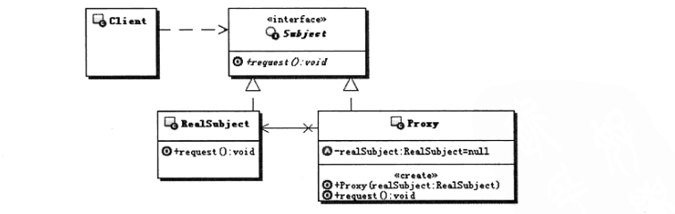
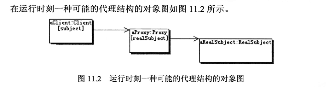

#   代理模式

-   实现与具体的目标对象一样的接口，这样就可以使用代理来代替具体的目标对象。
-   保存一个指向具体目标对象的引用，可以在需要的时候调用具体的目标对象。
-   可以控制对具体目标对象的访问，并可以负责创建和删除他
-   Subject：目标接口，定义代理和具体目标对象的接口，这样就可以在任何使用具体目标对象的地方使用代理对象
-   RealSubject：具体的目标对象，真正实现目标接口要求的功能

本质：控制对象访问

代码：top.kaoshanji.example.books.yanm100.proxy

JDK支持动态接口代理调用