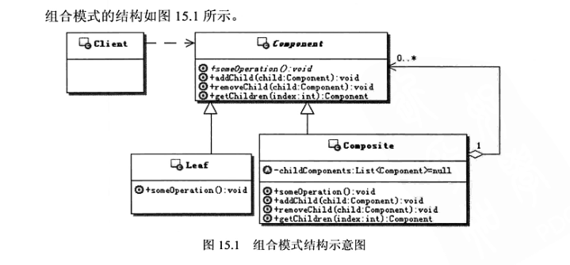

#   组合模式

-   Component：抽象的组件对象，为组合中的对象声明接口，让客户端可以通过这个接口来访问和管理整个对象结构，可以在里面为定义的功能提供缺省实现
-   Leaf：叶子节点对象，定义和实现叶子对象的行为，不再包含其他的子节点对象
-   Composite：组合对象，通常会存储子组件，定义包含子组件的那些组件的行为，并实现在组件接口中定义的与子组件有关的操作
-   Clinet：客户端，通过组件接口来操作组合结构里面的组件对象

代码：top.kaoshanji.example.books.yanm100.composite

本质：

