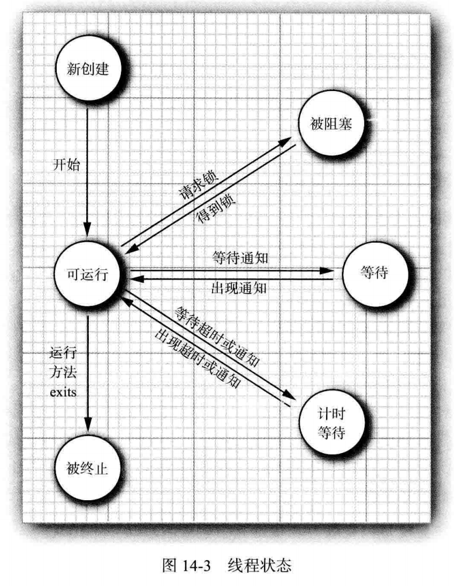
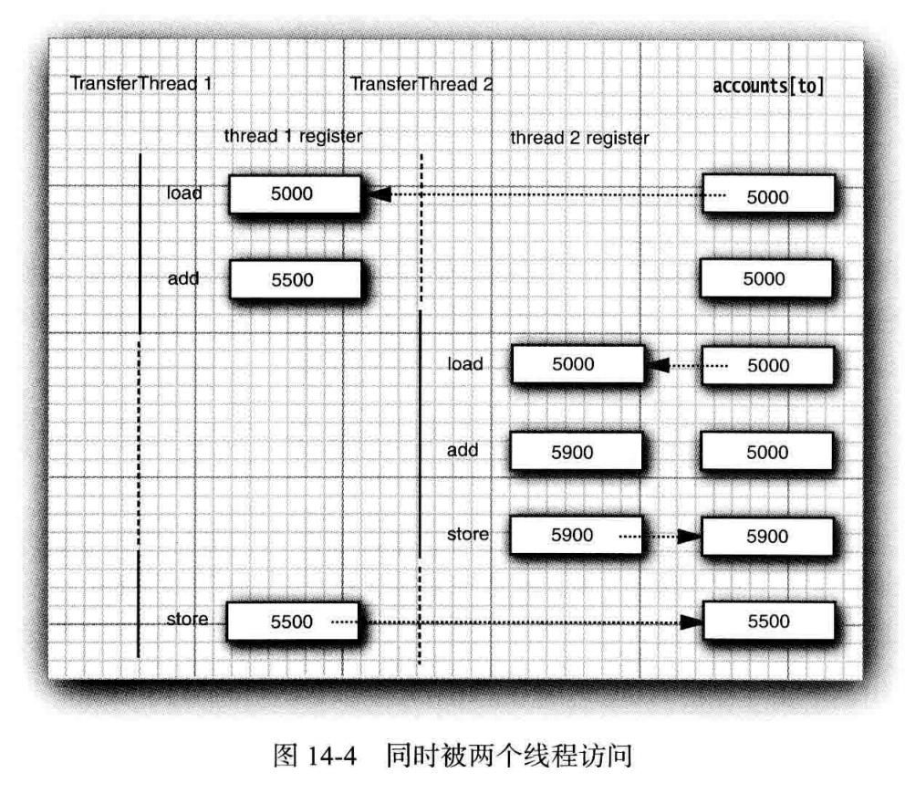
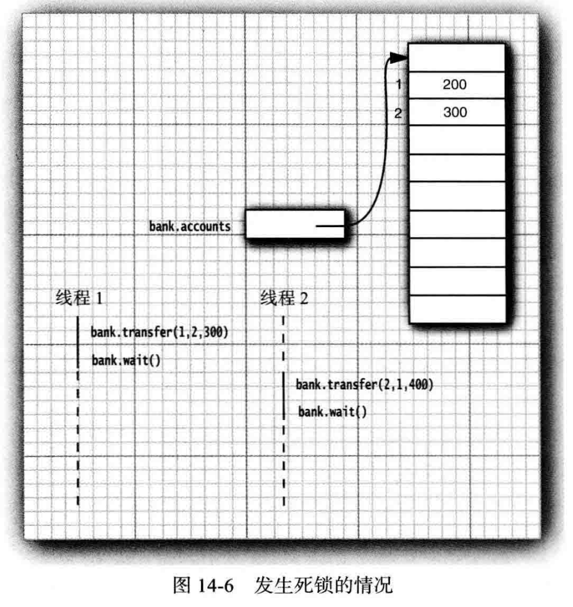

#   并发

现在的计算机可以在编辑或下载邮件的同时打印文件，这是因为操作系统将CPU的时间片分配给每一个进程，给人并行处理的感觉。

多线程程序在较低的层次上扩展了多任务的概念：一个程序同时执行多个任务。通常，每个任务称为一个线程，他是线程控制的简称。可以同时运行一个以上线程的程序称为多线程程序。

多线程与多进行的区别在于，每个进程拥有自己的一整套变量，而线程则共享数据。

共享变量使线程之间的通信比进程之间的通信更有效、更容易。

----

##  线程

1.  什么是线程

当通过网络连接读取数据时，阻塞其他任务是经常发生的，有时确实想要中断读取操作。例如，下载一张大图片，当看到一部分图片后，决定不需要或不想再看剩余的部分，希望能够点击Stop按钮或Back按钮中断下载操作。

线程执行任务。

-   实现线程
    -   实现 Runnable 接口，业务逻辑放在 run方法中
    -   由 Runnable创建一个 Thread对象：Thread t = new Thread(r);
    -   启动线程：s.start();

2.  中端线程

没有可以强制线程终止的方法，然而，interrupt方法可以用来请求终止线程

当对一个线程调用 interrupt 方法时，线程的中断状态将被置位，这是每个线程都具有的boolean标志，每个线程都应该不时的检查这个标志，以判断线程是否被中断

要想指导中断状态是否被置位，首先调用静态的Thread.currentThread方法获得当前线程，然后调用 isInterruptd 方法

但是，如果线程被阻塞，就无法检查中断状态，这是产生 InterruptedException 异常的地方，当在一个被阻塞的线程(调用sleep或wait)上调用 interrupt方法时，阻塞调用将会被 InterruptedException 异常中断。

中断一个线程不过是引起他的注意，被中断的线程可以决定如何响应中断，某些线程很重要以至于应该处理完异常后，继续执行，而不理会中断。

更普遍的情况是，线程将简单的将中端作为一个终止的请求。

如果在每次工作迭代之后都调用sleep方法，isInterruptd检查既没必要也没用处。如果在中端状态被置位时调用sleep方法，他不会休眠，相反，他将清除这一状态并抛出 InterruptedException。因此，如果循环调用sleep，不会检查中断状态，相反，要如下所示捕获 InterruptedException 异常：
``` Java
Runnable r = () -> {
    try {
        ....
        while(to do) {
            do more 
            Thread.sleep(delay);
        }
    } catch(InterruptedException e) {
        // thread was..
    } finally {
        cleanup,if required
    }
};
```

3.  线程状态

-   线程有如下6种状态
    -   New(新创建)
    -   Runnable(可运行)
    -   Blocked(被阻塞)
    -   Waiting(等待)
    -   Timed waiting(计时等待)
    -   Terrminated(被终止)

要确定一个线程的当前状态，可调用getState方法

-   新创建线程

当用new操作符创建一个新线程时，如new Thread(r)，该线程还没有开始运行。这意味着他的状态是new。当一个线程处于新创建状态时，程序还没有开始运行线程中的代码，在线程运行之前还有一些 基础工作要做

-   可运行线程

一旦调用start方法，线程处于runnable状态。一个可运行的线程可能正在运行也可能没有运行，这取决于操作系统给线程提供运行的时间

一旦一个线程开始运行，他不必始终保持运行。事实上，运行中的线程被中断，目的是为了让其他线程获得运行机会。线程调度细节依赖于操作系统提供的服务。

-   被阻塞线程和等待线程

当线程处于被阻塞或等待状态时，它暂时不活动，它不运行任何代码且消耗最少的资源，直到线程调度器重新激活它，细节取决于他是怎样达到非活动状态的

当一个线程试图获取一个内部的对象锁(而不是java.util.concurrent库中的锁)，而该锁被其他线程持有，则该线程进入阻塞状态。当所有其他线程释放该锁，并且线程调度器允许本线程持有他的时候，该线程将变成非阻塞状态

当线程等待另一个线程通知调度器一个条件时，他自己进入等待状态，在调用Object.wait方法或Thread.join方法，或是等待java.util.concurrent库中的Lock或Condition时，就会出现这种情况。实际上，被阻塞状态与等待状态是有很大不同的

有几个方法有一个超时参数。调用他们导致线程进入计时等待状态。这一状态将一直保持到超时期满或者接到适当的通知。带有超时参数的方法有Thread.sleep和Object.wait、Thread.join、Lock.tryLock以及Condition.await的计时版



-   被终止的线程

线程因如下两个原因之一而被终止：因为run方法正常退出而自然死亡、因为一个没有捕获的异常终止了run方法而意外死亡

4.  线程属性

讨论线程的各种属性，其中包括：线程优先级、守护线程、线程组以及处理未捕获异常的处理器

-   线程优先级

每一个线程有一个优先级，默认情况下，一个线程继承他的父线程的优先级，不要将程序构建为功能的正确性依赖于优先级

-   守护线程

可以通过调用
```
t.setDaemon(true);
```

将线程转换为守护线程，守护线程的唯一用途是为其他线程提供服务。

守护线程永远不要去访问固有资源，如文件、数据库，因为他会在任何时候甚至一个操作的中间发生中断。

-   未捕获异常处理器

线程的run方法不能抛出任何受查异常，但是，非受查异常会导致线程终止。在这种情况下，线程就死亡了

不需要任何catch子句来处理可以被传播的异常，相反，就在线程死亡之前，异常被传递到一个用于未捕获异常的处理器

该处理器必须属于一个实现`Thread.UncaughtExceptionHandler` 接口的类，这个接口只有一个方法：`void uncaughtException(Thread t, Throwable e)`

可以用`setUncaughtExceptionHandler`方法为任何线程安装一个处理器，也可以用Thread类的静态方法`setDefaultUncaughtExceptionHandler`为所有线程安装一个默认的处理器，替换处理器可以使用日志API发送未捕获异常的报告到日志文件

如果不为独立的线程安装处理器，此时的处理器就是该线程的 ThreadGroup 对象

ThreadGroup 类实现`Thread.UncaughtExceptionHandler`接口，他的 uncaughtException 方法做如下操作：
-   如果该线程组有父线程组，那么父线程组的 uncaughtException 方法被调用
-   否则，如果 Thread.UncaughtExceptionHandler 方法返回一个非空的处理器，则调用该处理器
-   否则，如果 Throwable 是 ThreadDeath 的一个实例，什么都不做
-   否则，线程的名字以及 Throwable 的栈轨迹被输出到 System.err 上
你肯定在程序中看到很多次了

----

##  数据

1. 阻塞队列

看到了Java并发程序设计基础的底层构建块，然而，对于实际编程来说，应该尽可能远离底层结构，使用有并发处理的专业人士实现的较高层次的结构要方便得多，要安全得多。

许多线程问题，可以通过使用一个或多个队列以优雅且安全的方式将其形式化。生产者线程向队列插入元素，消费者线程则取出他们，使用队列，可以安全的从一个线程向另一个线程传递数据。

当试图向队列添加元素而队列已满，或是想从队列移出元素而队列已空的时候，阻塞队列导致线程阻塞。在协调多个线程之间的合作时，阻塞队列是一个有用的工具。

工作者线程可以周期性的将中间结果存储在阻塞队列中，其他的工作者线程移出中间结果并进一步加以修改，队列会自动的平衡负载，如果第一个线程集运行得比第二个慢，第二个线程集在等待结果时会阻塞。

-   阻塞队列方法分为以下3类，这取决于当队列满或空时他们的响应方式
    -   如果将队列当做线程管理工具来使用，将要用到 put 和 take 方法
    -   当试图向满的队列中添加或从空的队列中移出元素时，add、remove 和 element操作抛出异常
    -   在一个多线程程序中，队列会在任何时候空或满，因此，一定要使用offer、poll和peek方法作为替代

还有带有超时的 offer 方法和 poll方法的变体。

java.util.concurrent包提供了阻塞队列的几个变种。

阻塞队列来控制一组线程：books.coreVolume.s1s14.BlockingQueueTest


2.  线程安全的集合

Java类库提供的另外一些线程安全的集合

-   高效的映射、集和队列

java.util.concurrent包提供了映射、有序集合队列的高效实现：ConcurrentMap、ConcurrentSkipListMap、ConcurrentSkipListSet和ConcurrentLinkedQueue。

这些集合使用复杂的算法，通过允许并发的访问数据结构的不同部分来使竞争极小化。

集合返回弱一致性的迭代器，这意味着迭代器不一定能反映出他们被构造之后的所有的修改，但是，他们不会将同一个值返回两次，也不会抛出 ConcurrentModificationException 异常。

-   映射条目的原子更新

假设多个线程会遇到单词，想统计他们的频率，使用一个 ConcurrentHashMap<String, AtomicLong>，或者ConcurrentHashMap<String, LongAdder>，更新代码如下：
``` Java
map.putIfAbsent(word,new LongAdder());
map.get(word).increment();
```

-   对并发散列映射的批操作

Java SE 8 为并发散列映射提供了批操作，即使有其他线程在处理映射，这些操作也能安全的执行，批操作会遍历映射，处理遍历过程中找到的元素。无须冻结当前映射的快照。

-   有3中不同的操作
    -   搜索：为每个键或值提供一个函数，直到函数生成一个非null的结果
    -   归约：组合所有键或值，这里要使用所提供的一个累加函数
    -   forEach：为所有键或值提供一个函数
-   每个操作有4个版本
    -   operationKeys：处理键
    -   operationValues：处理值
    -   operation：处理键和值
    -   operationEntries：处理Map.Entry对象

对于上述各个操作，需要指定一个参数化阈值，如果映射包含的元素多余这个阈值，就会并行完成批操作

-   并发集视图

假设想要的是一个大的线程安全的集而不是映射，静态 newKeySet方法会生成一个Set<K>，这实际上是ConcurrentHashMap<K,Boolean>的一个包装器。
``` Java
Set<String> words = ConcurrentHashMap.<String>newKeySet();
```
这个集是可变的，如果删除这个集的元素，这个键会从映射中删除，不过，不能向键集增加元素，因为没有相应的值可以增加。

-   写数组的拷贝

CopyOnWriteArrayList 和 CopyOnWriteArraySet 是线程安全的集合，其中所有的修改线程对底层数组进行复制。

当构建一个迭代器的时候，他包含一个对当前数组的引用，如果数组后来被修改了，迭代器任然引用旧数组，但是，集合的数组已经被替换了，因而，旧的迭代器拥有一致的(可能过时的)视图，访问他无须任何同步开销。

-   并行数组算法

在Java SE 8 中，Arrays类提供了大量并行化操作。静态 Arrays.parallelSort方法可以对一个基本类型值或对象的数组排序。

----

##  执行

1.  同步

在大多数实际的多线程应用中，两个或两个以上的线程需要共享对同一数据的存取。如果两个线程存取相同的对象，并且每一个线程都调用了一个修改该对象状态的方法，将会发生什么呢?线程彼此踩了对方的脚，根据各线程访问数据的次序，可能会产生错误的对象，这样一个情况通常称为竞争条件

-   竞争条件的一个例子

模拟一个有若干账户的银行，随机的生成在这些账户之间转移钱款的交易，每一个账户一个线程，每一笔交易中，会从线程所服务的账户中随机转移一定数目的钱款到另一个随机账户。

-   没有使用同步：books.coreVolume.s1s14.UnsynchBankTest

-   竞争条件详解

运行一段时间之后，错误不知不觉地出现了，总额要么增加，要么变少。当两个线程试图同时更新同一个账户的时候，这个问题就出现了。假定两个线程同时执行指令：
``` Java
accounts[to] += amount;
```
问题在于这不是原子操作，该指令可能被处理如下：
-   将 accounts[to] 加载到寄存器
-   增加 accounts
-   将结果写回 accounts[to]

现在，假定第1个线程执行步骤1和2，然后，他被剥夺了运行权。假定第2个线程被唤醒并修改了 accounts 数组中的同一项，然后，第1个线程被唤醒并完成其第3步。

这样，这一动作擦去了第二个线程所做的更新，于是，总金额不再正确。`增值命令是由几条指令组成的，执行他们的线程可以在任何一条指令点上被中断。`



对程序员而言，很少有比无规律出现错误更糟的事情。

真正的问题是 transfer 方法的执行过程中可能会被中断。如果能够确保线程在失去控制之前方法运行完成，那么银行账户对象的状态永远不会出现错误

-   锁对象

有两种机制防止代码块受并发访问的干扰，Java语言提供一个synchronized关键字达到这一目的，并且Java SE 5.0 引入了 ReentrantLock 类。

java.util.concurrent框架为这些基础机制提供独立的类。

用 ReentrantLock 保护代码块的基本结构如下：
``` Java
myLock.lock(); // 一个 ReentrantLock 对象
try {
    // 搞点事情
} finally {
    myLock.unlock();
}
```
这一结构确保任何时刻只有一个线程进入临界区。一旦一个线程封锁了锁对象，其他任何线程都无法通过 lock 语句。当其他线程调用 lock 时，他们被阻塞，直到第一个线程释放锁对象。

如果使用锁，就不能使用带资源的try语句，可以在首部声明一个新变量，使用多个线程共享那个变量(而不是新变量)

假定一个线程调用 synchTransfer，在执行结束前被剥夺了运行权。假定第二个线程也调用 synchTransfer，由于第二个线程不能获得锁，将在调用 lock 方法时被阻塞，他必须等待第一个线程完成 synchTransfer 方法的执行之后才能再度被激活，当第一个线程释放锁时，那么第二个线程才能开始运行。


每一个 Bank 对象有自己的 ReentrantLock 对象。如果两个线程试图访问同一个 Bank对象，那么锁以串行方式提供服务。

如果两个线程访问不同的 Bank 对象，每一个线程得到不同的锁对象，两个线程都不会发生阻塞，本该如此，因为线程在操作不同的 Bank 实例的时候，线程之间不会相互印象

锁是可重入的，因为线程可以重复的获得已经持有的锁。锁保存一个持有计数来跟踪对 lock 方法的嵌套调用。线程在每一次调用 lock 都要调用 unlock 来释放锁。由于这一特性，被一个锁保护的代码可以调用另一个使用相同的锁的方法。

-   条件对象

通常，线程进入临界区，却发现在某一条件满足之后他才能执行。要使用一个条件对象来管理那些已经获得了一个锁但是却不能做有用工作的线程。

现在来细化银行的模拟程序。

在线程再次运行前，账户余额可能已经低于提款额度，必须确保没有其他线程在本检查余额与转账活动之间修改余额。通过使用锁来保护检查与转账动作来做到这一点：
``` Java
public void transfer(int from, int to, int amount) {
    bankLock.lock();
    try {
        while(accounts[from] < amount) {
            // wait
        }
        // transfer funds
    } finally {
        bankLock.unlock();
    }
}
```
现在，当账户中没有足够的余额时，等待直到另一个线程向账户中注入了资金。但是，这一线程刚刚获得了对bankLock的排他性访问，因此别的线程没有进行存款操作的机会，这就需要条件对象的原因。

一个锁对象可以有一个或多个相关的条件对象，可以用 newCondition 方法获得一个条件对象。
``` Java
class Bank {
    private Condition sufficientFunds;
    ...
    public Bank() {
        sufficientFunds = bankLock.newCondition();
    }
}
```
如果 transfer方法发现余额不足，他调用
``` Java
sufficientFunds.await();
```
当前线程现在被阻塞了，并放弃了锁，希望这样可以使得另一个线程可以进行增加账户余额的操作。

等待获得锁的线程和调用 await 方法的线程存在本质上的不同，一旦一个线程调用 await方法，他进入该条件的等待集。当锁可用时，该线程不能马上解除阻塞，相反，他处于阻塞状态，直到另一个线程调用同一条件上的 signalAll 方法时为止。

当另一个线程转账时，他应该调用
```
sufficientFunds.signalAll();
```
这一调用重新激活因为这一条件而等待的所有线程。当这些线程从等待集中移出时，他们再次成为可运行的，调度器将再次激活他们。同时，他们将试图重新进入该对象，一旦锁成为可用的，他们中的某个将从 await 调用返回，获得该锁并从被阻塞的地方继续执行

此时，线程应该再次测试该条件，由于无法确保该条件被满足 ---- signalAll方法仅仅是通知正在等待的线程：此时有可能已经满足条件，值得再次去检查该条件。

至关重要的是最终需要某个其他线程调用 signalAll 方法，当一个线程调用 await时，他没有办法重新激活自身，他寄希望于其他线程。如果没有其他线程来重新激活等待的线程，他就永远不再运行了。这将导致死锁现象。

如果所有其他线程被阻塞，最后一个活动线程在解除其他线程的阻塞状态之前就调用 await 方法，那么他也被阻塞。没有任何线程可以解除其他线程的阻塞，那么该程序就挂起了。

在例子中，当完成了转账时，调用 signalAll 方法
``` Java
public void transfer(int from, int to, int amount) {
    bankLock.lock();
    try {
        while(accounts[from] < amount) {
            sufficientFunds.await();
        }
        ....
        sufficientFunds.signalAll();
    } finally {
        bankLock.unlock();
    }
}
```

调用signalAll不会立即激活一个等待线程，他仅仅解除等待线程的阻塞，以便这些线程可以在当前线程退出同步方式之后，通过竞争实现对对象的访问

-   synchronized 关键字

-   锁与条件的关键之处：
    -   锁用来保护代码片段，任何时刻只能有一个线程执行被保护的代码
    -   锁可以管理试图进入被保护代码段的线程
    -   锁可以拥有一个或多个相关的条件对象
    -   每个条件对象管理那些已经进入被保护的代码段但还不能运行的线程

Java中的每一个对象都有一个内部锁，如果一个方法用 synchronized 关键字声明，那么对象的锁将保护整个方法，也就是说，要调用该方法，线程必须获得内部的对象锁。
``` Java
public synchronized void  method() {
    /// method body
}
// 等价于
public void method() {
    this.intrinsiclock.lock();
    try {
        /// method body
    } finally {
        this.intrinsiclock.unlock();
    }
}
```

内部对象锁只有一个相关条件，wait、notifyAll 以及 notify 方法是 Object 类的 final 方法。
``` Java
// 用Java实现 Bank 类
class Bank  {
    private double口 accounts;
    public synchronized void transfer(int from，int to, int amount) throws InterruptedException {
        while (accounts[from] < amount)
        wait(); // wait on intrinsic object lock' s single condition
        accounts[from] -= amount ;
        accounts[to] += amount ;
        notifyAll()；// notify all threads waiting on the condition
    }
    public synchronized double getTotalBalanceO { . . . }
}
```
使用 synchronized 关键字来编写代码要简洁很多。当然，理解这一代码，必须了解每一个对象有一个内部锁，并且该锁有一个内部条件。由锁来管理那些试图进入 synchronized 方法的线程，由条件来管理那些调用 wait 的线程。

将静态方法声明为 synchronized 也是合法的，如果调用这种方法，该方法获得相关的类对象的内部锁。例如，如果 Bank 类有一个静态同步的方法，那么当该方法被调用时，Bank.class对象的锁被锁住，因此，没有其他线程可以调用同一个类的这个或任何其他同步静态方法。

-   内部锁和条件存在一些局限
    -   不能中断一个正在试图获得锁的线程
    -   试图获得锁是不能设置超时
    -   每个锁仅有单一的条件，可能是不够的

优先级：java.util.concurrent包中的一种机制 > synchronized 关键字 > 特别需要 Lock/Condition 结构时才用

-   同步阻塞

每一个Java对象有一个锁，线程可以通过调用同步方法获得锁，也可以通过进入一个同步阻塞获得锁。
``` Java
// 当线程进入如下形式的阻塞
synchronized (obj) {
    //
}
```
于是他获得obj的锁。

程序员使用一个对象的锁来实现额外的原子操作，实际上称为客户端锁定，但是这非常脆弱，通常不推荐使用。

-   监视器概念

锁和条件是线程同步的强大工具，但是，他们不是面向对象的。那么怎样在不需要程序员考虑如何加锁的情况下保证多线程的安全性呢，监视器是其中解决方案之一。

-   监视器具有如下特性：
    -   监视器是只包含私有域的类
    -   每个监视器类的对象有一个相关的锁
    -   使用该锁对所有的方法进行加锁
    -   该锁可以有任意多个相关条件

Java以不是很精确的方式采用了监视器概念，Java中的每一个对象有一个内部的锁和内部的条件，如果一个方法用 synchronized 关键字声明，那么，他表现的就像是一个监视器方法，通过调用 wait/notifyAll/notify来访问条件变量。

-   Volatile 域

-   使用现代的处理器与编辑器，出错的可能性很大
    -   多处理器的计算机能够暂时在寄存器或本地内存缓冲区中保存内存中的值，结果是，运行在不同处理器上的线程可能在同一个内存位置取到不同的值
    -   编辑器可以改变指令执行的顺序以使吞吐量最大化。这种顺序上的改变不会改变代码语义，但是编译器假定内存的值仅仅在代码中有显式的修改指令时才会改变，然而，内存的值可以被另一个线程改变！！！

如果使用锁来保护可以被多个线程访问的代码，那么可以不考虑这种问题。编译器被要求通过在必要的时候刷新本地缓存来保存锁的效应，并且不能不正当的重新排序指令。

[Java内存模型和线程规范](http://www.jcp.org/en/jsr/detail?id=133)
[Brian写的概要介绍](http://www-106.ibm.com/developerworks/java/library/j-jtp02244_html)

"同步格言"：如果向一个变量写入值，而这个变量接下来可能会被另一个线程读取。或者，从一个变量读值，而这个变量可能是之前被另一个线程写入的，此时必须使用同步。

volatile 关键字为实例域的同步访问提供了一种免锁机制。如果声明一个域为  volatile，那么编译器和虚拟机就知道该域是可能被另一个线程并发更新的

volatile变量不能提供原子性

-   final变量

一个域声明为final时，可以安全的访问一个共享域
``` Java
final Map<String, Double〉 accounts = new HashKap<>0；
// 其他线程会在构造函数完成构造之后才会看到这个 accounts 变量
// 当然对这个Map操作并不是线程安全的
```

-   原子性

假设对共享变量除了赋值之外并不完成其他操作，那么可以将这些共享变量声明为 volatile

java.util.concurrent.atomic 包中有很多使用了很高效的机器级指令(而不是使用锁)来保证其他操作的原子性。例如，AtomicInteger 类提供了方法 incrementAndGet 和 decrementAndGet，他们分别以原子方式将一个整数自增或自减。

假设希望跟踪不同线程观察的最大值，需要这样：
``` Java
do {
    oldValue = largest.get();
    newValue = Math.max(oldValue, observd);
} while (!largest.compareAndSet(oldValue,newValue));
// 如果另一个线程也在更新 largest，就可能阻止这个线程更新，这样一来，compareAndSet 会返回 false，而不会设置新值。
```
在Java8中这样写就行：
``` Java
largest.updateAndGet(x -> Math.max(x,observd));
// 或
largest.accumulateAndGet(observd, Math::max);

```

如果有大量线程要访问相同的原子值，性能会大幅下降，Java8提供了 LongAdder 和 LongAccumulator 类来解决这个问题。如果认为可能存在大量竞争，只需要使用 LongAdder 而不是 AtomicLong。

LongAccumulator 将这种思想推广到任意的累加操作。

-   死锁

锁和条件不能解决多线程中的所有问题。考虑下面的情况：

账户1：$200
账户2：$300
线程1：从账户1转移$300到账户2
线程2：从账户2转移$400到账户1

如图所示，线程1和线程2都被阻塞了，因为账户1和账户2中的余额不足以进行转账，两个线程都无法执行下去。



有可能会因为每一个线程要等待更多的钱款存入而导致所有线程都被阻塞，这样的状态称为死锁。

导致死锁的另一种途径是让第i个线程负责向第i个账户存钱，而不是从第i个账户取钱。

Java编程语言中没有任何东西可以避免或打破这种死锁现象，必须仔细设计程序，以确保不会出现死锁。

-   线程局部变量

上面都是线程间共享变量的风险，有时可能要避免共享变量，使用 ThreadLocal 辅助类为各个线程提供各自的实例。

要为每个线程构造一个实例，可以使用以下代码：
``` Java
public static final ThreadLocal<SimpleDateFormat> dateFormat = ThreadLocal.withInitial(() -> new SimpleDateFormat("yyyy-MM-dd"));
```

要访问具体的格式化方法，可以调用：
``` Java
String dateStamp = dateFormat.get().format(new Date());
```

java.util.concurrent.ThreadLocalRandom 返回特定于当前线程的 Random类的实例

-   锁测试和超时

线程在调用 lock 方法来获得另一个线程持有的锁的时候，很可能发生阻塞，应该更加谨慎的申请锁。tryLock方法试图申请一个锁，在成功获得锁后返回 true，否则，立即返回 false，而且线程可以立即离开去做其他事情。

可以调用 tryLock 时，使用超时参数，像这样：
``` Java
if (myLock.tryLock(100, TimeUnit.MILLISECONDS))...
```

lock方法不能被中断，如果一个线程在等待获得一个锁时被中断，中断线程在获得锁之前一直处于阻塞状态，如果出现死锁，那么 lock 方法就无法终止。

然而，如果调用带有超时参数的 tryLock，那么如果线程在等待期间被中断，将抛出 InterruptedException异常，他允许程序打破死锁

-   读/写锁

java.util.concurrent.locks包定义了两个锁类，如果很多线程从一个数据结构读取数据而很少线程修改其中数据的话，后者是十分有用的，在这种情况下，允许对读线程共享访问时合适的，当然，写线程依然必须是互斥访问的。

下面是使用读/写锁的必要步骤：
``` Java
// 1 构造一个 ReentrantReadWriteLock 对象：

private ReentrantReadWriteLock rwl = new ReentrantReadWriteLock();

// 2 抽取读/写锁：

private Lock readLock = rwl.readLock();
private Lock wroteLock = rwl.writeLock();

// 3 对所有的获取方法加读锁：
public double getTotalBalance() {
    readLock.lock();
    try {

    } finally {
        readLock.unlock();
    }
}

// 4 对所有的修改方法加写锁：
public void transFer() {
    wroteLock.lock();
    try {

    } finally {
        wroteLock.unlock();
    }
}

```

2.  Callable和Future

Runnable封装一个异步运行的任务，可以把它想象成为一个没有参数和返回值得异步方法。Callable 与 Runnable 类似，但是有返回值， Callable 接口是一个参数化的类型，只要一个方法 call。
``` Java
public interface Callable<V> {
    V call() throws Exception;
}
```

类型参数是返回值的类型。

Future 保存异步计算的结果，可以启动一个计算，将 Future 对象交给某个线程，然后忘掉他，Future对象的所有者在结果计算好之后就可以获得他。

计算匹配的文件数目：books.coreVolume.s1s14.FutureTest

3.  执行器

构建一个新的线程是有一定代价的，因为涉及与操作系统地交互，如果程序中创建了大量的生命期很短的线程，应该使用线程池。一个线程池中包含许多准备运行的空闲线程，将 Runnable 对象交给线程池，就会有一个线程调用 run 方法，当 run 方法退出时，线程不会死亡，而是在池中准备为下一个请求提供服务。

另一个使用线程池的理由是减少并发线程的数目。创建大量线程会大大降低性能甚至是虚拟机崩溃，如果有一个会创建许多线程的算法，应该使用一个线程数"固定的"线程池以限制并发线程的总数。

执行器(Executor)类有许多静态工厂方法用来构建线程池，如下：

|  方法   |  描述 |
|---------|-------|
|newCachedThreadPool|必要时创建新线程，空闲线程会保留60秒|
|newFixedThreadPool|该池包含固定数量的线程，空闲线程会一直被保留|
|newSingleThreadExecutor|只有一个线程的"池"，该线程顺序执行每一个提交的任务|
|newScheduledThreadPool|用于预定执行而构建的固定线程池，替代java.util.Timer|
|newSingleThreadScheduledExecutor|用于预定执行而构建的单线程"池"|
|||

前面三个方法返回实现了 ExecutorService 接口的 ThreadPoolExecutor类的对象。

可以用 submit 方法将一个 Runnable 对象或 Callable 对象交给 ExecutorService

当用完一个线程池的时候，调用 shutdown ，该方法启动该池的关闭序列。被关闭的执行器不再接受新的任务，当所有任务都完成以后，线程池中的线程死亡，另一种方法是调用 shutdownNow，该池取消尚未开始的所有任务并试图中断正在运行的线程。

-   总结一下在使用线程池时应该做的事情：
    -   调用 Executors 类中的静态方法 newCachedThreadPool 或 newFixedThreadPool
    -   调用 submit 提交 Runnable 或 Callable 对象
    -   如果想要取消一个任务，或如果提交 Callable对象，那就要保持好返回的 Future 对象
    -   当不再提交任何任务是，调用 shutdown

线程池：books.coreVolume.s1s14.ThreadPoolTest

-   预定执行

ScheduledExecutorService 接口具有为预定执行或重复执行任务而设计的方法。他是一种允许使用线程池机制的 java.util.Timer的泛化。Executors 类的 newScheduledThreadPool 和 newSingleThreadScheduledExecutor 方法将返回实现了 ScheduledExecutorService接口的对象。

可以预定 Runnable 或 Callable 在初始的延迟之后只运行一次，也可以预定一个 Runnable 对象周期性的运行。

-   控制任务组

使用执行器有更有实际意义的原因，控制一组相关任务。

invokeAny 方法提交所有对象到一个 Callable 对象的集合中，并返回某个已经完成了的任务的结果。无法知道返回的究竟是哪个任务的结果，也许是最先完成的那个任务的结果。

用常规的方法获得一个执行器，然后，构建一个 ExecutorCompletionService ，提交任务给完成服务，该服务管理 Future 对象的阻塞队列，其中包含已经提交的任务的执行结果，大概如下：
``` Java
ExecutorCompletionService service = new ExecutorCompletionService<>(executor);
for (Callable<T> task : tasks)
    service.submit(task);

for (int i = 0; i < tasks.size(); i++)
    processFurther(service.take().get());

```

-   Fork-Join 框架

针对计算密集型任务，可以使用 Fork-Join 框架。

Fork-Join：books.coreVolume.s1s14.ForkJoinTest

-   可完成 Future

处理非阻塞调用的传统方法是使用事件处理器，程序员为任务完成之后要出现的动作注册一个处理器。Java SE 8 的 CompletableFuture 类提供了一种候选方法，"可完成future"可以"组合"。

。。。。


4.  同步器

java.util.concurrent包包含可几个能帮助`管理相互合作的线程集`的类，如下，这些机制具有为线程之间的`共用集结点模式`提供的"预置功能"，如果有一个相互合作的线程集满足这些行为模式之一，那么应该直接重用合适的库类而不要视图提供手工的锁或条件的集合。

|    类    |   他能做什么     |    说明    |
|---------|-----------------|------------|
|CyclicBarrier|允许线程集等待直至其中预定数目的线程到达一个公共障栅，然后可以选择执行一个处理障栅的动作|当大量的线程需要在他们的结果可用之前完成时|
|Phaser|类似循环障栅，不过有一个可变的计数|Java SE 7 中引入|
|CountDownLatch|允许线程集等待直到计数器减为0|当一个或多个线程需要等待直到指定书目的事件发生|
|Exchanger|允许两个线程在要交换的对象准备好时交换对象|当两个线程工作在同一数据结构的两个实例上的时候，一个向实例添加数据而另一个从实例清除数据|
|Semaphore|允许线程集等待直到被允许继续运行为止|限制访问资源的线程总数，如果许可数是1，常常阻塞线程直到另一个线程给出许可为止|
|SynchronousQueue|允许一个线程把对象交给另一个线程|在没有显式同步的情况下，当两个线程准备好将一个对象从一个线程传递到另一个时|
||||

-   信号量

概念上将，一个信号量管理许多的许可证，为了通过信号量，线程通过调用 acquire 请求许可，其实没有实际的许可对象，信号量仅维护一个计数，许可的数目是固定的，由此限制了通过的线程数量，其他线程可以通过调用 release 是否许可，而且，许可不是必须由获取他的线程释放，事实上，任何线程都可以释放任意数目的许可，这可能会增加许可数目以至于超出初始数目。

-   倒计时门栓

一个倒计时门栓让一个线程集等待指导计数变为0。倒计时门栓是一次性的，一旦计数为0，就不能再重用了

一个有用的特例是计数值为1的门栓，实现一个只能通过一次的门，线程在门外等待直到另一个线程将计数器值置为0.

举例来讲，假定一个线程集需要一些初始的数据来完成工作，工作器线程被启动并在门外等待，另一个线程准备数据，当数据准备好的时候，调用 countDown，所有工作器线程就可以继续运行了。

-   障栅

CyclicBarrier 类实现了一个集结点称为 障栅。考虑大量线程运行在一次计算的不同部分的情形，当所有部分都准备好时，需要把结果组合在一起，当一个线程完成了他的那部分任务后，让他运行到障栅处，一旦所有的线程都到达这个障栅，障栅就撤销，线程就可以继续运行。

Phaser 类增加了更大的灵活性，运行改变不同阶段中参与线程的个数。

-   交换器

当两个线程在同一个数据缓冲区的两个实例上工作时，就可以使用交换器。典型的情况是，一个线程向缓冲区填入数据，另一个线程消耗这些数据，当他们都完成以后，相互交换缓冲区。

-   同步队列

同步队列是一种将生产者与消费者线程配对的机制，当一个线程调用 SynchronousQueue 的 put 方法时，他会阻塞直到另一个线程调用 take方法为止，反之亦然。与 Exchanger 的情况不同，数据仅仅沿一个方向传递，从生产者到消费者。

即使 SynchronousQueue 类实现了 BlockingQueue 接口，概念上讲，他依然不是一个队列，他没有包含任何元素，他的size方法总是返回0.

----
