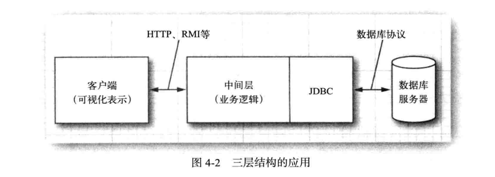

#   数据库编程

SQL是关系数据库的业界标准

试试连接：books.coreVolume.s2s4.TestDB

----

##  JDBC的设计

数据库供应商支持Java提供一套数据库访问的标准网络协议，希望Java为SQL访问提供一套"纯"Java API，同时提供一个驱动管理器，以允许第三方驱动程序可以连接到特定的数据。

数据库供应商提供自己的驱动程序，并插入到驱动管理器中，在加上一套简单的机制，以使得第三方驱动程序可以向驱动管理器注册。

根据API编写的程序都可以与驱动管理器进行通信，而驱动管理器则通过驱动程序与实际的数据库进行通信

-   JDBC实现的目标
    -   通过使用标准的SQL语句，甚至是专门的SQL扩展，程序员就可以利用Java语言开发访问数据库的应用，同时还依旧遵守Java语言的相关约定
    -   数据库供应商和数据库工具开发商可以提供底层的驱动程序，以优化各自数据库产品的驱动程序。



----

##  结构化查询语言

SQL是对所有现代关系型数据库都至关重要的命令行语言，JDBC则使得我们可以通过SQL与数据库进行通信

----

##  JDBC配置
1.  安装关系数据库，使用客户端连接
2.  数据库URL：与数据库类型相关的参数，例如主机名、端口号和数据库名
    -   例如：jdbc:mysql://localhost:3306/get_over
3.  驱动程序JAR文件
4.  启动数据库
5.  注册驱动器类
    -   自动注册驱动器类
    -   使用DriverManager
6.  连接到数据库
    -   在代码中打开一个数据库连接
    -   getConnection方法返回一个Connection对象

----

##  执行SQL语句

在执行SQL命令之前，首先要创建一个Statement对象，要创建Statement对象，需要调用DriverManager.getConnection方法所获得的Connection对象，接着将要执行的SQL语句放入字符串中，调用Statement接口中的executeUpdate方法

-   DriverManager.getConnection()[获得连接]==>Connection/createStatement()[执行SQL语句对象]==>Statement
-   更改：Statement.executeUpdate()
-   查询：Statement.executeQuery()==>ResultSet
    -   next()
    -   getXxx(int/String)
-   关闭连接

每个Connection对象都可以创建一个或多个Statement对象。同一个Statement对象可以用于多个不相关的命令和查询。但是，一个Statement对象最多只能有一个打开的结果集。

----

##  执行查询操作

-   预备语句
    -   使用占位符：PreparedStatement
-   获取自动生成键
    ```
    stat.executeUpdate("insertSql", Statement.RETURN_GENERATED_KEYS);
    ResultSet rs = stat.getGeneratedKeys();
    if (rs.next()) {
        int key = rs.getInt(1);
    }
    ```

----

##  行集

得到多行记录，RowSet接口扩展自ResultSet接口，javax.sql.rowset包提供的接口，扩展自RowSet接口。

一个被缓存的行集包含了一个结果集中所有的数据。CachedRowSet是ResultSet接口的子接口，所以可以像使用结果集一样来使用被缓存的行集。

----

##  元数据

在SQL中，描述数据库或其组成部分的数据成为元数据(区别于那些存在数据库中的实际数据)。可以获得三类元数据：关于数据库的元数据、关于结果集的元数据以及关于预备语句参数的元数据

-   数据库：DatabaseMetaData meta = conn.getMetaData();
-   结果集：ResultSetMetaData meta = result.getMetaData();

----

##  事务

将一组语句构建成一个事务，当所有语句都顺利执行之后，事务可以被提交，否则，如果其中每个语句遇到错误，那么事务将被回滚，就好像没有任何语句被执行过一样。

将多个语句组合成事务的主要原因是为了确保数据库完整性。

-   批量提交

----
