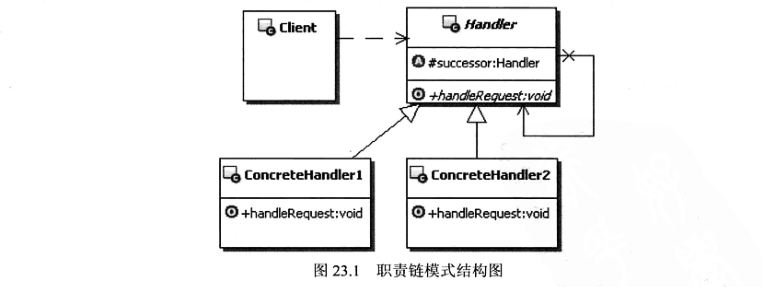

#   职责链模式

-   Handlder：定义职责的接口，通常在这里定义处理请求的方法，可以在这里实现后继链
-   ConcreteHandlder：实现职责的类，在这个类中，实现对在他职责范围内请求的处理，如果不处理，就继续转发请求给后继者
-   Client：职责链的客户端，向链上的具体处理对象提交请求，让职责链负责处理

代码：top.kaoshanji.example.books.yanm100.chain

本质：分离职责，动态组合

