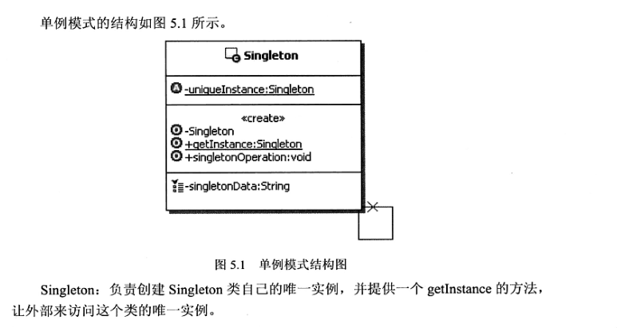

#   单例模式

本质：控制实例数目

-   应用
    -   读取配置文件
    -   缓存

##  Java的类级内部类和多线程缺省同步锁
-   什么是类级内部类
    -   简单点说，类级内部类值得是，有static修饰的成员式内部类，如果没有static修饰的成员式内部类就被称为对象级内部类
    -   类级内部类相当于其外部类的static成分，他的对象与外部类对象间不存在依赖关系，因此可直接创建，而对象级内部类的实例，是绑定在外部对象实例中的
    -   类级内部类中，可以定义静态的方法，在静态方法中只能够引用外部类中的静态成员方法或成员变量
    -   类级内部类相当于其外部类的成员，只有在第一次被使用的时候才会被装载
-   多线程缺省同步锁
    -   由静态初始化器(在静态字段上或static {}块中的初始化器)初始化数据时
    -   访问final字段时
    -   在创建线程之前创建对象时
    -   线程可以看见他将要处理的对象时

##  枚举
-   Java的枚举类型实质上是功能齐全的类，因此可以有自己的属性和方法
-   Java枚举类型的基本思想是通过公有的静态final域为每个枚举常量导出实例的类
-   从每个角度讲，枚举是单例的泛型化，本质上是单元素的枚举

