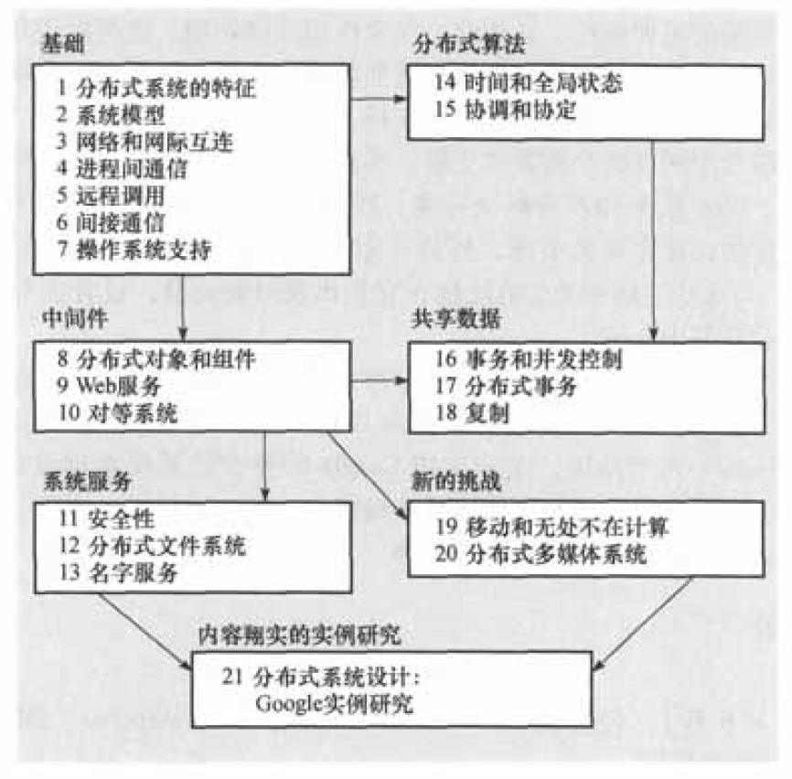

#   分布式系统：概念与设计（原书第5版）

-   作者：[英] George Coulouris，[英] Jean Dollimore，[英] Tim Kindberg，[英] Gordon Blair 
-   出版社：机工出版

5星！内容有深度、有广度，只要感兴趣很容易理解书中的内容，组织得很有调理。虽然里面的具体技术深入很有难度，但是系统性描绘，树立整体认知。

----

##  简介

提供对互联网和其他分布式系统原理的理解，提供这些系统地体系结构、算法和设计，展示他们如何满足当代分布式应用的需求。

采用自顶向下的方法，首先叙述在分布式系统设计中要解决的问题，然后，通过抽象模型、算法和对广泛使用的系统进行详细的实例研究，描述成功开发系统地方法。

----

##  导图
-   

----

##  基础
-   分布式系统地特征
-   系统模型
-   网络和网际互联
-   进程间通信
-   远程调用
-   间接通信
-   操作系统支持

----

##  中间件
-   分布式对象和组件
-   Web服务
-   对等系统

----

##  系统服务
-   安全性
-   分布式文件系统
-   名字服务

----

##  分布式算法
-   时间和全局状态
-   协调和协定

----

##  共享数据
-   事务和并发控制
-   分布式事务
-   复制

----

##  新的挑战
-   移动和无处不在计算
-   分布式多媒体系统

----

##  内容翔实的实例研究
-   分布式系统设计：Google实例研究

----
