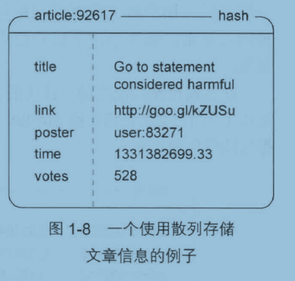
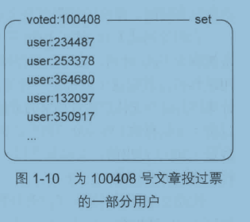
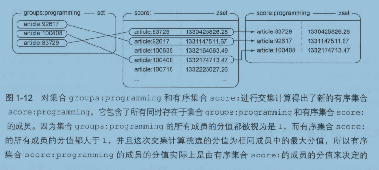

#   对文章进行投票

一篇文章获得至少200张支持票，网站就认为这篇文章是一篇有趣的文章；假如这个网站每天发布1000篇文章，而其中的50篇复合网站对有趣文章的要求，那么网站要把这50篇文章放到文章列表前100位至少一天。

##  计算评分

为了产生一个能够随着`时间流逝而不断减少`的评分，程序根据文章的发布时间和当前时间来计算文章的评分，具体的计算方法为：将文章得到的支持票数量乘以一个常量(一天的秒数/展示一天需要的票数=432)，然后加上文章的发布时间(时间戳)，得出的结果就是文章的评分。

相同的票数，晚发布的文章评分大于早发布的文章

评分=票数 * 432 + 文章发布的时间戳

----

##  存储文章

使用符号(:)构建命名空间。

-   文章基本信息

每篇文章使用一个散列存储，键是：article:id，值是文章的描述属性和值。

-   文章排序：发布时间、评分

两个有序集合：一个键是文章ID，值是文章发布时间；一个键同样是文章ID，值是文章评分

-   用户投票

一个用户对同一篇文章只能投一次票，需要为每篇文章记录一个已投票用户名单

当一篇文章发布期满一周之后，用户将不能再对他进行投票，评分将固定下来，而记录文章已经投票的用户名单的集合也会被删除。

----

##  业务：用户投票

当用户对一篇文章投票时，程序需要使用 ZSCORE 命令检查记录文章发布时间的有序集合，判断文章的发布时间是否未超过一周。

如果文章仍然处于可以投票的时间范围之内，那么程序将使用 SADD 命令，尝试将用户添加到记录文章已投票用户名单的集合里面，如果添加操作执行成功，那么说明用户是第一次对这篇文章进行投票，程序使用 ZINCRBY 命令为文章的评分增加 432分，并使用 HINCRBY 命令对散列记录的文章投票数量进行更新

----

##  业务：发布文章

创建新文章ID，通过对一个计数器执行 INCR 命令来完成

初始化 `文章已经投票用户的集合`，使用 SADD 将文章作者的ID添加进去，用 EXPIRE 命令 对这个集合设置一个过期命令，让 Redis在文章发布期满一周之后自动删除这个集合

初始化 `存储文章的相关信息`，使用 HMSET

初始化 执行`评分和发布时间`这两个有序集合，使用 ZADD 命令

----

##  业务：取出最新、评分最高的文章

使用 ZREVRANGE 命令在 记录`发布时间和评分`的两个集合里取出多个文章ID，然后再对每个文章ID执行一次 HGETALL 命令来取出文章的详细信息。

ZREVRANGE 命令，以 "分值从大到小"的排序取出

----

##  业务：对文章进行分组

群组功能由两个部分组成，一个部分负责记录文章属于哪个群组，另一部分负责取出群组里面的文章。

为了记录各个群组都保存了那些文章，网站需要为每个群组创建一个集合，并将所有同属一个群组的文章ID都记录到哪个集合里面。

为了能够根据评分对群组文章进行排序和分页，网站需要将同一个群组里面的所有文章都按照评分有序的存储到一个有序集合里面。

这个集合会随着评分变化而变化，当一篇文章属于多个群组，那么就需要同时更新多个集合，可以考虑缓存。

ZINTERSTORE 命令可以接受多个集合和多个有序集合作为输入，找出所有同时存在于集合和有序集合的成员，并以几种不同的方式来合并这些成员的分值(集合成员的分值是1)。

----
