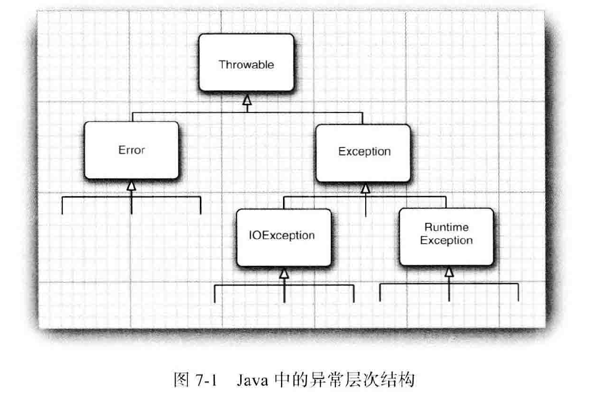
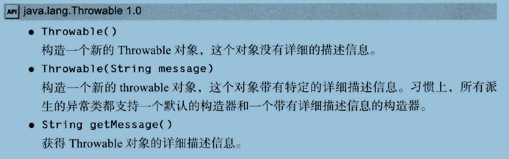
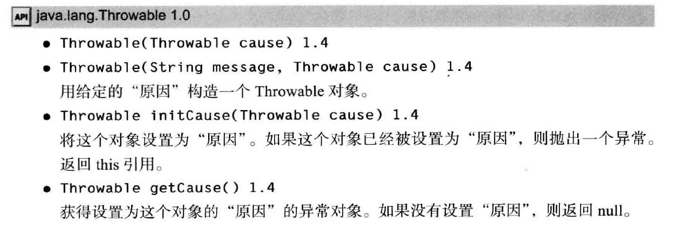
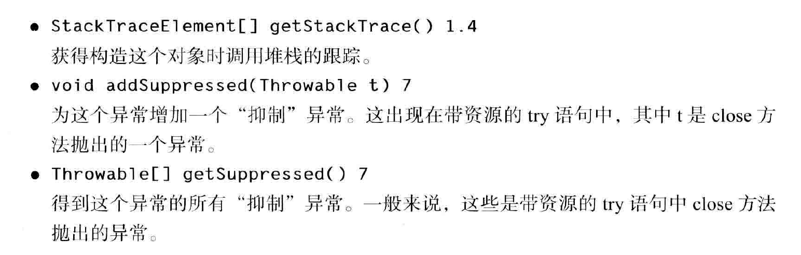
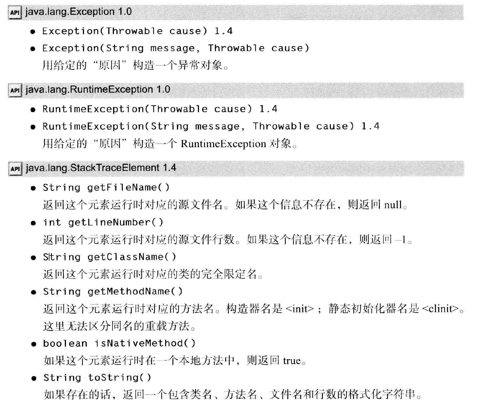

#   异常和日志

-   内容
    -   处理错误
    -   捕获异常
    -   使用异常机制的技巧
    -   使用断言
    -   记录日志
    -   调试技巧

在理想状态下，用户输入数据的格式永远都是正确的，选择打开的文件也一定存在，并且永远不会出现bug，但是这是理想状态下。

----

##  Java的异常

1.  处理错误

假设一个Java程序运行期间出现了一个错误，可能是由于文件包含了错误信息，或者网络连接出现问题，也可能是因为无效的数组下标，或者试图使用一个没有被赋值的对象引用而造成的。

-   用户期望出现错误时，程序应该：
    -   返回到一种安全状态，并能够让用户执行一些其他的命令
    -   允许用户保存所有的操作结果，并以妥善的方式终止程序


异常处理的任务就是将`控制权`从错误产生的地方转移给能够处理这种情况的错误处理器

-   程序中可能会出现的错误和问题
    -   用户输入错误
    -   设备错误
    -   物理限制
    -   代码错误


### 异常分类

在Java程序设计语言中，异常对象都是派生于 Throwable 类的一个实例

-   

Error类层次结构描述了Java运行时系统地内部错误和资源耗尽错误，程序不应该抛出这种类型的对象，如果出现这种内部错误，除了通知用户，并经历使程序安全终止之外，再也无能为力。

设计Java程序时，需要关注Exception层次结构，这个层次结构又分解为两个分支：由于程序错误导致的异常RuntimeException，另一分支包含其他异常，是程序本身没有问题，但是由于像I/O错误这类问题导致的异常

-   RuntimeException的异常包含下面几种情况
    -   错误的类型转换
    -   数组访问越界
    -   访问null指针
-   不是RuntimeException异常
    -   试图在文件尾部后面读取数据
    -   试图打开一个并不存在的文件
    -   根据字符串查找Class对象，但是并不存在

如果出现 RuntimeException 异常，一定是你的问题。

Java 语言规范将派生于Error 类或RuntimeException 类的所有异常称为非受查( unchecked ) 异常，所有其他的异常称为受查（ checked) 异常。

### 声明受检异常

一个方法不仅需要告诉编译器将要返回什么值，还要告诉编译器有可能发生什么错误。方法应该在其首部声明所有可能抛出的异常，这样可以从首部反映出这个方法可能抛出哪类受查异常。

-   遇到下面4种情况时应该抛出异常：
    -   调用一个抛出受检异常的方法，例如，FileInputStream构造器
    -   程序运行过程中发现错误，并且利用throw语句抛出一个受检异常
    -   程序出现错误
    -   虚拟机和运行时库出现内部错误

不需要声明Java内部错误，即从Error继承的错误，任何程序代码都具有抛出那些异常的潜能，而我们对其没有任何控制能力。

也并应该声明从 RuntimeException 继承的那些非受检异常，这些运行时错误完全在我们的控制之下，应该将更多的时间花费在修正程序中的错误上，而不是说明这些错误发生的可能性上

如果类中的一个方法声明将会抛出一个异常，而这个异常是某个特定类的实例时，则这个方法就有可能抛出一个这些类的异常，或者这个类的任意一个子类的异常。

### 如何抛出异常

在一个名为readData的方法正在读取一个首部具有下列信息的文件：
```
Content-length:1024
```

但是读到733个字符后文件结束，认为这是一种不正常的情况，希望抛出一个异常，如
```Java
String readData(Scanner in) throws EOFException
{
    while (…）
    {
        if (Mn.hasNextQ) // EOF encountered
        {
            if (n < len)
                throw new EOFExcepion();
        }
        。。。
    }
    return s;
}

```

EOFExcepion 类还有一个含有一个字符串型参数的构造器，这个构造器可以更加细致的描述异常出现的情况。

### 创建异常类

在程序中，可能会遇到任何标准异常类都没有能够充分描述清楚的问题，在这种情况下，创建自己的异常类就是一个顺理成章的事情了。

需要做的只是定义一个派生于 Excepion 的类，或者派生于 Excepion子类的类。习惯上，定义的类应该包含两个构造器，一个是默认的构造器，另一个是带有详细描述信息的构造器(超类Throwable的toString方法将会打印出这些详细信息)

```Java
class FileFormatException extends IOException
{
    public FileFormatExceptionO {}
    public FileFormatException(String gripe)
    {
    super(gripe);
    }
}
```

现在，就可以抛出自己定义的异常类型了
``` Java
String readData(Scanner in) throws FileFormatException
{
    while (…）
    {
        if (Mn.hasNextQ) // EOF encountered
        {
            if (n < len)
                throw new FileFormatException();
        }
        。。。
    }
    return s;
}
```



2.  捕获异常

抛出一个异常十分容易，只要将其抛出就不用理睬了。当然，有些代码必须捕获异常

### 捕获异常

如果某个异常发生的时候没有在任何地方进行捕获，那程序就会终止执行，并在控制台上打印出异常信息，其中包括异常的类型和堆栈的内容。

要想捕获一个异常，必须设置 try/catch 语句块。最简单的 try 语句块如下所示：
``` Java
try {
    //more code
} catch (ExceptionType e) {
    //handlerfor this type
}
```

-   如果在 try 语句块中的任何代码抛出一个在 catch 子句中说明的异常类，那么：
    -   程序将跳过 try 语句块的其余代码
    -   程序将执行 catch 子句中的处理器代码
-   如果在 try 语句块中的代码没有抛出任何异常，那么程序将跳过 catch 子句

读取数据的典型程序代码：
``` Java
public void read(String filename) {
    try {
        InputStream in = new Filei叩utStream(filename) ;
        int b;
        while ((b = in.read()3 != -1) {
            //process input
        }
    }   catch (IOException exception) {
        exception.printStackTrace();
    }
}
```

正如在Java API中看到的那样，read方法有可能抛出一个 IOException 异常，在这种情况下，将跳出整个 while 循环，进入 catch 子句，并生成一个栈轨迹，

通常，可以选择将异常传递给调用者，如果 read 方法出现了错误，就让 read 方法的调用者去操心！如果采用这种处理方式，就必须声明这个方法可能会抛出一个 IOException
```Java
public void read(String filename) throws IOException {
    InputStream in = new Filel叩utStream(filename) ;
    int b;
    while ((b = in.readO) != -1) {
        //process input
    }
}

```

捕获那些知道如何处理的异常，而将那些不知道怎么处理的异常继续进行传递。

例外：如果编写一个覆盖超类的方法，而这个方法又没有抛出异常，那么这个方法就必须捕获方法代码中出现的每一个受查异常。不允许在子类的 throws 说明符中出现超类方法所列出的异常类范围。

### 捕获多个异常

在一个 try 语句块中可以捕获多个异常类型，并对不同类型的异常做出不同的处理，可以按照下列方式为每个异常类型使用一个单独的catch子句：
``` Java
try {
    //code that might throw exceptions
} catch (FileNotFoundException e) {
    //emergencyactionfor missingfiles
} catch (UnknownHostException e) {
    //emergency actionfor unknown hosts
}   catch (IOException e) {
    //emergencyactionfor all other I/O problems
}

```

异常对象可能包含与异常本身有关的信息。要想获得对象的更多信息，可以试着使用
```Java
e.getHessage()
```

在Java SE 7 中，同一个 catch 子句中可以捕获多个异常类型。例如，假设对应缺少文件和未知主机异常的动作是一样的，就可以合并 catch 子句：
```Java
try {
    //code that might throw exceptions
} catch (FileNotFoundException | UnknownHostException e) {
    //emergency action for missing files and unknown hosts
}   catch (IOException e) {
    //emergency action for all other I/O problems
}
```
只有当你捕获的异常类型彼此之间不存在子类关系时才需要这个特性。

### 再次抛出异常与异常链

在 catch 子句中可以抛出一个异常，这样做的目的是改变异常的类型。如果开发了一个供其他程序员使用的子系统，那么，用户表示子系统故障的异常类型可能会产生多种解释。

ServletException 就是这样一个异常类型的例子，执行 servlet 的代码可能不想知道发生错误的细节原因，但系统明确的知道 servlet 是否有问题。

捕获异常并将它再次抛出的基本方法：
``` Java
try {
    //access the database
}  catch (SQLException e)  {
    throw new ServletException("database error: " + e.getMessageO) ;
}
```
这里，ServletException 用带有异常信息文本的构造器来构造。

有一种更好的处理方法，并且将原始异常设置为新异常的"原因"：
```Java
try {
    //access the database
} catch (SQLException e) {
    Throwable se = new ServletException ("database error")；
    se.ini tCause(e);
    throw se;
}
```
当捕获到异常时，就可以使用下面这条语句重新得到原始异常：
```Java
Throwable e = se.getCause();
```

这样可以让用户抛出子系统中的高级异常，而不会丢失原始异常的细节。

### finally子句

如果方法获得了一些本地资源，并且只有这个方法自己知道，又如果这些资源在退出方法之前必须被回收，那么就会产生资源回收问题。

需要在两个地方清楚所分配的资源，一个在正常的代码中，另一个在异常代码中。

Java使用 finally 子句解决这个问题。如果使用Java编写数据库程序，就需要使用同样的技术关闭与数据库的连接，当异常发生时，恰当的关闭所有数据库的连接是非常重要的。

不管是否有异常被捕获， finally 子句的代码都被执行，如下所示：
```Java
InputStream in = new FileInputStream(. . .);
try {
    // 1
    //code that might throw exceptions
    // 2
}  catch (IOException e) {
    // 3
    //show error message
    // 4
} finally {
    // 5
    in.close();
}
// 6
```

-   在上面这段代码中，有下列3中情况会执行 finally 子句：
    -   代码没有抛出异常。在这种情况下，程序首先执行 try 语句块中的全部代码，然后执行 finally 子句中的代码。随后，继续执行 try 语句块之后的第一条语句。也就是说，执行标注的 1、2、5、6
    -   抛出一个在 catch 子句中捕获的异常。在上面的示例中就是 IOException 异常。在这种情况下，程序将执行 try 语句块中的所有代码。直到发生异常为止，此时，将跳过 try 语句块中的剩余代码，转去执行与该异常匹配的 catch 子句中的代码，最后执行 finall 子句中的代码
    -   代码抛出一个异常，但这个异常不是有 catch 子句捕获的。在这种情况下，程序将执行 try 语句块中的所有语句，直到有异常被抛出为止。此时，将跳过 try 语句块中的剩余代码，然后执行 finally 子句中的语句，并将异常抛给这个方法的调用者，在这里，执行标注1、5处的语句。

try 语句可以只有 finally 子句，而没有 catch 子句，例如：
```Java
InputStream in = . .;
try {
    //code that might throw exceptions
} finally {
    in.close();
}
```

无论在 try 语句块中是否遇到异常，finally子句中的 in.close(); 语句都会被执行。当然，如果真的遇到一个异常，这个异常将会重新抛出，并且必须由另一个 catch子句捕获。

在需要关闭资源时，用这种方式使用 finally 子句是一种不错的选择。

### 带资源的 try 语句

对于以下代码模式：
```Java
// open a resource
try {
    //work with the resource
} finally {
    // close the resource
}
```

假设资源属于一个实现了 AutoCloseable 接口的类，Java SE 7 为这种代码模式提供了一种很有用的快捷方式，AutoCloseable 接口有一个方法：
``` Java
void close() throws Exception
```

带资源的 try 语句 (try-with-resources) 的最简形式为：
```Java
try (Resource res = . . .) {
    // work with res
}
```

try 块退出时，会自动调用 res.close()。例如，读取一个文件中的所有单词：
```Java
try (Scanner in = new Scanner(new FileInputStream(7usr/share/dict/words")) , "UTF-8") {
    while (in.hasNext()){
        System.out.println(in.next());
    }
}
```
这个块正常退出时，或者存在一个异常时，都会调用 in.close() 方法，就好像使用了 finally 块一样。

还可以指定多个资源，例如：
```Java
try (Scanner in = new Scanne「(new FileInputStream('7usr/share/dict/words"). "UTF-8"):
    PrintWriter out = new Pri ntWriter("out.txt")){
    while (in.hasNext()){
        out.println(in.next().toUpperCase()) ;
    }
}
```
无论这个块如何退出，in 和 out 都会关闭。

带资源的 try 语句抛出异常，在finally 里 close 方法也抛出异常，使用上面的语法，原来的异常会重新抛出，而close 方法抛出的异常会"被抑制"，这些异常将自动捕获，并由 addSuppressed 方法增加到原来的异常。

如果对这些异常感兴趣，可以调用 getSuppressed 方法，他会得到从 close 方法抛出并被抑制的异常列表。

### 分析堆栈轨迹元素

堆栈轨迹是一个方法调用过程的列表，他包含了程序执行过程中方法调用的特定位置。

可以调用 Throwable类的 printStackTrace方法访问堆栈轨迹的文本描述信息。

更灵活的方法是使用 getStackTrace方法，他会得到 StackTraceElement 对象的一个数组，可以在程序中分析这个对象数组。

StackTraceElement 类含有能获得文件名和当前执行的代码行号的方法，同时，还含有能够获得类名和方法名的方法。
```Java
Throwable t = new ThrowableO;
StackTraceElement[] frames = t.getStackTrace() ;
for (StackTraceElement frame : frames)
//analyze frame
```

静态的 Thread.getAllStackTrace方法，他可以产生所有线程的堆栈轨迹。
```Java
Map<Thread, StackTraceElement[]> map = Thread.getAl1StackTraces() ;
for (Thread t : map.keySet () ) {
    StackTraceElement[] frames = map.get(t) ;
//analyze frames
}
```

-   打印递归阶乘函数的堆栈情况：books.coreVolume.s1s7.StackTraceTest





3.  使用异常机制的技巧

-   异常处理不能代替简单的测试
-   不要过分的细化异常
-   利用异常层次结构
-   不要压制异常
-   在检测错误时，"苛刻"要比放任更好
-   不要羞于传递异常

----

##  使用断言来有选择的启用检测

4.  使用断言

在一个具有自我保护能力的过程中，断言很常用。

### 断言的概念

假设确信某个属性符合要求，并且代码的执行依赖于这个属性，例如，需要计算：double y = Math.sqrt(x);

我们确信，这里的x是一个非负数值，原因是：x是另外一个计算的结果，而这个结果不可能是负值；或者x是一个方法的参数，而这个方法要求他的调用者只能提供一个正整数。还希望进行检查，以避免让"不是一个数"的数值参与计算操作。

断言机制允许在测试期间向代码中插入一些检查语句，当代码发布时，这些插入的检测语句将会被自动的移走。

Java 语言引入了关键字 assert ，这个关键字有两种形式：

assert 条件;

或者

assert 条件 : 表达式;

这两种形式都会对条件进行检测，如果结果为 false，则抛出一个 AssertionError 异常。在第二种形式中，表达式将被传入 AssertionError 的构造器，并转换成一个消息字符串。

AssertionError 对象并不存储表达式的值，因此，不可能在以后得到他。

要想断言 x 是一个非负数值，只需要简单的使用下面这条语句：assert x >= 0;

或者将x的实际值传递给 AssertionError 对象，从而可以在后面显示出来。

assert x >= 0 : x;

### 启用和禁用断言

在默认情况下，断言会被禁用，可以在运行程序时用 -enableassertions 或-ea 选项启用：
```Java
java -enableassertions MyApp
```

也可以在某个类或整个包中使用断言，例如：
```Java
java -ea:MyClass -ea:com.mycompany.mylib. . , MyApp
```
这条命令将开启 MyClass 类以及在 com.mycompany.mylib 包和他的子包中的所有类的断言

选项 `-ea` 将开启默认包中的所有类的断言

### 使用断言完成参数检测

-   在Java语言中，给出了3中处理系统错误的机制：
    -   抛出一个异常
    -   日志
    -   使用断言

-   什么时候应该选择使用断言呢？
    -   断言失败是致命的、不可恢复的错误
    -   断言检测只用于开发和测试阶段

----

##  讨论标准的Java日志框架

-   使用日志的好处：
    -   可以很容易地取消全部日志记录，或者仅仅取消某个级别的日志，而且打开和关闭这个操作也很容易
    -   可以很简单的禁止日志记录的输出，因此，将这些日志代码留在程序中的开销很小
    -   日志记录可以被定向到不同的处理器，用于在控制台中显式，用户存储在文件中
    -   日志记录器和处理器都可以对记录进行过滤。过滤器可以根据过滤实现制定的标准丢弃那些无用的记录项
    -   日志记录可以采用不同的方式格式化，例如，纯文本或XML
    -   应用程序可以使用多个日志记录器，他们使用类似包名的这种具有层次结构的名字
    -   在默认情况下，日志系统地配置有配置文件控制，如果需要的话，应用程序可以替换这个配置

### 基本日志

要生成简单的日志记录，可以使用全局日志记录器并调用其 info 方法：
```Java
Logger.getClobal 0,info("File->Open menu item selected");
```

在默认情况下，这条记录将会显示以下内容：
```Java
May 10, 2013 10:12:15 PM LogginglmageViewer fileOpen
INFO: File->0pen menu item selected
```

但是，如果在适当的地方(如main开始)调用：
```Java
Logger.getClobal () .setLevel (Level .OFF) ;
```

将会取消所有的日志。

### 高级日志

在一个专业的程序中，不要将所有的日志都记录到一个全局日志记录中，而是可以自定义日志记录器。

可以调用 getLogger 方法创建或获取记录器：
```Java
private static final Logger myLogger = Logger.getLogger("com.mycompany.myapp") :
```

与包名类似，日志记录器也具有层次结构。日志记录器的父与子之间将共享某些属性。例如，如果对 com.mycompany 日志记录器设置了日志级别，他的字记录器也会继承这个级别。

记录日志的常见用途是就那些不可预料的异常，可以使用下面两个方法提供日志记录中包含的异常描述内容。
```Java
void throwing(St ring className, String methodName , Throwable t)
void log(Level 1 , String message, Throwable t)
```

典型的用法是：
```Java
if (…）{
    IOException exception = new IOException(". . .")；
    1ogger.throwing("com•mycompany.mylib.Reader" , "read", exception) ;
    throw exception;
}
```

### 修改日志管理器配置

可以同修编辑配置文件来修改日志系统地各种属性，在默认情况下，配置文件存在于：jre/lib/1ogging.properties

要想使用另一个配置文件，就要将 java.utiUogging.config.file 特性设置为配置文件的存储位置，并用下列命令启动应用程序。

### 处理器

在默认情况下，日志记录器将记录发送到 ConsoleHandler 中，并由他输出到 System.err 流中。特别是，日志记录器还会将记录发送到父处理器中，而最终的处理器有一个 ConsoleHandler。

与日志记录器一样，处理器也有日志记录级别，对于一个要被记录的日志记录，他的日志记录级别必须高于日志记录器和处理器的阈值。日志管理器配置文件设置的默认控制台处理器的日志记录级别为：
```Java
java.uti1.1ogging.ConsoleHandler.level =INF0
```

要想将日志记录发送到其他地方，就要添加其他处理器。日志API为此提供了两个很有用的处理器，一个是 FileHandler ，另一个是 SocketHandler 。SocketHandler将记录发送到特定的主机和端口，FileHandler 可以收集文件中的记录。

可以像下面这样直接将记录发送到默认文件的处理器：
```Java
FileHandler handler = new FileHandlerO ;
1ogger.addHandl er(handler) ;
```

这些记录被发送到用户主目录的 javan.log文件中，n是文件名的唯一编号。

### 过滤器

在默认情况下，过滤器根据日志记录的级别进行过滤，每个日志记录器和处理器都可以有一个可选的过滤器来完成附加的过滤。另外，可以通过实现 Filter 接口并定义下列方法来自定义过滤器。

### 格式化器

ConsoleHandler 类和 FileHandler 类可以生成文本和XML格式的日志记录，但是，也可以自定义格式，这需要扩展 Formatter类并覆盖下面这个方法：
```
String format(LogRecord record)
```

### 日志记录说明

总结一些最常用的操作。

-   为一个简单的应用程序，选择一个日志记录器，并把日志记录器命名为与主应用程序包一样的名字，例如：com.mycompany.myprog，这是一个好的编程习惯
-   默认的日志配置将级别等于或高于 INFO 级别的所有信息记录到控制台。用户可以覆盖默认的配置文件
-   最好只将程序用户有意义的消息设置为这几个级别

----