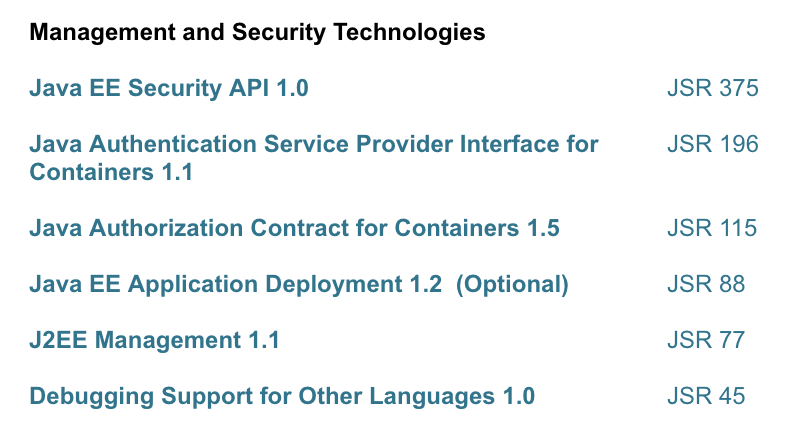

#   Java EE 入门实践

##  内容
-    
-   
-   
-   
-   

##  具体部分
-   web 应用
-   企业应用
-   web服务
-   管理与安全
-   基于Java SE
-   [Servlet](servlet.md)
-   [Jaxrs](jaxrs.md)
-   [JTA](jta.md)
-   [JSON-B](jsonb.md)
-   [Bean Validation](beanv.md)

----