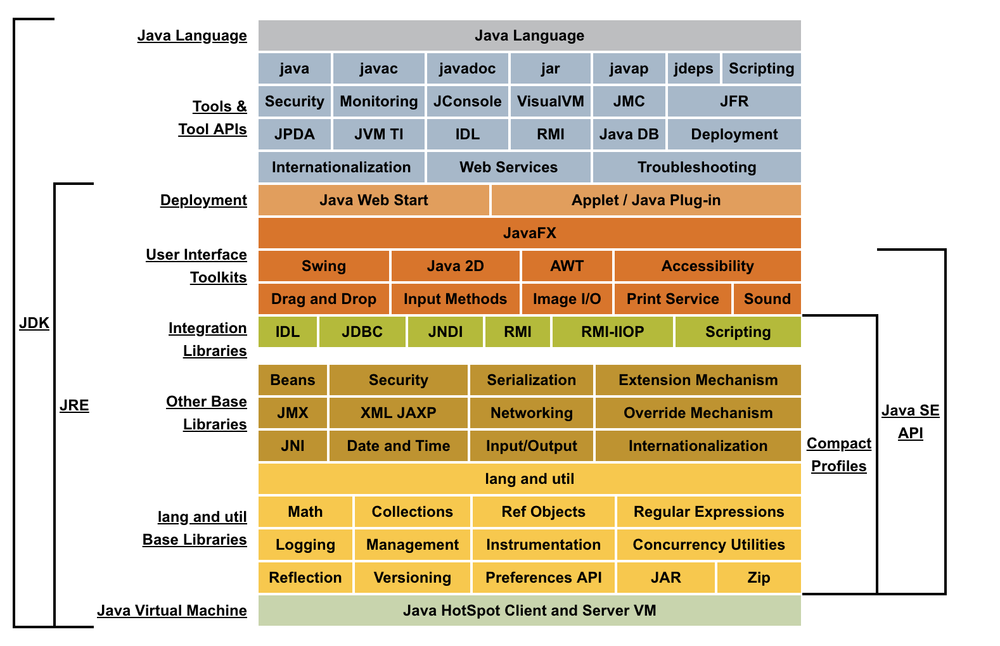

#   Java SE

##  导图

>   java version "1.8.0_151"

>   Java(TM) SE Runtime Environment (build 1.8.0_151-b12)

>   Java HotSpot(TM) 64-Bit Server VM (build 25.151-b12, mixed mode)

-   [大纲](000.md)
-   

##  资料
-   [GitHub](https://github.com/topics/java)
-   [入门实践](action/README.md)
    -   版本：8
    -   [官网](https://www.oracle.com/technetwork/java/javase/overview/index.html)
    -   [文档](action/doc/README.md)
    -   [Java核心技术(第10版)](action/corejava/README.md)
    -   [深入理解Java7核心技术与最佳实践](action/java70814/README.md)
    -   [Java8实战](action/java80814/README.md)
    -   [Java技术手册](action/nutshell0814/README.md)
    -   [Java程序员修炼之道](action/developer0814/README.md)
    -   [Java网络编程(第四版)](action/network40814/README.md)
    -   [Java编程的逻辑](action/logic0814/README.md)
    -   [Java语言程序设计(基础篇 原书第10版)(机工出版)](action/Introduction0814/README.md)
-   [经验分享](experience/REAMDE.md)
    -   [Java编程思想](experience/thinking0814/README.md)
    -   [Java特种兵](experience/forces0814/README.md)
    -   [Java语言规范:基于Java SE8](experience/language80814/README.md)
    -   [Effective-Java](experience/Effective0814/README.md)
    -   [Java性能权威指南](experience/javaperformance/README.md)
-   备注
    -   [Java SE 首页](http://www.oracle.com/technetwork/java/javase/overview/index.html)
    -   [Java SE 概览](http://www.oracle.com/technetwork/cn/java/javase/overview/index.html)
    -   [Java SE 技术](http://www.oracle.com/technetwork/java/javase/tech/index.html)
    -   [Java™ 8 教程](https://docs.oracle.com/javase/tutorial/index.html)
    -   [在线文档](https://docs.oracle.com/javase/8/)
    -   [Tutorials](https://docs.oracle.com/javase/tutorial/tutorialLearningPaths.html)
    -   [API](https://docs.oracle.com/javase/8/docs/api/)
    -   [Java™ 平台概述](https://docs.oracle.com/javase/8/docs/technotes/guides/index.html)
    -   [Java语言和虚拟机规范](https://docs.oracle.com/javase/specs/)
    -   [Java语言环境](http://www.oracle.com/technetwork/java/langenv-140151.html)
    -   [Java™ 8 自述文件](http://www.oracle.com/technetwork/java/javase/jdk-8-readme-2095712.html)
    -   [Java编程新手中心](http://www.oracle.com/technetwork/cn/topics/newtojava/overview/index.html)

----