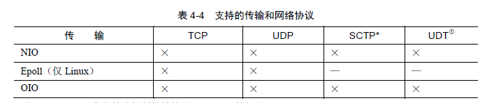

#   Netty 入门实践

##   目录
-   [官网](https://netty.io/)
-   Netty实战(来源)
-   Netty权威指南

----

## 理论
-   Java阻塞和非阻塞
-   异步通信和事件驱动

## 核心组件

### Channel

Channel 抽象了 Socket

代表一个到实体(如一个文件、一个网络套接字)的开放连接，如读操作和写操作。

可以把 Channel 看作是传入(入站)或者传出(出站)数据的载体，因此可以被打开或被关闭，连接或者断开连接。

基本的 I/O 操作(bind()、connect()、read()和write())依赖于底层网络传输所提供的原语。

Channel 所提供的 API，大大降低了直接使用 Socket 类的复杂性，也拥有许多预定义的、专门话实现的广泛类层次结构的根：

-   EmbeddedChannel
-   LocalServerChannel
-   NioDatagramChannel
-   NioSctpChannel
-   NioSocketChannel

-   生命周期
    -   Channel 已经被创建，但还未注册到一个 EventLoop
    -   Channel 已经被注册到了 EventLoop
    -   Channel 处于活动状态(已经连接到他的远程节点)，现在可以接收和发生数据了
    -   Channel 没有连接到远程节点

### 回调/事件

一个回调其实就是一个方法，一个指向已经被提供给另外一个方法的方法引用，这使得后者可以在适当的时候调用前者，是一种在操作完成后通知相关方常见方式。

Netty在内部使用回调来处理事件，当一个回调被触发时，相关的事件可以被一个 ChannelHandler 接口的实现处理。

回调事件里处理的就是逻辑， ChannelHandler 代表着自定义业务逻辑。

Netty 使用不同的事件来通知我们状态的改变或者是操作的状态。这使得我们能够基于已经发生的事件来触发适当的动作，这些动作可能是：

-   记录日志
-   数据转换
-   流控制
-   应用程序逻辑

Netty 是一个网络编程框架，所以事件是按照他们与入站或出站数据流的相关性进行分类，可能由入站数据或相关的状态更改而触发的事件包括：

-   连接已被激活或连接失活
-   数据读取
-   用户事件
-   错误事件

出站事件是未来将会触发的某个动作的操作结果，这些动作包括：

-   打开或关闭到远程节点的连接
-   将数据写到或者冲刷到套接字

每个事件都可以将被分发给 ChannelHandler 类中的某个用户实现的方法，这是个事件驱动范式直接转换为应用程序构件块的例子。

可以认为每个 ChannelHandler 的实例都类似于一种为了响应特定事件而被执行的回调。

### Future

Future 提供了另一种在操作完成时通知应用程序的方式。这个对象可以看作是一个异步操作结果的占位符，他将在未来的某个时刻完成，并提供对其结果的访问。

Netty在JDK之外提供了自己的实现：ChannelFuture，用于在执行异步操作的时候使用。

ChannelFuture 提供了几种额外的方法，这些方法使得我们能够注册一个或多个 ChannelFutureListener 实例。监听器的回调方法 operationComplete()，将会在对应的操作完成时被调用。

ChannelFutureListener 提供的通知机制消除了手动检查对应的操作是否完成的必要。

每个 Netty 的出站 I/O 操作都将返回一个 ChannelFuture。

ChannelFuture 抽象了 异步通知。

在 Netty 中所有的 I/O 操作都是异步地，一个操作可能不会立即返回，就需要一种用于在之后的某个时间点确定其结果的方法。为此提供了 ChannelFuture 接口，其 addListener() 方法注册了一个 ChannelFutureListener 以便在某个操作完成时(无论是否成功)得到通知。

### 关联在一起

1.  Future、回调和 ChannelHandler

Netty 的异步编程模型是建立在 Future 和回调的概念之上，而将事件派发到 ChannelHandler 的方法则发生在更深的层次上。

拦截操作以及高速的转换入站数据和出站数据，都只需提供回调或者利用操作所返回的 Future。

2.  选择器、事件和 EventLoop

Netty 通过触发事件将 Selector 从应用程序中抽象出来，消除了所有本来需要手动编写的派发代码。

在内部，将会为每个 Channel 分配一个 EventLoop，用以处理所有事件，包括：

-   注册感兴趣的事件
-   将事件派发给 ChannelHandler
-   安排进一步的动作

EventLoop 本身只由一个线程驱动，其处理了一个 Channel 生命周期中的所有 I/O 事件，并且在该 EventLoop 的整个生命周期内部都不会改变。

EventLoop 抽象了 控制流、多线程处理、并发。

-   对象之间的关系
    -   一个 EventLoopGroup 包含一个或者多个 EventLoop
    -   一个 Channel 在他的生命周期内只注册于一个 EventLoop
    -   一个 EventLoop 在他的生命周期内只和一个 Thread 绑定
    -   所有由 EventLoop 处理的 I/O 事件都将在他专有的 Thread 上被处理
    -   一个 EventLoop 可能会被分配给一个或多个 Channel
-   EventLoopGroup 一对多 EventLoop
-   EventLoop 一对多 Channel
-   EventLoop 一对一 Thread
-   Channel(s) -> EventLoop -> Thread

一个给定的 Channel 的I/O操作都是由相同的 Thread 执行的，就消除了对同步的需求。

----

##  组件和设计

### ChannelHandler 和 ChannelPipeline、ChannelHandlerContext

ChannelHandler 充当了所有处理入站和出站数据的应用程序逻辑的容器，他的方法是由网络事件触发。

ChannelHandler 可用于几乎任何类型的动作，例如将数据从一种格式转换为另一种格式，或者处理转换过程中抛出的异常。

使得事件流经 ChannelPipeline 是 ChannelHandler 的工作，他们是在应用程序的初始化或引导阶段被安装的。

ChannelPipeline 提供了 ChannelHandler 链的容器，并定义了用于在该链上传播入站和出站事件流的API。当 Channel 被创建时，他会被自动得分配到他专属的 ChannelPipeline。

当 ChannelHandler 被添加到 ChannelPipeline 时，他将会被分配一个 ChannelHandlerContext ，其代表了 ChannelHandler 和 ChannelPipeline 之间的绑定。

-   ChannelHandler 生命周期
    -   把 ChannelHandler 添加到了 ChannelPipeline
    -   把 ChannelHandler 移除 ChannelPipeline
    -   当处理过程中在 ChannelPipeline 中有异常时
-   ChannelHandler 重要的子接口
    -   ChannelInboundHandler：处理入站数据以及各种状态变化
    -   ChannelOutboundHandler：处理出站数据并且允许拦截所有的操作

ChannelPipeline 的 API 公开了用于调用入站和出站操作的附加方法。

### ByteBuf

Netty 的字节容器

-   堆缓冲区
-   直接缓冲区
-   复合缓冲区

### 编解码器

将字节序列从一种格式转换为另一种格式，比如将一个非结构化的字节流转换为一个特定于协议的布局结构，或者相反。

从传输层接收到的数据是无序的字节，需要按照约定的规范转换成可以被处理的格式，HTTP协议代表了一种数据格式。

通过Netty 发送或者接收一个消息的时候，就将会发生一次数据转换

### 引导

为应用程序的网络层配置提供了容器

-   Bootstrap：连接到远程主机和端口
-   ServerBootstrap：绑定到一个本地端口

### 测试

----

##  网络协议和传输

### 内置的传输

-   网络传输
    -   NIO：非阻塞I/O
    -   Epoll：Linux的本地非阻塞传输
    -   OIO：旧的阻塞I/O
    -   Local：JVM内部通信
-   

### HTTP

### WebSocket

### UDP广播事件

### HTTP

----

##  EventLoop 和 线程模型

EventLoop 用于处理连接的生命周期中所发生的事件，控制流、多线程处理、并发。

----

##  案例

----

