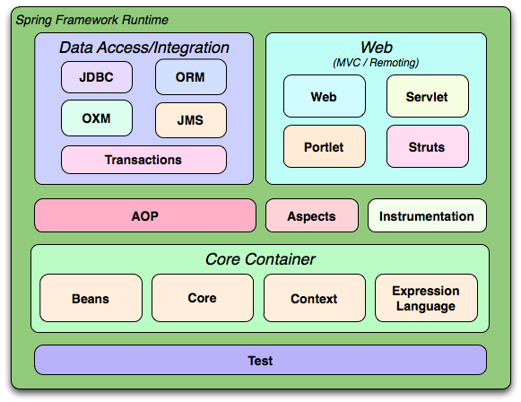

#   Spring Framework 简介

Spring Framework 是面向`应用开发`人员在实际中`开发Java项目`的综合式框架。

模块及模块关系

-   核心容器：管理对象，解耦对象，解决对象之间的依赖，自动化了对象的过程
-   Aop...：把嵌套在各处具有相识的功能集中在一起
-   数据访问/集成：抽象事务和持久层，简化固定操作流程
-   Web：一套MVC框架，屏蔽了原生语法
-   Test：各种测试支持

##  版本
-   源码版本
    -   3.2.19.BUILD-SNAPSHOT
    -   Java SE 7 
    -   Servlet 3 

##  参考资料
-   Spring Framework 文档
-   《Spring源码深度解析》- 郝佳
-   《Spring技术内幕：深入解析Spring架构与设计原理(第2版)》-  计文柯
-   《Spring框架高级编程》- Rod Johnson
