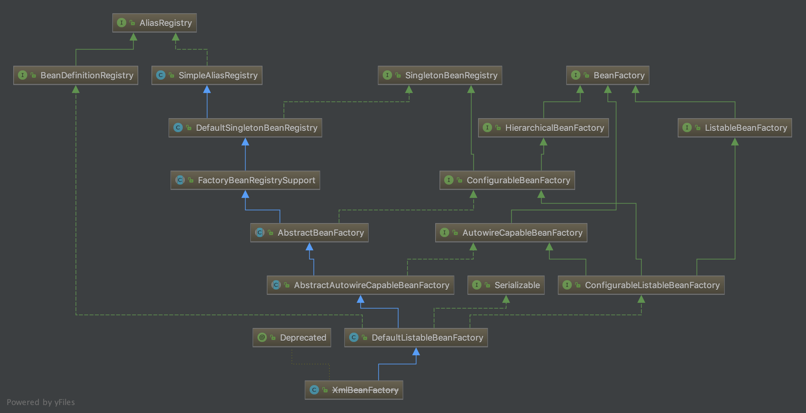

#   概述

## 示例代码

```Java
package top.kaoshanji.example.core.xmlBeanFactory;

import org.springframework.beans.factory.BeanFactory;
import org.springframework.beans.factory.xml.XmlBeanFactory;
import org.springframework.core.io.ClassPathResource;

/**
 * 感受一下全手动
 * 基本容器：XmlBeanFactory
 * kaoshanji create by 2018/5/16 10:40
 */
public class ApplicationXml {

    public static void main(String[] args) {

        // 数据准备
        BeanFactory beanFactory = new XmlBeanFactory(new ClassPathResource("xmlBeanFactory.xml"));

        // 逻辑处理
        XmlMessagePrinter messagePrinter =  (XmlMessagePrinter)beanFactory.getBean("xmlMessagePrinter");
        messagePrinter.printMessage();

    }
}
```

##  源码

故事从这里开始。。

一次执行上述代码的过程。

```Java

public class XmlBeanFactory extends DefaultListableBeanFactory {

	// bean 获取信息、注册信息对象 勾结在一起
	// 一开始就在一起
	private final XmlBeanDefinitionReader reader = new XmlBeanDefinitionReader(this);

	public XmlBeanFactory(Resource resource) throws BeansException {
		// 看到的是这个，对外暴露足够简单
		// Resource 是资源抽象
		this(resource, null);
	}

	public XmlBeanFactory(Resource resource, BeanFactory parentBeanFactory) throws BeansException {
		// 在 AbstractAutowireCapableBeanFactory 构造器中处理逻辑
		super(parentBeanFactory);
		// 资源加载的真正实现
		this.reader.loadBeanDefinitions(resource);
	}

}

```

来张镇图(使用IDEA导出)，也可以导出有方法。



右边的大多都是接口，左边层次实现，从上往下，逐渐具体。

方法命名特点，一个`真正`干活的函数其实是以 do 开头的，比如： doGetObjectFromFactoryBean ，而给我们错觉的函数，比如： getObjectFromFactoryBean ，其实只是从全局角度去做些统筹的工作。

在`真正`逻辑实现前后留有处理函数，就是所谓前置、后置方法，这就是可扩展。

##  主要接口
-   BeanFactory
    -   默认实现：DefaultListableBeanFactory
    -   定义如何访问容器内管理的Bean的方法
-   BeanDefinitionReader
    -   默认实现：XmlBeanDefinitionReader
    -   将相应的配置文件内容读取并映射到BeanDefinition
    -   将映射后的BeanDefinition注册到一个BeanDefinitionRegistry
    -   转换配置文件为 BeanDefinition
-   BeanDefinitionRegistry
    -   默认实现：DefaultSingletonBeanRegistry
    -   完成Bean的注册和加载
    -   一堆的map，可见是保存bean的地方
-   BeanDefinition
    -   保存对象的所有必要信息，包括其对应的对象的class类型、是否是抽象类、构造方法参数以及其他属性等

----


