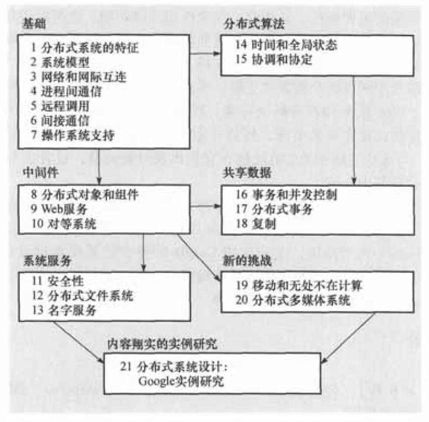

#   分布式系统：概念与设计

全面介绍互联网及其他常用分布式系统地原理、体系结构、算法和设计。

采用自顶向下的方法，首先叙述在分布式系统设计中要解决的问题，然后，通过抽象模型、算法和对广泛使用的系统进行详细的实例研究，描述成功开发系统地方法。

-   作者：[英] George Coulouris，[英] Jean Dollimore，[英] Tim Kindberg，[英] Gordon Blair 
-   出版社：机工出版

5星！内容有深度、有广度，只要感兴趣很容易理解书中的内容，组织得很有调理。虽然里面的具体技术深入很有难度，但是系统性描绘，树立整体认知。

很学术性，对分布式有些实际感觉再看效果比较好

分布式入门，爬虫是个路径，特别是Python

----

##  简介

提供对互联网和其他分布式系统原理的理解，提供这些系统地体系结构、算法和设计，展示他们如何满足当代分布式应用的需求。

采用自顶向下的方法，首先叙述在分布式系统设计中要解决的问题，然后，通过抽象模型、算法和对广泛使用的系统进行详细的实例研究，描述成功开发系统地方法。

----

##  导图
-   

##  目录

-   [基础](001.md)
-   [中间件](002.md)
-   [系统服务](003.md)
-   [分布式算法](004.md)
-   [共享数据](005.md)
-   [新的挑战](006.md)
-   [内容翔实的实例研究](007.md)

