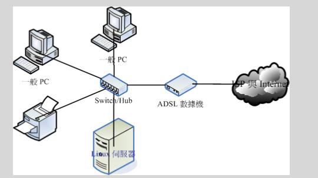
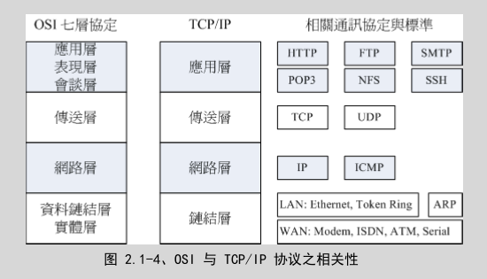

#  网络概述

服务器上面的网络服务都是用来达成某项因特网的通讯协议，以提供相对应的服务

##  网络是个什么玩意儿

### 什么是网络

网络就是几部计算机主机或者是网络打印机之类的接口设备， 透过网络线或者是无线网络的技术，将这些主机与设备连接起来， 使得数据可以透过网络媒体(网络线以及其他网络卡等硬件)来传输的一种方式

Internet 就是使用 TCP/IP 的网络连接技术所串联起来的一个网络世界

最成功的网络是以太网络 (Ethernet) 与 Internet，因为这两者都被『标准』所支持的缘故

早期的 Linux 为了要连接上 Internet ，Linux团队就自己撰写出 TCP/IP 的程序代码， 透过RFC (Request For Comments, 注 4) 的形式发布标准文件的标准依据

### 计算机网络组成组件
-   硬件
-   
-   节点 (node)：节点主要是具有网络地址 (IP) 的设备之称，因此上面图示中的一般 PC、Linux 服务器、ADSL调制解调器与网络打印机等，个别都可以称为一个 node！那中间那个集线器 (hub) 是不是节点呢？因为他不具有 IP ，因此 hub 不是节点。
-   服务器主机 (server)：就网络联机的方向来说，提供数据以『响应』给用户的主机，都可以被称为是一部服务器
-   工作站 (workstation) 或客户端 (client)：任何可以在计算机网络输入的设备都可以是工作站，若以联机发起的方向来说，主动发起联机去『要求』数据的，就可以称为是客户端 (client)
-   网络卡 (Network Interface Card, NIC)：内建或者是外插在主机上面的一个设备，主要提供网络联机的卡片，目前大都使用具有 RJ-45 接头的以太网络卡。一般 node 上都具有一个以上的网络卡，以达成网络联机的功能
-   网络接口：利用软件设计出来的网络接口，主要在提供网络地址 (IP) 的任务。一张网卡至少可以搭配一个以上的网络接口；而每部主机内部其实也都拥有一个内部的网络接口，那就是 loopback (lo) 这个循环测试接口
-   网络形态或拓朴 (topology)：各个节点在网络上面的链接方式，一般讲的是物理连接方式。 举例来说，上图中显示的是一种被称为星形联机 (star) 的方式，主要是透过一个中间连接设备， 以放射状的方式连接各个节点的一种形态，这就是一种拓朴
-   网关 (route) 或通讯闸 (gateway)：具有两个以上的网络接口，可以连接两个以上不同的网段的设备，例如 IP 分享器就是一个常见的网关设备。那上面的 ADSL 调制解调器不算网关

### 计算机网络区域范围
-   局域网络 (Local Area Network, LAN)
    -   节点之间的传输距离较近，例如一栋大楼内，或一个学校的校区内。网络速度较快，联机质量较佳且可靠，因此可应用于科学运算的丛集式系统、 分布式系统、云端负荷分担系统等
-   广域网(Wide Area Network, WAN)
    -   传输距离较远，例如城市与城市之间的距离，因此使用的联机媒体需要较为便宜的设。网络应用方面大多为类似 email, FTP, WWW 浏览等

### 计算机网络协议： OSI 七层协定

各个节点之间是如何沟通讯息的呢？ 其实就是透过标准的通讯协议

将整个网络连接过程分成数个阶层 (layer)，每个阶层都有特别的独立的功能， 而且每个阶层的程序代码可以独立撰写，因为每个阶层之间的功能并不会互相干扰的

应用程序将数据放入第七层的包裹，再将第七层的包裹放到第六层的包裹内， 依序一直放到第一层的最大的包裹内，然后传送出去给接收端。接收端的主机就得由第一个包裹开始，依序将每个包裹拆开，然后一个一个交给对应负责的阶层来视察

包裹表面都会有个重要的信息，这些信息包括有来自哪里、要去哪里、接收者是谁等等， 而包裹里面才是真正的数据。同样的，在七层协议中，每层都会有自己独特的表头数据 (header)，告知对方这里面的信息是什么， 而真正的数据就附在后头

|分层|负责内容|
|----|------|
|Layer 1 物理层 Physical Layer|由于网络媒体只能传送 0 与 1 这种位串，因此物理层必须定义所使用的媒体设备之电压与讯号等， 同时还必须了解数据讯框转成位串的编码方式，最后连接实体媒体并传送/接收位串|
|Layer 2 数据链结层 Data-Link Layer|这一层是比较特殊的一个阶层，因为底下是实体的定义，而上层则是软件封装的定义。因此第二层又分两个子层在进行数据的转换动作。 在偏硬件媒体部分，主要负责的是 MAC。MAC 是网络媒体所能处理的主要数据报裹，这也是最终被物理层编码成位串的数据。MAC 必须要经由通讯协议来取得媒体的使用权， 目前最常使用的则是 IEEE802.3 的以太网络协议。偏向软件的部分则是由逻辑链接层 (logical linkcontrol, LLC) 所控制，主要在多任务处理来自上层的封包数据 (packet) 并转成 MAC 的格式， 负责的工作包括讯息交换、流量控制、失误问题的处理|
|Layer 3 网络层 Network Layer|我们提及的 IP (InternetProtocol) 就是在这一层定义的。 同时也定义出计算机之间的联机建立、终止与维持等，数据封包的传输路径选择等等，因此这个层级当中最重要的除了 IP 之外，就是封包能否到达目的地的路由 (route)|
|Layer 4 传送层 Transport Layer|定义了发送端与接收端的联机技术(如 TCP, UDP技术)， 同时包括该技术的封包格式，数据封包的传送、流程的控制、传输过程的侦测检查与复原重新传送等等， 以确保各个资料封包可以正确无误的到达目的端|
|Layer 5 会谈层 Session Layer|主要定义了两个地址之间的联机信道之连接与挂断，确定网络服务建立联机的确认。此外，亦可建立应用程序之对谈、 提供其他加强型服务如网络管理、签到签退、对谈之控制等等|
|Layer 6 表现层 Presentation Layer|将来自本地端应用程序的数据格式转换(或者是重新编码)成为网络的标准格式， 然后再交给底下传送层等的协议来进行处理|
|Layer 7 应用层 Application Layer|定义应用程序如何进入此层的沟通接口，以将数据接收或传送给应用程序，最终展示给用户。|

### 计算机网络协议： TCP/IP

TCP/IP 也是使用 OSI 七层协议的观念， 所以同样具有分层的架构，只是将它简化为四层，在结构上面比较没有这么严谨，程序撰写会比较容易些

网络媒体一次传输的数据量是有限的，因此如果要被传输的数据太大时，我们在分层的包装中，就得要将数据先拆开放到不同的包裹中， 再给包裹一个序号，好让目的端的主机能够藉由这些序号再重新将数据整合回来

##  TCP/IP 的链接层相关协议

TCP/IP 最底层的链结层主要与硬件比较有关系。

##  TCP/IP 的网络层相关封包与数据

##  TCP/IP 的传输层相关封包与数据

##  其他
-   网络概述
    -   协议
    -   IP
    -   路由
    -   DNS
-   网络命令
-   网络安全
-   网络封包分析
    -   WireShark