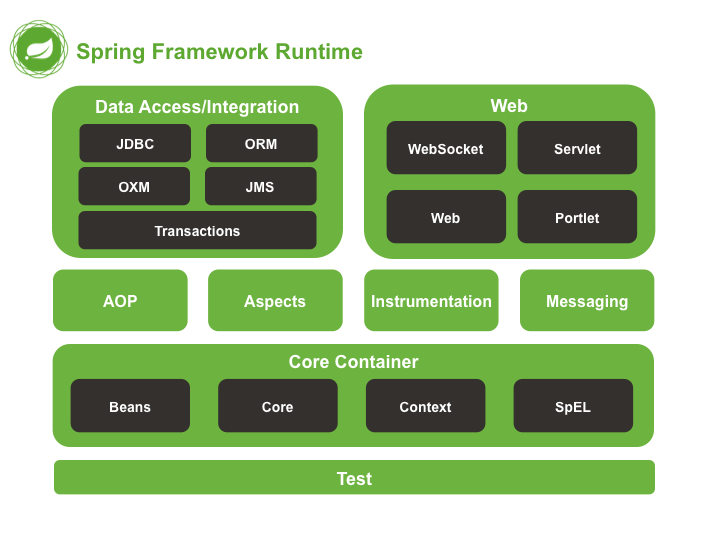
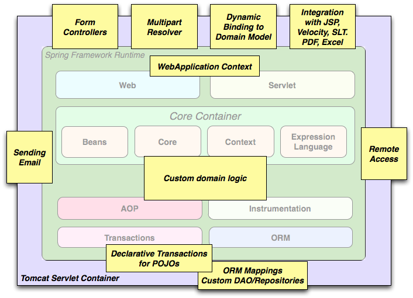

#   Spring Framework

##  版本：4.3.9.RELEASE
-   [文档](https://docs.spring.io/spring/docs/4.3.9.RELEASE/spring-framework-reference/htmlsingle/)
-   [API](https://docs.spring.io/spring/docs/4.3.9.RELEASE/javadoc-api/)

##  模块结构

Spring框架由约20个模块组成的特征组成。这些模块分为核心容器，数据访问/集成，Web，AOP（面向方面​​编程），Instrumentation，Messaging和Test，如下图所示

----

##  目录
-   [核心技术](c01.md)
-   [测试](c02.md)
-   [数据访问](c03.md)
-   [Web框架](c04.md)
-   [集成](c05.md)

----

##  典型的全面的Spring Web应用程序

Spring的声明式事务管理功能使Web应用程序完全事务化，就像使用EJB容器管理的事务一样。所有的定制业务逻辑都可以用简单的POJO来实现，并由Spring的IoC容器来管理。其他服务包括支持发送独立于Web层的电子邮件和验证，以便您选择执行验证规则的位置。Spring的ORM支持与JPA，Hibernate和JDO集成; 例如，在使用Hibernate时，您可以继续使用现有的映射文件和标准的Hibernate `SessionFactory`配置。表单控制器可以将网络层与领域模型无缝集成，从而消除了需要`ActionForms` 或将HTTP参数转换为您的域模型的值的其他类。

----

##  Spring Framework Artifacts

|GroupId|ArtifactId|描述|
|----|----|----|
|org.springframework|spring-aop|基于代理的AOP支持|
|org.springframework|spring-aspects|基于AspectJ的方面|
|org.springframework|spring-beans|Bean支持，包括Groovy|
|org.springframework|spring-context|应用程序上下文运行时，包括调度和远程抽象|
|org.springframework|spring-context-support|支持将常见第三方库集成到Spring应用程序上下文中的类|
|org.springframework|spring-core|核心实用程序，被许多其他Spring模块使用|
|org.springframework|spring-expression|Spring表达语言（SpEL）|
|org.springframework|spring-instrument|Instrumentation agent for JVM bootstrapping|
|org.springframework|spring-instrument-tomcat|Tomcat的Instrumentation代理|
|org.springframework|spring-jdbc|JDBC支持包，包括DataSource设置和JDBC访问支持|
|org.springframework|spring-jms|JMS支持包，包括用于发送/接收JMS消息的帮助类|
|org.springframework|spring-messaging|支持消息传递体系结构和协议|
|org.springframework|spring-orm|对象/关系映射，包括JPA和Hibernate支持|
|org.springframework|spring-oxm|对象/XML映射|
|org.springframework|spring-test|支持单元测试和集成测试Spring组件|
|org.springframework|spring-tx|事务基础设施，包括DAO支持和JCA集成|
|org.springframework|spring-web|基础Web支持，包括Web客户端和基于Web的远程处理|
|org.springframework|spring-webmvc|Servlet堆栈的基于HTTP的模型 - 视图 - 控制器和REST端点|
|org.springframework|spring-webmvc-portlet|MVC实现将在Portlet环境中使用|
|org.springframework|spring-websocket|WebSocket和SockJS基础架构，包括STOMP消息传递支持|

-----