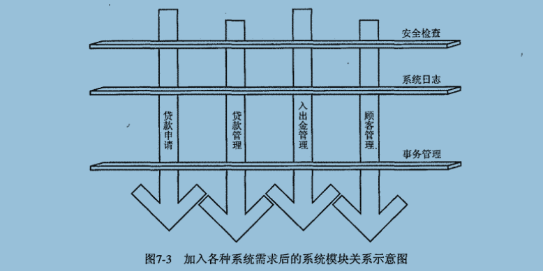
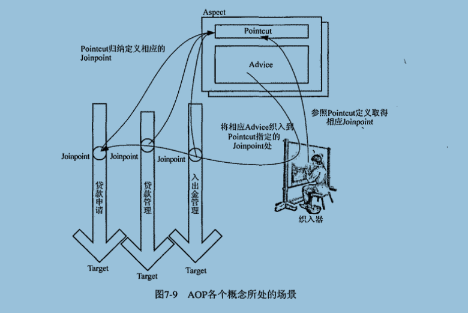

# 第7章：一起来看AOP

AOP：面向切面编程，是OOP(面向对象)的补充。

软件开发的目的，最终是为了解决各种需求，包括业务需求和系统需求。

使用面向对象方法，可以对业务需求进行很好的抽象和封装，并且使之模块化，但是不能满足系统需求。

系统需求，如日志记录、权限限制和事务等等，与业务关系不大但是不可缺少。

使用AOP可以对类似日志和权限等系统需求进行模块化的组织，这些也就是AOP里面的横切关注点。

加入各种系统需求后的系统模块关系示意图

----

##  7.3、Java平台上的AOP实现机制

- 动态代理

将`横切关注点逻辑封装到动态代理的InvocationHandler`中，然后再系统运行期间，根据横切关注点需要织入的模块位置，将横切逻辑织入到相应的代理类中。

以动态代理类为载体的横切逻辑，自然就可以与系统其它实现模块一起工作了。

唯一缺点或优点是，所有需要织入横切关注点逻辑的魔力类都得实现相应的接口，因为动态代理机制只针对接口有效。

- 动态字节码增强

JVM加载的class文件都是符合一定规范的，所以，只要交给JVM运行的文件符合Java class规范，程序的运行就没有问题。

可以使用ASM或CGLIB等Java工具库，在程序运行期间，动态构建字节码的class文件。

可以为需要织入横切逻辑的模块类在运行期间，通过动态字节码增强技术，为这些系统模块类生成相应的子类，而将横切逻辑加到这些子类中，让`应用程序在执行期间使用的是这些动态生成的子类`，从而达到将横切逻辑织入系统的目的。

- 自定义类加载器

所有的Java程序的class都要通过相应的类加载器加载到JVM之后才可以运行。

默认的类加载器会读取class字节码文件，然后按照class字节码规范，解析并加载这些class文件到JVM运行。如果能够在这个class文件加载到JVM运气期间，将横切逻辑织入到class文件的话，AOP和OOP就融合了。

可以通过自定义类加载器的方式完成横切逻辑到系统的织入，自定义类加载器通过读取外部文件规定的织入规则和必要信息，在加载class文件期间就可以将横切逻辑添加到系统模块类的现有逻辑中，然后将改动后的class交给JVM运行。

- AOL扩展

比如：AspectJ，需要重新学习一门扩展了旧有语言的AOL或全新的AOL。

##  7.4、AOP国家的公民

- Joinpoint

要就那些织入过程，需要知道在系统的那些执行点上进行织入操作，这些将要在其之上进行织入操作的系统执行点就是 Joinpoint。

常见的Joinpoint类型：方法调用、方法调用执行、构造方法调用、字段设置/获取、异常处理执行、类初始化

- Pointcut

Pointcut代表的是Joinpoint的表述方式。将横切逻辑织入当前系统的过程中，需要参照Pointcut规定的Joinpoint信息，才知道应该往系统的那些Joinpoint上织入横切逻辑

- Advice

Advice 是单一横切关注点逻辑的载体，他代表将会织入到Joinpoint的横切逻辑。

Advice具体形式：前置、后置、环绕、异常

- Aspect

Aspect是对系统中的横切关注点逻辑进行模块化封装的AOP概念实体。

通常情况下，Aspect可以包含多个Pointcut以及相关的Advice定义。

- 织入和织入器

Spring AOP使用一组类来完成最终的织入操作，ProxyFactory类则是Spring AOP中最通用的织入器。

- 目标对象

符合 Pointcut 所指定的条件，将在织入过程中被织入横切逻辑的对象，称为目标对象。

AOP各个概念所处的场景

----