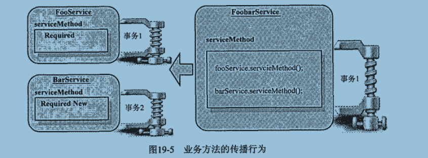
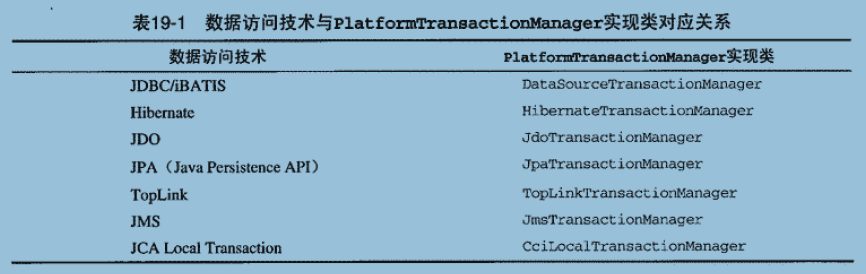

# 第19章：Spring事务王国的架构

Spring的事务框架将开发过程中事务管理相关的关注点进行适当的分离，并对这些关注点进行合理的抽象。

通过Spring的事务框架，可以按照统一的编程模型来进行事务编程，却不用关心所使用的数据访问技术以及具体要访问什么类型的事务资源。

- Spring的事务框架设计理念的基本原则是：让事务管理的关注点与数据访问关注点相分离
  - 当在业务层使用事务的抽象API进行事务界定的时候，不需要关心事务将要加诸于上的事务资源是什么，对不同的事务资源的管理将有相应的框架实现类处理
  - 当在数据访问层对可能参与事务的数据资源进行访问的时候，只需要使用相应的数据访问API进行数据访问，不需要关心当前的事务资源如何参与事务或者是否需要参与事务，这同样由事务框架类处理

业务层事务界定 --> 数据访问层事务资源 --> 事务抽象API

##  1、统一中原的过程

核心接口：`org.springframework.transaction.PlatformTransactionManager`，为应用程序提供事务界定的统一方式。

PlatformTransactionManager 是整个事务抽象策略的顶层接口，具体实施则由相应的实现类执行。

Spring的事务框架针对不同的数据访问方式以及全局事务场景，提供了相应的实现类。

在JDBC里，要使用 java.sql.Connection，可以将整个事务对应的 Connection 实例放到统一的一个地方去，无论是谁，要使用该资源，都从这个地方来获取，这样就解除了事务管理代码和数据访问代码之间通过 java.sql.Connection 的"直接"耦合。

在事务开始之前获得一个java.sql.Connection，然后将这个java.sql.Connection绑定到当前的调用线程。之后，数据访问对象在使用java.sql.Connection进行数据访问的时候，就可以从当前线程上获得这个事务开始的时候绑定的java.sql.Connection实例。

当所有的数据访问对象全部使用这个绑定到当前线程的java.sql.Connection完成了数据访问工作时，就使用这个java.sql.Connection实例提交或回滚事务，然后解除他到当前线程的绑定。

##  2、和平年代

- 界定事务边界：org.springframework.transaction.PlatformTransactionManager
- 定义事务属性：org.springframework.transaction.TransactionDefinition(隔离级别、传播行为)
- 事务开启和结束之间的状态：org.springframework.transaction.TransactionStatus

事务的传播行为表示整个事务处理过程所跨越的业务对象，将以什么样的行为参与事务。比如，当有FoobarService调用FooService和BarService两个方法的时候，FooService的业务方法和BarService的业务方法可以指定他们各自的事务传播行为。

业务方法的传播行为

FooService的业务方法的传播行为被指定为 Required，表示如果当前存在事务的话，则加入当前事务，因为FoobarService在调用FooService的业务方法的时候已经启动了一个事务，所以，FooService的业务方法会直接加入FoobarService启动的事务1中。

BarService的业务方法的传播行为被指定为 Required New，表示无论当前是否存在事务，都需要为其重新启动一个事务，所以，他使用的是自己启动的事务2。

- PROPAGATION_REQUIRES_NEW

新创建的事务是在当前外层事务内执行，但新创建的事务是独立于当前外层事务而存在，两者拥有各自独立的状态而互不干扰。

- PROPAGATION_NESTED

新创建的事务属于外层事务的内部子事务，内部子事务的处理内容属于当前外层事务的一部分，不能独立于外层事务而存在，并且与外层事务共享事务状态。

适合将一个大事务的划分为多个小事务来处理，并且外层事务可以根据各个内部嵌套事务的执行结果，来选择不同的执行流程。

数据访问技术与PlatformTransactionManager实现类对应关系

PlatformTransactionManager的各个子类在实现时，基本上遵循统一的结构和理念，可以选择以`org.springframework.jdbc.datasource.DataSourceTransactionManager`这个实现类作为切入点。

后面不懂...