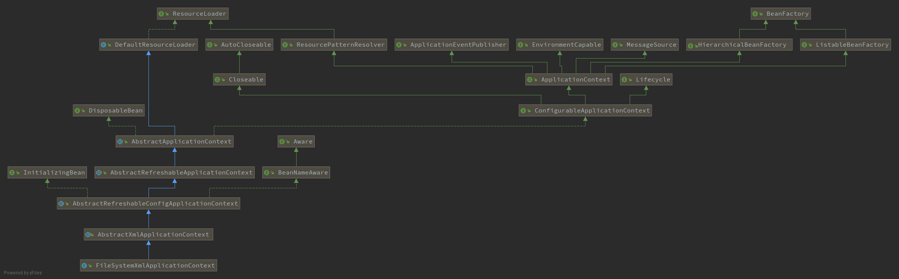

# 流程：初始化过程

示例入口类：`org.springframework.context.support.FileSystemXmlApplicationContext`

由 FileSystemXmlApplicationContext 类构造器里 `refresh()` 方法启动.

##  三步走

- BeanDifinition 的 Resource 定位

Resource定位指的是 BeanDifinition的资源定位，由 ResourceLoader 通过统一的 Resource接口完成，Resource对各种形式的 BeanDifinition 的使用都提供了统一接口。

- BeanDifinition的载入和解析

把定义好的Bean表示成IoC容器内部的数据结构，而这个容器内部的数据结构就是BeanDifinition。

BeanDifinition实际上是 POJO 对象在IoC容器中的抽象，通过BeanDifinition定义的数据结构，使IoC容器能够方便的对POJO对象也就是Bean进行管理。

- BeanDifinition的注册

通过调用 BeanDifinitionRegistry 接口的实现来完成的，把载入过程中解析得到的 BeanDifinition 向IoC容器进行注册，在IoC容器内部将 BeanDifinition 注入到一个HashMap中去，IoC容器就是通过这个 HashMap 来持有这些BeanDifinition数据的。

FileSystemXmlApplicationContext 继承实现体系

注意 `configLocations`的传递