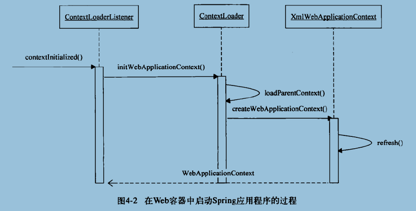
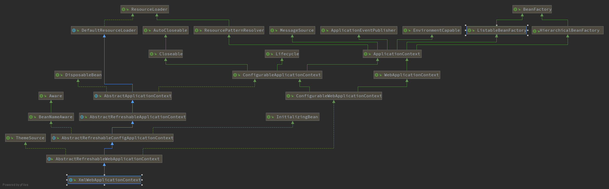

# 上下文在Web容器中的启动

##  IoC容器启动的基本过程

IoC容器的启动过程就是建立上下文的过程，该上下文是与ServletContext相伴而生的，同时也是IoC容器在Web应用环境中的具体表现之一。

由ContextLoaderListener启动的上下文为根上下文，在根上下文的基础上，还有一个与Web MVC相关的上下文用来保存控制器(DispatcherServlet)需要的MVC对象，作为根上下文的子上下文，构成一个层次化的上下文体系。

在Web容器中启动Spring应用程序时，首先建立根上下文，然后建立子上下文体系，这个子上下文体系的建立是由ContextLoader来完成。

ContextLoaderListener是Spring提供的类，是为在Web容器中建立IoC容器服务的，他实现了ServletContextListener接口，这个接口是Servlet API中定义的，提供了与Servlet生命周期结合的回调，比如contextInitialized方法和contextDestroyed方法。

而在Web容器中，建立WebApplicationContext的过程，是在contextInitialized的接口实现中完成的，具体的载入IoC容器的过程是由ContextLoaderListener的父类ContextLoader完成。

在ContextLoader中，完成了两个IoC容器建立的基本过程，一个是在Web容器中建立起双亲IoC容器，另一个是生成响应的WebApplicationContext并将其初始化。

##  Web容器中的上下文设计

为了方便在Web环境中使用IoC容器，Spring为Web应用提供了上下文的扩展接口WebApplicationContext来满足启动过程的需要。

参考：`org.springframework.web.context.support.XmlWebApplicationContext`

WebApplicationContext接口定义了一些常量和getServletContext()方法返回ServletContext就没类....

ServletContext 是当前Web容器的Servlet上下文环境，也是Web容器级别的全局环境。

XmlWebApplicationContext是从ApplicationContext继承下来的，在基本的ApplicationContext功能基础上，增加了对Web环境和XML配置定义的处理。

在`XmlWebApplicationContext的初始化过程`中，Web容器中的IoC容器被建立起来，从而在Web容器中建立起整个Spring应用。

与IoC容器的初始化一样，这个过程也有loadBeanDefinition对BeanDefinition的载入。

在Web环境中，，对定位BeanDefinition的Resource有特别的要求，这个要求的处理提现在getDefaultConfigLocations方法的处理中。

这里使用了默认的BeanDefinition的配置路径，即：`/WEB-INF/applicationContext.xml`

在XmlWebApplicationContext中，基本的上下文功能都已经通过类的继承获得，需要处理的是，如何获取Bean定义信息，就转换为如何在Web容器环境中获得Bean定义信息。

在获得Bean定义信息之后，后面的过程基本就和XmlFileSystemBeanFactory一样。

##  ContextLoader的设计与实现

对于Spring承载的Web应用而言，可以指定在Web应用程序启动时载入IoC容器(WebApplicationContext)，这个功能是由ContextLoaderListener类完成的，他是在Web容器中配置的监听器。

ContextLoaderListener通过使用ContextListener来完成实际的WebApplicationContext，也就是IoC容器的初始化工作。

这个ContextListener就像Spring应用程序在Web容器中启动器，这个启动过程是在Web容器中发生，所以需要根据Web容器部署的要求来定义ContextListener。

ContextLoaderListener监听器是启动根IoC容器并把他载入到Web容器的主要功能模块，也是整个Spring Web应用加载IoC的第一个地方。

