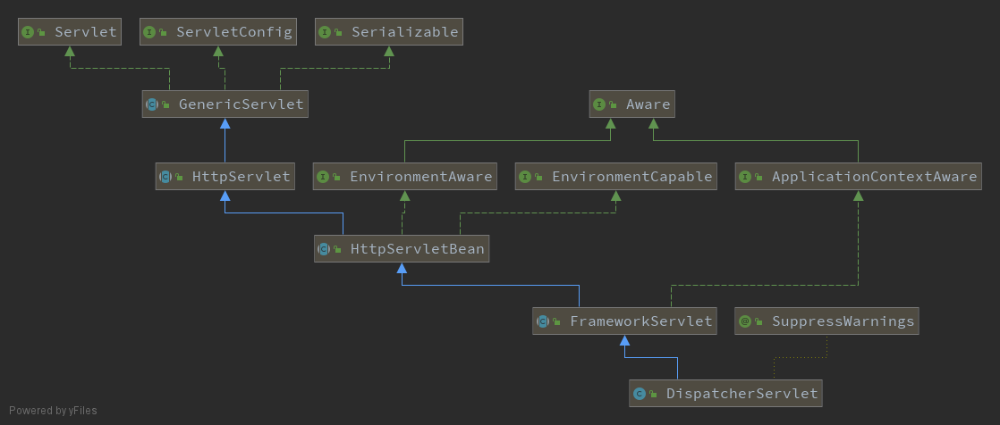

# Spring MVC 设计与实现

##  Spring MVC 的应用场景

Spring MVC 是一个MVC模式的实现。

DispatcherServlet是一个Servlet，实现的是Sun的J2EE核心模式中的前端控制器模式，作为一个前端控制器，所有的Web请求都需要通过他来处理，进行转发、匹配、数据处理后，并转由页面进行展现。

`DispatcherServlet`的设计和分析是一条主线。

在Spring MVC中，对于不同的Web请求的`映射需求`，提供了不同的HandlerMapping得实现，可以让应用开发选取不同的映射策略。

各种`Controller`的实现来供应用扩展和使用，以应对不同的控制器场景。

各种`视图`实现，比如常见的JSP视图、PDF视图等，为应用UI开发提供丰富的视图选择。

`拦截器`，允许应用对Web请求进行拦截，以及前置处理和后置处理。

`国际化`支持，提供了LocalResolver实现和接口。

##  Spring MVC 设计概览

在完成对ContextLoaderListener的初始化后，Web容器开始初始化DispatcherServlet。

DispatcherServlet会建立自己的上下文来持有Spring MVC的Bean对象，在建立这个自己持有的IoC容器时，会从ServletContext中得到根上下文作为DispatcherServlet持有上下文的双亲上下文。有了这个根上下文，再对自己持有的上下文进行初始化，最后把自己持有的这个上下文保存到ServletContext中。

这个过程是在DispatcherServlet的父类FrameworkServlet完成。

DispatcherServlet通过继承FrameworkServlet和HttpServletBean而继承HttpServlet，通过使用Servlet API来对HTTP请求进行响应，成为Spring MVC的前端处理器，同时成为MVC模块与Web容器集成的处理前端。

### DispatcherServlet的工作大致分为两部分

1.  初始化部分

由HttpServletBean#init启动，最终实现DispatcherServlet#initStrategies

2.  对HTTP请求进行响应

作为一个Servlet，Web容器会调用Servlet的doGet和doPost方法。

FrameworkServlet实现了Servlet调用方法，最终转到DispatcherServlet#doService，这个方法封装了doDispatch(request, response)，doDispatch就是Dispatcher实现MVC模式的主要部分。

##  DispatcherServlet 的启动和初始化

> DispatcherServlet 的启动和初始化的设计和实现进行详细分析。

作为Servlet，DispatcherServlet的启动与Servlet的启动过程是相联系的。在Servlet的初始化过程中，Servlet的init方法会被调用，以进行初始化。

初始化：org.springframework.web.servlet.HttpServletBean#init

在初始化过程中，一个新的上下文被建立起来，这个DispatcherServlet持有的上下文被设置为根上下文的子上下文。

根上下文是和Web应用相对应的一个上下文，而DispatcherServlet持有的上下文是和Servlet对应的一个上下文。

在一个Web应用中，往往会容纳多个Servlet存在；与此相对应，对于应用在Web容器中的上下体系，一个根上下文可以作为许多Servlet上下文的双亲上下文。

根上下文中定义的Bean是可以被各个Servlet持有的上下文得到和共享。

DispatcherServlet持有的上下文被建立起来以后，也需要和其他IoC容器一样完成初始化，这个初始化也是通过refresh方法完成的。

DispatcherServlet给这个自己持有的上下文命名，并把他设置到Web容器的上下文中，这个名称和在web.xml中设置的DispatcherServlet得Servlet名称有关。从而保证了这个上下文在Web环境上下文体系中的唯一性。

----