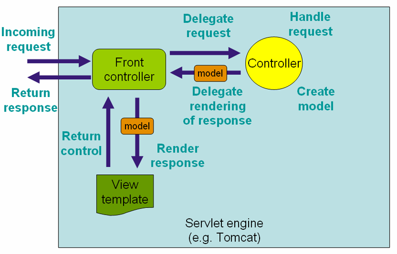
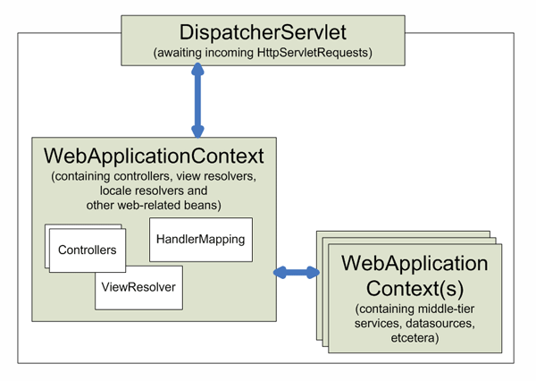

#    概述

##  运行流程

抽象的流程派。。

-   Servlet 引擎



-   Spring Web MVC 上下文



##  示例代码

出发地：webapp/WEB-INF/web.xml

```XML
<web-app>

<!-- 配置启动时参数 -->
  <context-param>
    <param-name>contextConfigLocation</param-name>
    <param-value>classpath:applicationContext.xml</param-value>
  </context-param>

  <!-- 开启spring功能 启动 Web 容器时，自动装配 ApplicationContext 的配置信息 -->
  <listener>
    <listener-class>org.springframework.web.context.ContextLoaderListener</listener-class>
  </listener>

  <!-- Spring MVC servlet -->
  <servlet>
    <servlet-name>dispatcher</servlet-name>
    <servlet-class>org.springframework.web.servlet.DispatcherServlet</servlet-class>
    <load-on-startup>1</load-on-startup>
  </servlet>
  <servlet-mapping>
    <servlet-name>dispatcher</servlet-name>
    <url-pattern>/</url-pattern>
  </servlet-mapping>

</web-app>

```

ContextLoaderListener 的作用就是启动 Web 容器时，自动装配 ApplicationContext 的配置信息。因为他实现了 ServletContextListener 这个接口，在 web.xml 配置这个监听器，启动容器时，就会默认执行他实现的方法，使用 ServletContextListener 接口，开发者可以在为客户端请求提供服务之前向 ServletContext 中添加`任意的对象`。这个对象在 ServletContext 启动的时候被`初始化`，然后在 ServletContext 整个运行期间都是可见的。

ContextLoaderListener 用于创建 WebApplicationContext 类型实例，初始化上下文。

DispatcherServlet 是一个普通的 Servlet 类，拦截了所有的请求，是真正逻辑实现的地方，处理请求响应。
