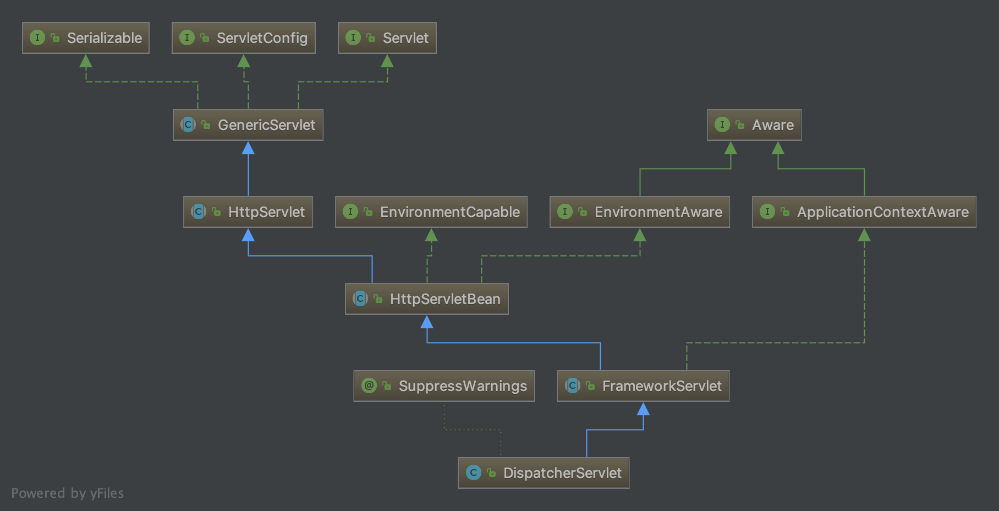

#   逻辑处理--请求响应流程

完成请求响应逻辑流程， Servlet 的自我突破。

>   出发地：org.springframework.web.servlet.DispatcherServlet

一个 Servlet 拦截了所有的请求，但是还是一个 Servlet，关注他的生命周期。

有图有真相，看到 HttpServlet 没有。。

准备跋山涉水！！

从 HttpServletBean 开始，他继承了 HttpServlet。

##  初始化

1.  HttpServletBean

Servlet 的 init 方法在这里实现了

-   封装及验证初始化参数
-   将当前 servlet 实例化转成 BeanWrapper 实例，`划重点`
-   注册相对于 Resource 的属性编辑器
-   属性注入
-   servletBean 的初始化

2.  FrameworkServlet

覆盖 `initServletBean();` 

创建或刷新 WebApplicationContext 实例并对 servlet 功能所使用的变量进行初始化。

this.webApplicationContext = initWebApplicationContext();

-   通过构造函数的注入进行初始化
-   通过 contextAttribute 进行初始化
-   重新创建 WebApplicationContext 实例

configureAndRefreshWebApplicationContext(wac) 还是来到这里。

3.  DispatcherServlet

重写 `onRefresh(wac);` 

完成 各个对象变量 初始化

##  逻辑处理

HTTP 的请求方法：POST、GET等，在 FrameworkServlet 里面实现。

各个请求方法统一交给 `processRequest(HttpServletRequest request, HttpServletResponse response)` 处理。

-   为了保证当前线程的 LocaleContext 以及 RequestAttributes 可以在当前请求后还能恢复，提取当前线程的两个属性
-   根据当前 request 创建对应的 LocaleContext 和 RequestAttributes，并绑定到当前线程
-   委托给 doService 方法进一步处理
-   请求处理结束后恢复线程到原始状态
-   请求处理结束后无论成功与否发布事件通知

doService 方法在 DispatcherServlet 里，做了些准备工作，完成请求处理过程： doDispatch

-   MultipartContext 类型的 request 处理
-   根据 request 信息寻找对应的 Handler
    -   根据 request 查找对应的 Handler
    -   加入拦截器到执行链
-   没找到对应的 Handler 的错误处理
-   根据当前 Handler 寻找对应的 HandlerAdapter
-   缓存处理
-   HandlerInterceptor 的处理
-   逻辑处理
-   异常视图的处理
-   根据视图跳转页面
    -   解析视图名称
    -   页面跳转