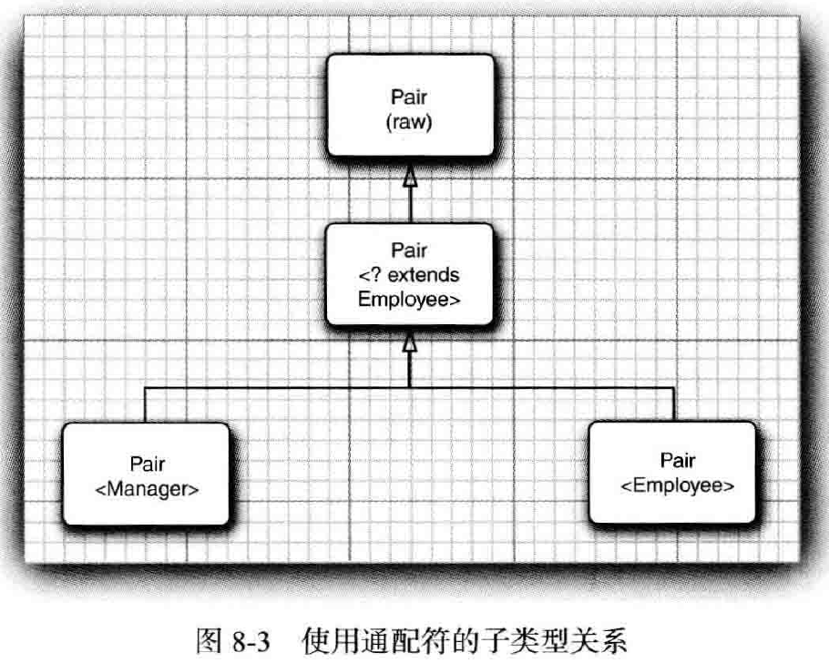

#   泛型程序设计

-   内容
    -   为什么要使用泛型程序设计
    -   定义简单泛型类
    -   泛型方法
    -   类型变量的限定
    -   泛型代码和虚拟机
    -   约束与局限性
    -   泛型类型的继承规则
    -   通配符类型
    -   反射和泛型

使用泛型机制编写的程序代码要比那些杂乱的使用 Object 变量，然后再进行强制类型转换的代码具有更好的安全性和可读性，泛型对于集合类尤其有用，例如，ArrayList就是一个无处不在的集合类。

1.  为什么要使用泛型程序设计

泛型程序设计意味着编写的代码可以被很多不同类型的对象所重用，例如，ArrayList类型可以聚集任何类型的对象，而不需要为每个类型分别编写ArrayList。

### 类型参数的好处

在Java中增加泛型类之前，泛型程序设计是用继承实现的。ArrayList类只维护一个Object引用的数组：
```Java
public class ArrayList {// before generic classes
    private Object[] elementData;
    public Object get(int i ) { . . , }
    public void add(Object o) { . . . }
}
```
这种方法有两个问题，当获取一个值时必须进行强制类型转换。
```Java
ArrayList files = new ArrayList();
String filename = (String) files.get(O);
```
这里也没有错误检查，可以向数组列表中添加任何类的对象
```Java
files.add(new File(". ."));
```

对于这个调用，编译和运行都不会出错，然而在其他地方，如果将get的结果强制类型转换为String类型，就会产生一个错误。

泛型提供了一个更好的解决方案：类型参数。ArrayList类有一个类型参数用来指示元素的类型：
```Java
ArrayList<String> files = new ArrayList<String>();
```

这使得代码具有更好的可读性，人们一看就知道这个数组列表中包含的是String对象。

编译器也可以很好的利用这个信息，当调用get的时候，并需要进行强制类型转换，编译器就知道返回值类型为String，而不是Object：
```Java
String filename = files.get(0);
```

编译器还知道ArrayList<String>中add方法有一个类型为String的参数。

类型参数的魅力在于：使得程序具有更好的可读性和安全性。

2.  定义简单泛型类

一个泛型类就是具有一个或多个类型变量的类，本章使用一个简单的 Pair 类作为例子。
```Java
public class Pair<T>    {
    private T first;
    private T second;
    public Pair() { first = null ; second = null ; }
    public PairfT first , T second) { this,first = first; this.second = second; }
    public T getFirstO { return first; }
    public T getSecondO { return second; }
    public void setFirst (T newValue) { first = newValue; }
    public void setSecond(T newValue) { second = newValue; }
}
```
Pair 类引入了一个类型变量T，用尖括号(<>)括起来，并放在类名的后面。

泛型类可以有多个类型变量，例如，可以定义 Pair 类，其中第一个域和第二个域使用不同的类型：
```Java
public class Pair<T, U> { . . . }
```
类定义中的类型变量指定方法的`返回类型`以及`域和局部变量的类型`，例如：
```Java
private T first; // uses the type variable
```

用具体的类型替换变量就可以实例化泛型类型，例如：
```Java
Pair<String>
```

可以将结果想象成带有构造器的普通类：
```Java
Pair<String>0
Pair<String>(String, String)
//和方法：
String getFirstO
String getSecond()
void setFirst (String)
void setSecond(String)
```

换句话说，泛型类可看作普通类的工厂。

-   获取数据最大和最小值：books.coreVolume.s1s08.PaitTest

3.  泛型方法

还可以定义一个带有类型参数的简单方法。
```Java
class ArrayAlg {
    public static <T> T getMiddle(T... a) {
        return a[a.length / 2];
    }
}
```

这个方法是在普通类中定义的，而不是在泛型类中定义的，然而，这是一个泛型方法，可以从尖括号和类型变量看出这一点。类型变量放在修饰符(这里是public static)的后面，返回类型的前面.

泛型方法可以定义在普通类中，也可以定义在泛型类中。

当调用一个泛型方法时，在方法名前的尖括号中放入具体的类型：
```Java
String middle = ArrayAlg.getMiddle("]ohnM, "Q.n", "Public");
```

4.  类型变量的限定

有时，类或方法需要对类型变量加以约束。例如：
```Java
class ArrayAIg {
    public static <T> T iin(T[] a) { // almost correct
        if (a null || a.length = 0) return null ;
        T smallest = a[0] ;
        for (int i = 1; i < a.length; i ++) {
            if (smallest.compareTo(a[i]) > 0) smallest = a[i] ;
        }
        return smallest;
    }
}
```

但是，这里有一个问题，变量 smallest 类型为T，这意味着他可以是任何一个类的对象，怎么才能确信 T 所属的类有 compareTo 方法呢？

解决这个问题的方案时将 T 限制为实现了 Comparable 接口的类，可以通过对类型变量 T 设置限定实现这一点：
```Java
public static <T extends Comparable> T a) T main(T[] a). . .
```

实际上 Comparable 接口本身就是一个泛型类型。

现在，泛型的 min 方法只能被实现了 Comparable 接口的类的数组调用，由于 Rectangle 类没有实现 Comparable 接口，所以调用 min 将会产生一个编译错误。

5.  泛型代码和虚拟机

虚拟机没有泛型类型对象 --- 所有对象都属于普通类。

### 类型擦除

无论何时定义一个泛型类型，都自动提供了一个相应的原始类型。原始类型的名字就是删去类型参数后的泛型类型名。擦除类型变量，并替换为限定类型(无限定的变量用Object).

例如，Pair<T>的原始类型如下所示：
```Java
public class Pair {
    private Object first;
    private Object second;
    public Pair(Object first, Object second) {
        this,first = first;
        this.second = second;
    }
    public Object getFirst() { return first; }
    public Object getSecond() { return second; }
    public void setFirst(Object newValue) { first = newValue; }
    public void setSecond(Object newValue) { second = newValue; }
}
```

因为T是一个无限定的变量，所以直接用Object替换。

在程序中可以包含不同类型的 Pair ，例如，Pair<String>或Pair<LocalDate>。而擦除类型后就变成原始的Pair类型了。

### 翻译泛型表达式

当程序调用泛型方法时，如果擦除返回类型，编译器插入强制类型转换。例如，下面这个语句序列：
```Java
Pair<Employee> buddies = . .
Employee buddy = buddies.getFirst()；
```
擦除 getFirst 的返回类型后将返回 Object 类型。编译器自动插入 Employee 的强制类型转换。也就是说，编译器把这个方法调用翻译为两条虚拟机指令：
-   对原始方法 Pair.getFirst 的调用
-   将返回的 Object 类型强制转换为 Employee 类型

当存取一个泛型域时也要插入强制类型转换。

### 翻译泛型方法

类型擦除也会出现在泛型方法中，程序员通常认为下述的泛型方法：
```Java
public static <T extends Comparable> T min(T[] a)
```
是一个完整的方法族，而擦除类型之后，只剩下一个方法：
```Java
public static Comparable min(Comparable[] a)
```
类型参数T已经被擦除了，只留下了限定类型 Comparable。

在虚拟机中，用参数类型和返回类型确定一个方法，因此，编译器可能产生两个仅返回类型不同的方法字节码，虚拟机能够正确的处理这一情况。

-   Java泛型转换的事实：
    -   虚拟机中没有泛型，只有普通的类和方法
    -   所有的类型参数都用他们的限定类型替换
    -   桥方法被合成来保持多态
    -   为保持类型安全性，必要时插入强制类型转换

6.  约束与局限性

阐述使用Java泛型时需要考虑的一些限制，这些都是由类型擦除引起的。

### 不能用基本类型实例化类型参数

不能用类型参数代替基本类型。因此，没有 Pair<double>，只有 Pair<Double>。当然，其原因是类型擦除，擦除之后，Pait 类含有Object 类型的域，而 Object 不能存储 double 值。

### 运行时类型查询只适用于原始类型

原始类型：去掉泛型的类型，如：Pair<String>的原始类型是 Pair

类型变量：泛型类型

虚拟机中的对象总有一个特定的非泛型类型。因此，所有的类型查询只产生原始类型。

例如：if (a instanceof Pair<String>) // Error

实际上仅仅测试 a 是否是任意类型的一个 Pair，下面的测试同样如此：
```Java
if (a instanceof Pair<T>) // Error
```

或强制类型转换：
```Java
Pair<String> p = (Pair<String>) a; // Warning-can only test that a is a Pair
```

getClass方法总是返回原始类型，例如：
```Java
Pair<String> stringPair = . .;
Pair<Employee> employeePair = . .;
if (stringPair.getClass() == employeePair .getClass()) // they are equal
```

其比较结果是 true。这是因为两次调用 getClass 都将返回 Pair.class。

### 不能创建参数化类型的数组

不能实例化参数化类型的数组，例如：
```Java
Pair<String>[] table = new Pair<String>[10] ; // Error
```

这有什么问题呢？擦除之后，table 的类型是 Pair[]，可以把他转换为 Object[]：
```Java
Object[] objarray = table;
```

数组会记住他的元素类型，如果试图存储其他类型的元素，就会抛出一个 ArrayStoreException 异常：
```Java
objarray[0] = "Hello"; // Error component type is Pair
```

只是不允许创建这些数组，而声明类型为 Pair<String>[] 的变量扔是合法的，不过不能用 new Pair<String>[10] 初始化这个变量。

### Varargs警告

向参数个数可变的方法传递一个泛型类型的实例。

考虑下面这个简单的方法，他的参数个数是可变的：

```Java
public static <T> void addAll(Collections coll, T... ts) {
    for (t : ts) {
        coll.add⑴；
    }
}
```

应该记得，实际上参数 ts 是一个数组，包含提供的所有实参。

现在考虑以下调用：
```Java
Col1ection<Pair<String» table = . . .;
Pair<String> pairl = . . .;
Pair<String> pair2 = . .
addAll (table, pairl, pair2);
```

为了调用这个方法，Java虚拟机必须建立一个 Pair<String> 数组，这就违反了前面的规则，不过，对于这种情况，规则有所放松，只会得到警告，而不是错误。

### 不能实例化类型变量

不能使用像 new T(...)，new T[...]或T.class 这样的表达式中的类型变量。例如，下面的 Pair<T> 构造器就是非法的：
```Java
public Pair() { first = new T(); second = new T(); } // Error
```

类型擦除将 T 改变成 Object，而且，本意肯定不希望调用 new Object()。

在Java SE 8 之后，最好的解决办法是让调用者提供一个构造器表达式，例如：
```Java
Pair<String> p = Pair.makePair(String::new);
```

makePair 方法接收一个 Supplier<T>，这是一个函数式接口，表示一个无参数而且返回类型为 T 的函数：
```Java
public static <T> Pair<T> makePair(Supplier<T> constr)  {
    return new Pair<>(constr.get(),constr.get())；
}
```

表达式 T.class 是不合法的，因为他会擦除为 Object.class。

必须像下面这样设计API以便得到一个 Class 对象：
```Java
public static <T> Pair<T> makePair(Class<T> cl) {
    try { 
        return new Pairo(d.newInstance().cl.newInstance())；
    }   catch (Exception ex) { 
        return null; 
    }
}
```

这个方法可以按照下列方式调用：
```Java
Pair<String> p = Pair.makePair(String.class);
```

Class类本身是泛型，例如，String.class 是一个 Class<String> 的实例(事实上，他是唯一的实例)，因此，makePair 方法能够推断出 pair的类型.

### 不能构造泛型数组

可以有集合泛型

### 泛型类的静态上下文中类型变量无效

不能在静态域或方法中引用类型变量，例如，下面是错误的：
```Java
public class Singleton<T> {
    private static T singlelnstance; // Error
    public static T getSinglelnstance() { // Error
        if (singleinstance == null) construct new instance of T
        return singlelnstance;
    }
}
```

### 不能抛出或捕获泛型类的实例

泛型类扩展 Throwable 是不合法的。

catch 子句中不能使用类型变量

但是，在异常规范中使用类型变量是允许的，如：
```Java
public static <T extends Throwable〉void doWork(T t) throws T { // OK
    try {
       // do work
    } catch (Throwable realCause) {
        t .initCause( realCause) ;
        throw t ;
    }
}
```

### 可以消除对受查异常的检查

Java异常处理的一个基本原则是，必须为所有受查异常提供一个处理器，不过可以利用泛型消除这个限制，关键在于以下方法：
```Java
@SuppressWamings("unchecked")
public static <T extends Throwable〉void throwAs(Throwable e) throws T  {
    throw (T) e;
}
```

通过使用泛型类、擦除和 @SuppressWamings 注解，就能消除 Java 类型系统地部分基本限制。

### 注意擦除后的冲突

当泛型类型被擦除时，无法创建引发冲突的条件。

假定像下面这样将 equals 方法添加到 Pair 类中：
```Java
public class Pair<T> {
    public boolean equals(T value) {
        return first.equals(value) && second,equals(value); 
    }
}
```
考虑一个 Pair<String>，从概念上讲，他有两个 equals 方法：
```Java
boolean equals(String) // defined in Pair<T>
boolean equals(Object) // inherited from Object
```

但是，直接把我们引入歧途，方法擦除
```Java
boolean equals(T)
```
就是
```Java
boolean equals(Object)
```

与Object.equals 方法发送冲突。

补救的办法是重新命名引发错误的方法。

泛型规范说明：`要想支持擦除的转换，就需要强行限制一个类或类型变量不能同时成为两个接口类型的子类，而这两个接口是同一接口的不同参数化。`

如下是非法：
```Java
class Employee implements Comparable<Employee> { . . . }
class Manager extends Employee implements Comparable<Manager>
{ . . . } // Error
```

Manager 会实现 Comparable<Manager> 和 Comparable<Employee>，这是同一接口的不同参数化。

7.  泛型类型的继承规则

有些不太直观的情况，如，一个类和一个子类，如 Employee 和 Manager。`Pair<Manager>` 是 `Pair<Employee>` 的一个子类吗？答案是"不是"，下面的代码编译不能成功：
```Java
Manager[] topHonchos = . .
Pair<Employee> result = ArrayAlg.minmax(topHonchos) ; // Error
```

minmax 方法返回 `Pair<Manager>`，而不是 `Pair<Employee>`，并且这样的赋值是不合法的。

无论 S 与 T 有什么关系，通常， `Pair<S> 与 Pair<T> 没有什么关系`。

泛型类可以扩展或实现其他的泛型类，就这一点而言，与普通的类没有什么区别。例如，`ArrayList<T>`类实现 `List<T>` 接口，这意味着，一个 `ArrayList<Managet>`可以被转换为一个`List<Manager>`，但是，一个 `ArrayList<Manager>`不是一个`ArrayList<Employee>`或`List<Employee>`。


8.  通配符类型

固定的泛型类型系统使用起来并没有那么令人愉快，解决方案是：通配符类型。

### 通配符概念

通配符类型中，允许类型参数变化。例如，通配符类型
```Java
Pair<? extends Employee>
```

表示任何泛型Pair类型，他的类型参数是 Employee 的子类，如 `Pair<Manager>`，但不是 `Pair<String>`。

假设要编写一个打印雇员对的方法，像这样：
```Java
public static void printBuddies(Pai<Employee> p) {
    Employee first = p.getFirst();
    Employee second = p.getSecondO;
    Systefn.out.println(first.getName() + " and " + second.getNameQ + " are buddies.");
}
```

不能将`Pair <Manager>` 传递给这个方法，但是可以使用通配符：
```Java
public static void printBuddies(Pair<? extends Employee> p)
```

类型 Pair<Manager> 是 Pair<? extends Employee> 的子类型。



使用通配符通过 `Pair<? extends Employee>` 的引用不会破坏 
```Java
Pai <Manager> managerBuddies = new Pai<>(ceo, cfo) ;
Pai <? extends Employee> wildcardBuddies = manage rBuddies; // OK
wi1dcardBuddies.setFirst(1owlyEnployee) ; // compile-time error
```

对`setFirst`的调用有一个类型错误，这样将不可能调用`setFirst`方法。

编译器只知道需要某个 Employee 的子类型，但不知道具体是什么类型，他拒绝传递任何特定的类型，毕竟 `?` 不能用来匹配。

### 通配符的超类型限定

通配符还可以指定一个超类型限定，如下所示：
```Java
? super Manager
```

这个通配符限制为 Manager 的所有超类型。

带有超类型限定的通配符的行为与上节相反，可以为方法提供参数，但不能使用返回值。

### 无限定通配符

还可以使用无限定的通配符，例如， `Pair<?>`，看起来与原始的 Pair 类型一样。实际上有很大的把不同，类型 `Pair<?>` 有以下方法：
```Java
? getFirst()
void setFirst(?)
```
getFirst的返回值只能赋给一个 Object，setFirst 方法不能被调用，甚至不能用 Object调用。

`Pair<?>` 和 Pair 本质的不同在于：可以用任意 Object 对象调用原始 Pair类的 setObject方法。

这对于许多简单的操作非常有用。

### 通配符捕获

。。。。


9.  反射和泛型

反射允许你在运行时分析任意的对象，如果对象时泛型类的实例，关于泛型类型参数则得不到太多信息，因为他们会被擦除。


### 泛型Class类

Class 类是泛型的，例如，String.class 实际上是一个 `Class<String>` 类的对象。

类型参数十分有用，因为他允许 `Class<T>` 方法的返回类型更加具有针对性，下面 `Class<T>` 中的方法就使用了类型参数：
```Java
T newInstance()
T cast(Object obj)
T[] getEnumConstants()
Class<? super T> getSuperclass()
Constructors getConstructor(Class... parameterTypes)
Constructors getDeclaredConstructor(Class... parameterTypes)
```

newInstance 方法返回一个实例，这个实例所属的类由默认的构造器获得，他的返回类型目前被声明为 T，其类型与 `Class<T>` 描述的类相同，这样就免除了类型转换。

如果给定的类型确实是 T 的一个子类型，cast 方法就会返回一个现在声明为类型 T 的对象，否则，抛出一个 BadCastException 异常。

### 使用Class参数进行类型匹配

有时，匹配泛型方法中的 Class<T> 参数的类型变量很有实用价值，例如：

``` Java
public static <T> Pair<T> makePair(Class<T> c) throws InstantiationException,IllegalAccessException {
    return new Pair<>(c.newInstance(), c.newInstance()) ;
}
```

如果调用 `makePair(Employee.class)`

Employee.class 是类型 Class<Employee> 的一个对象。makePair方法的类型参数 T 同Employee匹配，并且编译器可以推断出这个方法将返回一个 Pair<Employee>。

### 虚拟机中的泛型类型信息

Java泛型的卓越特性之一是在虚拟机中泛型类型的擦除。

这是一个泛型方法的擦除
```Java
public static <T extends Comparable? super T>>T min(T() a)
```
可以使用反射 API 来确定：
-   这个泛型方法有一个叫做T的类型参数
-   这个类型参数有一个子类型限定，其自身又是一个泛型类型
-   这个限定类型有一个通配符参数
-   这个通配符参数有一个超类型限定
-   这个泛型方法有一个泛型数组参数


为了表达泛型类型声明，使用 java.lang.reflect 包中提供的接口 Type。这个接口包含下列子类型：
-   Class类，描述具体类型
-   TypeVariable接口，描述类型变量(如 T extends Comparable<? super T>)
-   WildcardType接口，描述通配符(如 ? super T)
-   ParameterizedType接口，描述泛型类或接口类型(如 Comparable<? super T>)
-   GenericArrayType接口，描述泛型数组(如 T[])

使用泛型反射 API 打印给定类的有关内容：top.kaoshanji.example.books.coreVolume.s1s08.GenericReflectionTest

-----


