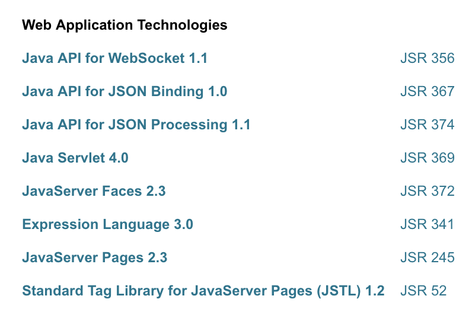

#   Java EE

Java 企业应用开发

##  内容

>   java EE 8

-    
-   
-   
-   
-   

##  资料

-   [GitHub](https://javaee.github.io/)
-   [入门实践](action/README.md)
    -   [官网](https://www.oracle.com/technetwork/java/javaee/overview/index.html)
-   文档
    -   [tutorial](https://javaee.github.io/tutorial/)
    -   [描述](https://www.oracle.com/technetwork/java/javaee/tech/index.html)
    -   [API](https://javaee.github.io/javaee-spec/javadocs/)
    -   [javaee8-samples](https://github.com/javaee-samples/javaee8-samples)
    -   [Java EE平台规范](https://github.com/javaee/javaee-spec)
    -   [Eclipse EE4J](https://projects.eclipse.org/projects/ee4j)
-   项目
    -   [Tomcat](http://tomcat.apache.org/)

##  具体部分
-   [servlet](servlet.md)
-   [jaxrs](jaxrs.md)
-   [webSocket](webSocket.md)
-   [JTA](jta.md)
-   [JSON-B](jsonb.md)
-   [Bean Validation](beanv.md)

----
