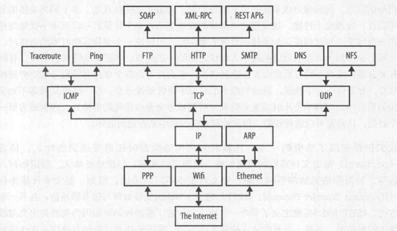
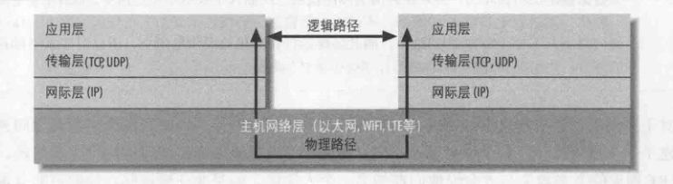
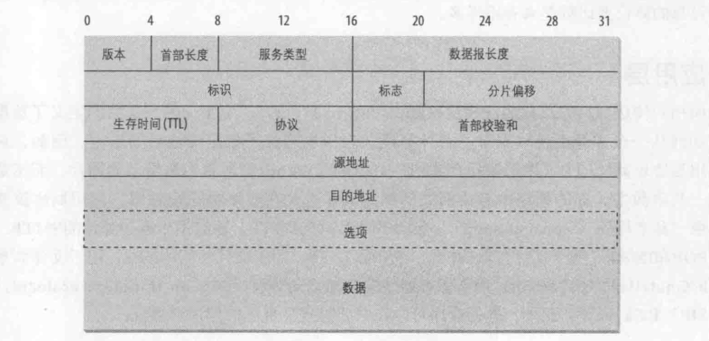

#   基础对象

##  基本网络概念

网络编程不再是专家们的研究领域，他已经成为每个开发人员工具箱中的核心部分，Java简化了网络程序的编写

-   网络
    -   网络是几乎可以实时相互发送和接收数据的计算机和其他设备的集合，通常用线缆连接，数据位转换为电磁波，通过线缆移动
    -   网络中的每台机器称为一个节点，具备完备功能的计算机节点称为`主机`
    -   每个网络`节点都有地址`，这是用于唯一标识节点的一个字节序列
    -   不同的网络会以不同的方法`分配地址`
        -   以太网地址与物理以太网硬件关联，以太网硬件的生产厂家使用预分配的厂家编码确保他们的硬件地址或与其他厂商的硬件地址不冲突
        -   Internet地址通常由负责分配地址的组织分配给计算机，一个组织允许选择的地址由该组织的Internet服务供应商(ISP)分配
        -   ISP从四个区域Internet注册机构之一获得IP地址
    -   节点可以帮助人们进行`识别名字`
        -   某一时刻一个特定的名字通常就指示一个地址，但是，名字并不与地址锁定，名字可以改变，但地址保存不变，或者类似，地址可以改变而名字保存不变，一个地址可以有多个名字，一个名字也可以指示多个不同的地址
    -   所有现代计算机网络都是`包交换(分组交换)网络`：流经网络的数据分割成小块，称为包(分组)，每个包都单独加以处理。
        -   每个包都包含了由谁发送和将发往何处的信息，将数据分成单独的带有地址的包
        -   多个即将交换的包可以在一条线缆上传输：建立网络的成本更低，多个计算机可以互不干扰地共用一条线缆
        -   分包可以进行效验，用来检测包在传输中是否遭到破坏
    -   `协议`是定义计算机如何通信的一组明确的规则：包括地址格式、数据如何分包等
        -   针对网络通信的不同方面，定义有很多不同的协议，如：超文本传输协议定义了Web浏览器如何与服务器通信
        -   IEEE 802.3标准定义了另一个协议，规定了数据位如何编码为某种特定类型线缆上的电信号
    -   开放、公开的协议标准允许不同厂家的软件和设备相互通信：Web服务器不关心客户端是UNIX工作站、Android手机还是iPad，因为所有客户端都使用相同的HTTP，与平台无关。
-   网络的分层
    -   通过网络发送数据是一项复杂的操作，必须仔细的协调网络的物理特性以及所发送数据的逻辑特征
    -   为了对应用程序开发人员和最终用户隐藏这种复杂性，网络通信的不同方面被分解为多个层。在理论上，每一层只与紧挨其上和其下的层对话，将网络分层，这样就可以修改甚至替换某一层的软件，只要层与层之间的接口保存不变，就不会影响到其他层
    -   分层模型实现了应用协议与网络硬件物理特性以及网络连接拓扑结构的解耦合
    -   网络不同层的协议
        -   
    -   网络分层
        -   
        -   应用程序如Firefox运行在应用层，只与传输层对话
        -   传输层只与应用层和网际层对话
        -   网际层则只与主机网络层和传输层对话，绝不直接与应用层对话
        -   主机网络层通过线缆、光纤或其他介质将数据移动到远程系统的主机网络层
        -   然后在通过上述各层将数据逐级上移传输到远程系统的应用层
    -   90%的情况下Java代码都将在应用层工作，只需要与传输层对话，其他10%的时间会在传输层处理，与应用层或网际层对话
    -   主机网络层的复杂性对你是隐藏的，这是分层模型的关键
-   主机网络层
    -   Java唯一真正理解的网络是基于IP的Internet，网络中隐藏的部分属于主机网络层。主机网络层定义了一个特定的网络接口(如以太网或WiFi天线)如何通过物理连接向本地网络或世界其他地方发送IP数据报
    -   主机网络层中，由连接不同计算机的硬件(线缆、光纤电缆、无线电波)组成的部分有时称为网络的物理层，Java从来都不看物理层。
    -   需要考虑主机网络层和物理层的主要原因是性能
    -   无论遇到哪一种物理链路，在这些网络上用来完成通信的API都是一样的，这是因为有`网际层`
-   网际层
    -   网络层协议定义了数据位和字节如何组织为更大的分组，称为包，还定义了寻址机制，不同计算机要按这个寻址机制查找对方
    -   网际协议(IP)是世界上使用最广泛的网络层协议，也是Java唯一理解的网络层协议
    -   实际上，这是两个协议：IPv4和IPv6，这是两个完全不同的网络协议，如果没有特殊的网关或隧道协议，即使在相同的网络上他们也无法做到互操作，不过Java隐藏了这些区别
    -   在IPv4和IPv6中，数据按包在网络层上传输，这些包称为数据报
        -   每个IPv4数据报包含一个长度为20至60字节的首部
        -   一个包含多大65 515字节数据的有效载荷
    -   IPv4数据报结构
        -   
    -   网际层的第二个作用是支持不同类型的主机网络层相互对话
-   传输层
    -   负责确保各包以发送的顺序接收，并保证没有数据丢失或破坏
    -   如果丢包，传输层会请求发送方重传这个包，为实现这个目标，IP网络会给每个数据报添加一个附加首部，其中包含有更多信息
    -   这一层主要有两个协议
        -   第一个是传输控制协议(TCP)，这是一个开销很高的协议，支持对丢失或破坏的数据进行重传，并按照发送时的顺序进行传送
        -   第二个协议是用户数据报协议(UDP)，他允许接收方检测被破坏的包，但不保证这些包以正确的顺序传送(或者包有可能根本未传递)，但是，UDP通常比TCP快
-   应用层
    -   向用户传送数据的层称为应用层，确定了数据传输后的操作
-   IP地址和域名
    -   IPv4网络中的每台计算机都有唯一的4字节地址
    -   当数据通过网络传输时，包的首部会包括要发往的机器地址(目的地址)和发送这个包的机器地址(源地址)
    -   Java不需要担心IP的内部工作原理，但必须了解寻址
    -   计算机轻松处理数字，但是人类对于记忆数字不在行，就有了域名系统(DNS)，用来将人类易于记忆的主机名(如www.oreilly.com)转换为数字Internet地址(如208.111.239.101)
    -   当Java程序访问网络时，需要同时处理数字地址和相应的主机名，这些方法由java.net.InetAddress类提供
-   端口
    -   现代计算机同时要做很多不同的事情，电子邮件需要与FTP请求分开，而FTP又要与Web业务流分开，这是通过端口实现的
    -   每台IP地址的计算机都有几千个逻辑端口，这些只是计算机内存中的抽象，不表示任何物理实际，每个端口由1到65536之间的一个数字标识。
    -   每个端口可以分配给一个特定的服务
    -   例如，Web的底层协议HTTP一般使用端口80。
        -   说Web服务器在端口80监听入站连接，当数据发送到特定IP地址的某个机器上的Web服务器时，他还会发送到该机器的特定端口
        -   接收方检查接口收到的各个包，将数据发送给监听这个端口的程序
        -   各种通信业务流就是这样区分的
-   Internet
    -   Internet是世界上最大的基于IP的网络，他是所有七个大洲多个不同国家的计算机使用IP相互对话的一个无组织的集合
    -   Internet上每台计算机都至少有一个标识此计算机的IP地址，大多数还有至少一个主机名映射到这个IP地址
-   Internet地址分块
    -   区域Internet注册机构会为Internet服务提供商(ISP)分配IPv4地址块
    -   当公司或组织要建立一个基于IP的网络连接到Internet时，他们的ISP会给他们分配一个地址块
-   网络地址转换
    -   如今大多数网络都使用了网络地址转换(NAT)，基于NAT的网络中，大多数节点只有不可路由的本地地址，这些地址可能是172.16.x.x或192.168.x.x
    -   将本地网络连接到ISP的路由器会把这些本地地址转换为更小的一组可路由的地址
    -   路由器会监视出站和入站连接，调整IP包中的地址
        -   对于出站的包，他将源地址改为路由器的外部地址
        -   对于入站的包，他将目的地址改为一个本地地址
-   防火墙
    -   位于Internet和本地网络之间的一些硬件和软件会检查所有进出的数据，以保证其合法性，这就是防火墙
    -   防火墙通常是将本地网络连接到更大的Internet的路由器的一部分，还可以完成其他任务，如网络地址转换
-   代理服务器
    -   代理服务器与防火墙有关
    -   如果说防火墙会阻止一个网络上的主机与外界直接建立连接，那么代理服务器就起到了中间人的作用
    -   如果防火墙阻止一个机器连接外部网络，这个机器可以请求本地代理服务器的Web页面，而不是直接请求远程Web服务器的Web页面
    -   然后代理服务器会请求Web服务器的页面，将响应转发给最初发出请求的机器
    -   代理还可以用于FTP服务和其他连接
    -   使用代理服务器的安全优势之一是外部主机只能看到代理服务器，而不会知道内部机器的主机名和IP地址
    -   防火墙一般工作于传输层或网际层，而代理服务器通常工作于应用层
    -   代理服务器还可以用来实现本地缓存，但是不能应对所有协议，通常已有的协议如HTTP、FTP和SMTP允许通过，而其他则不能通过
-   客户/服务器模型
    -   大多数现代网络编程都基于客户/服务器模型，应用程序一般将大量数据存储在服务器上，而程序逻辑和用户界面由客户端软件处理
    -   多数情况下，服务器主要发送数据，而客户端主要接收数据
    -   Web服务器(如Apache)响应Web客户端(如Firefox)的请求。数据存储在Web服务器上，会发送给请求数据的客户端。

----

##  流

网络程序所做的很大一部分工作都是简单的输入和输出：将数据字节从一个系统移动到另一系统，字节就是字节。在很大程度上讲，读取服务器发送给你的数据与读取文件并没有什么不同，向客户端发送文本与写文件也没什么不同。

Java的I/O建立于流之上，输入流读取数据，输出流写入数据，过滤器(filter)流可以串联到输入流或输出流上。读/写数据时，过滤器可以修改数据(加密或压缩)，或者只是提供额外的方法，将读/写的数据转换为其他格式

阅读器和书写器可以串联到输入流和输出流上，允许程序读/写文本(即字符)而不是字节。

流是同步的，当程序(线程)请求一个流读/写一段数据时，在做任何其他操作前，他要等待所读/写的数据。

-   输出流/输入流
    -   标记和重复
    -   过滤器流
    -   缓冲流
    -   阅读器和书写器
        -   过滤器阅读器和书写器
    -   PrintStream
    -   数据流
-   PrintWriter

----

##  线程

-   运行线程
    -   派生Thread
    -   实现 Runnable 接口
    -   竞态条件
    -   轮询
    -   回调
    -   Future、Callable和Executor
-   同步
    -   同步块
    -   同步方法
    -   同步的替代方式
    -   死锁
-   线程调度
    -   优先级
    -   抢占
    -   阻塞
    -   线程状态和行为
-   线程池和Executor

----

##  Internet地址

连接到Internet的设备称为节点(node)，计算机节点称为主机(host)。每个节点或主机都由至少一个唯一的数来标识，这称为Internet地址或IP地址，一堆有序序列的字节。

IP地址对于计算机很不错，但是对于人类来说是个问题，人很难记忆长的数字，为了避免到处携带记满IP地址的通讯录，Internet的设计者发明了域名系统(DNS)。DNS将人们可以记忆的主机名(如：www.kaoshanji.top)与计算机可以记忆的IP地址(如：152.11.134.143)关联在一起。服务器通常至少有一个主机名。

有些机器有多个名，例如，www.beand.com 和 xom.nu 实际上是同一台Linux主机。名 www.beand.com 实际上指示一个Web网站而不是一个特定的机器。

有时，一个名会映射到多个IP地址，这时就要由DNS服务器负责随机选择一台机器来响应各个请求，例如，www.oreilly.com实际上有两台机器，一台是208.201.211.112，一台是208.201.239.101。

每台连接到 Internet 的计算机都应当能访问一个称为域名服务器的机器，他通常是一个运行特殊DNS软件的UNIX主机，这种软件了解不同主机名和IP地址之间的映射。大多数域名服务器只知道其本地网络上主机的地址，以及其他网站中一些域名服务器的地址。如果客户端请求本地域之外的一个机器的地址，本地域名服务器就会询问远程位置的域名服务器，再将答案转发给请求者。

大多数情况下，可以使用主机名，而让DNS处理向IP地址的转换。

-   InetAddress 类

java.net.InetAddress类是Java对IP地址(包括IPV4和IPv6)的高层表示，一般讲，他包括一个主机名和一个IP地址。

-   创建新的 InetAddress 对象

InetAddress类没有公共构造函数，有一些静态工厂方法，可以连接到DNS服务器来解析主机名。
``` Java
// 最常见的形式，如查找 www.oreilly.com
InetAddress address = InetAddress.getByName("www.oreilly.com");
// 他会建立与本地DNS服务器的一个连接，来查找名字和数字地址
```

-   方法分类
    -   获取方法
    -   地址类型
    -   测试可达性

-   NetworkInterface 类

NetworkInterface 类表示一个本地IP地址，提供一些方法可以枚举所有本地地址，并由他们创建 InetAddress 对象，然后这些 InetAddress 对象可用于创建 Socket、服务器 Socket等。

使用工厂方法获取

128页

----

##  URL和URI


----