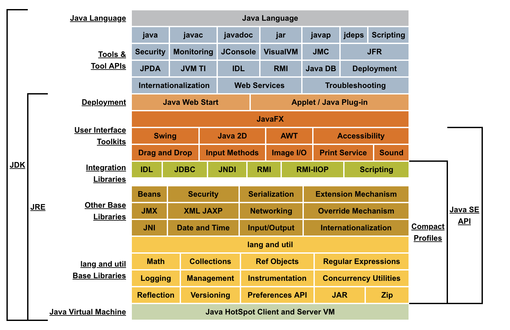

#   Java SE

Java 标准版

##  内容

>   java version "1.8.0_151"

>   Java(TM) SE Runtime Environment (build 1.8.0_151-b12)

>   Java HotSpot(TM) 64-Bit Server VM (build 25.151-b12, mixed mode)

-   

##  资料

-   [GitHub](https://github.com/topics/java)
-   [入门实践](action/README.md)
    -   [官网](https://www.oracle.com/technetwork/java/javase/overview/index.html)
    -   [官方文档](../doc/README.md)
    -   Java核心技术(10) 卷1:基础知识
    -   深入理解Java7核心技术与最佳实践
    -   Java8实战
    -   Java技术手册
    -   Java程序员修炼之道
    -   Java网络编程(第四版)
    -   Java编程的逻辑
    -   Java特种兵
    -   Java语言程序设计(基础篇 原书第10版)(机工出版)
-   [经验分享](experience/REAMDE.md)
    -   [Java编程思想](thinking0814/README.md)
    -   [Java语言规范:基于Java SE8](language80814/README.md)
    -   [Java性能权威指南](performance0814/README.md)
    -   [Effective-Java](Effective0814/README.md)
-   网站
    -   [文档](https://docs.oracle.com/javase/8/)
    -   [Tutorials](https://docs.oracle.com/javase/tutorial/tutorialLearningPaths.html)
    -   [API](https://docs.oracle.com/javase/8/docs/api/)

----
