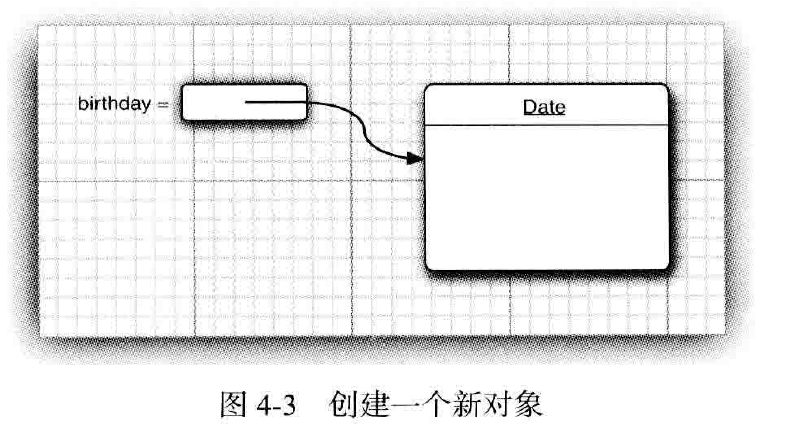
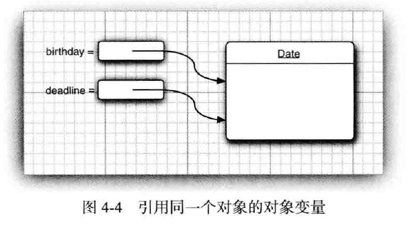

#   对象与类

-   内容
    -   面向对象程序设计概述
    -   使用预定义类
    -   用户自定义类
    -   静态域与静态方法
    -   方法参数
    -   对象构造
    -   包
    -   类路径
    -   文档注释
    -   类设计技巧

介绍面向对象两个基本成分中最重要的---封装，以及Java语言实现封装的机制，即类和方法，并给出如何完成合理的OOP设计给出忠告。

1.  面向对象程序设计概述

面向对象程序设计(OOP)是当今主流的程序设计范型，Java是完全面向对象的，必须熟悉OOP才能够编写Java程序。

面向对象的程序是由对象组成的，每个对象包含对用户公开的特定功能部分和隐藏的实现部分。程序中的很多对象来自标准库，还有一些是自定义的。

在OOP中，不必关心对象的具体实现，只要能够满足用户的需求即可。

OOP是先确定数据结构再考虑算法，适合解决规模较大的问题。

### 类

类(class)是构造对象的模板或蓝图，由类构造对象的过程称为创建类的实例。

用Java编写的所有代码都位于某个类的内部，除了标准库之外，还可以创建自己的类，以便描述应用程序所对应的问题域中的对象。

封装(数据隐藏)是与对象有关的一个重要概念，从形式上看，封装是将数据和行为组合在一个包中，并对对象的使用者隐藏了数据的实现方法。对象中的数据称为实例域，操纵数据的过程称为方法。对于每个特定的类实例(对象)都有一组特定的实例域值，这些值得集合就是这个对象的当前状态。无论何时，只要向对象发送一个消息，他的状态就有可能发生变化。

实现封装的关键在于绝对不能让类中的方法直接的访问其他类的实例域。程序仅通过对象的方法与对象数据进行交互。封装给对象赋予"黑盒"特征，这是提高重用性和可靠性的关键，这意味着一个类可以全面的改变存储数据的方式，只要仍旧使用同样的方法操作数据，其他对象就不会知道或介意所发生的变化。

OOP 可以通过扩展一个类来建立另一个新的类，在Java中所有的类都源自Object。

在扩展一个已有的类时，这个扩展后的新类具有所扩展的类的全部属性和方法。在新类中，只需提供适用于这个新类的新方法和新数据域就可以了，这种行为称为 继承。

### 对象

要想使用OOP，一定要清楚对象的三个主要特征：
-   对象的行为：可以对对象施加那些操作，或可以对对象施加那些方法?
-   对象的状态：当施加那些方法时，对象如何响应?
-   对象标识：如何辨别具有相同行为与状态的不同对象?

同一个类的所有对象实例，由于支持相同的行为而具有家族式的相似性，对象的行为是用可调用的方法定义的。

每个对象都保存着描述当前特征的信息，这就是对象的状态。对象的状态可能会随着时间而发生改变，但这种改变不会是自发的，对象状态的改变必须通过调用方法实现(如果没有那就是封装遭到破坏)。

但是，对象的状态并不能完全描述一个对象，每个对象都有一个唯一的身份，作为一个类的实例，每个对象的标识永远是不同的，状态常常也存在着差异。

### 识别类

学习OOP是从设计类开始，然后再往每个类中添加方法。

识别类的简单规则是在分析问题的过程中寻找名称，而方法对应着动词。

例如，在订单处理系统中，有这样一些名称：
-   商品(Item)
-   订单(Order)
-   送货地址(Shipping address)
-   付款(Payment)
-   账户(Account)

这些名称很可能成为类 Item、Order等。

接下来，查看动词：商品被添加到订单，订单被发送或取消，订单货款被支付，对于每一个动词如："添加"、"发送"、"取消"以及"支付"，都要标识出主要负责完成相应动作的对象。

例如，当一个新的商品添加到订单中时，那个订单对象就是被指定的对象，因为他知道如何存储商品以及如何对商品进行排序，也就是说，add应该是 Order类的一个方法，而Item对象时一个参数。

在创建类的时候，那些名称和动词完全取决于个人的开发经验。

### 类之间的关系

在类之间，最常见的关系有：
-   依赖("uses-a")
-   聚合("has-a")
-   继承("is-a")

依赖是一种最明显、最常见的关系，例如，Order类使用Account类是因为Order对象需要访问Account对象查看信用状态，但是Item类不依赖于Account类，这是因为Item对象与客户账户无关，如果一个类的方法操作另一个类的对象，就说一个类依赖于另一个类

应该尽可能的将相互依赖的类减至最少，如果类A不知道B的存在，他就不会关心B的任何改变，软件工程术语：让类之间的耦合度最小。

聚合，类A的对象包含类B的对象。比如，一个Order对象包含一些Item对象，

继承，如果类A扩展类B，类A不但包含从类B继承的方法，还会拥有一些额外的功能，比如，RushOrder类由Order类继承而来，在具有特性性的RushOrder类中包含了一些用于优先处理的特殊方法，以及一个计算运费的不同方法。

2.  使用预定义类

在Java中，没有类就无法做任何事情。

在程序中，可以使用 Math 类的方法，如 Math.random，并只需要知道方法名和参数，而不必了解他的具体实现过程，这正是封装的关键所在。

### 对象与对象变量

要想使用对象，就必须首先构造对象，并指出其初始状态，然后，对对象应用方法。

在Java程序设计语言中，使用构造器构造新实例。构造器是一种特殊的方法，用来构造并初始化对象。

在标准Java库中包含一个 Date 类，他的对象将描述一个时间点，例如："2018-12-06 21：47：22"。

构造器的名字应该与类名相同，因此 Date类的构造器名为 Date。要想构造一个 Date对象，需要在构造器前面加上 new 操作符，如下所示：
```Java
new Date()
```
这个表达式构造了一个新对象。这个对象呗初始化为当前的日期和时间。

如果需要，可以将这个对象传递给一个方法：
```Java
System.out.println(new Date());
```
或者，也可以将一个方法应用于刚刚创建的对象。Date类中有一个`toString`方法。这个方法将返回日期的字符串描述。下面的语句可以说明如何将 `toString` 方法应用于新构造的 Date对象上。
```Java
String s = new Date().toString();
```

在这两个例子中，构造的对象仅适用可一次，通常希望构造的对象可以多次适用，因此，需要将对象存放在一个变量中：
```Java
Date birthday = new Date();
```

显式了引用新构造的对象变量 birthday：



在对象与对象变量之间存在着一个重要的区别，例如，语句：
```Java
Date birthday;// 这个变量没有引用任何对象
```

定义了一个对象变量 birthday，他可以引用 Date 类型的对象，但是，但是，变量 birthday 不是一个对象，实际上也没有引用对象，此时，不能将任何 Date 方法应用于这个变量上，语句：
```Java
s = deadline.toString(); // not yet
```

将产生编译错误。

必须首先初始化变量 deadline，这里有两个选择，当然，可以用新构造的对象初始化这个变量：
```Java
deadline = new Date();
```
也让这个变量引用一个已存在的对象：
```Java
deadline = birthday;
```

现在，这两个变量引用同一个对象


一定要认识到：`一个对象变量并没有实际包含一个对象，而仅仅引用一个对象`。

在Java中，任何对象变量的值都是对存储在另外一个地方的一个对象的引用。new 操作符的返回值也是一个引用，下列语句：
```Java
Date deadline = new Date();
```

有两个部分。表达式 `new Date()` 构造了一个 Date类型的对象，并且它的值是对新创建对象的引用，这个引用存储在变量 deadline 中。

可以显式的将对象变量设置为 null，表明这个对象变量目前没有引用任何对象。
```Java
deadline = null;
...
if (deadline != null) {
    System.out.println(deadline) ;
}
```
如果将一个方法应用于一个值为null的对象上，那么就会产生运行时错误。
```Java
birthday = null;
String s = birthday.toString();
```

局部变量不会自动的初始化为 null，而必须通过调用 new 或将它们设置为 null 进行初始化。

### Java类库中的 LocalDate 类

Date类的实例有一个状态，即特定的时间点。

标准Java类库分别包含了两个类：表示时间点Date类，日历表示法LocalDate类

将时间与日历分开是一种很好的面向对象设计，通常，最好使用不同的类表示不同的概念。

使用静态工厂方法构造 LocalDate类的对象，就像下面：
```Java
LocalDate.now()
```
会构造一个新对象，表示构造这个对象时的日期。

一旦有了一个 LocalDate对象，可以用 getYear、getMonthValue和getDayOfMonth得到年、月和日：
```Java
LocalDate.of(1999, 12, 31)
int year = newYearsEve.getYear(); // 1999
int month = newYearsEve.getMonthValue(); // 12
int day = newYearsEve.getDayOfMonth(); // 31
```
LocalDate类封装了实例域来维护所设置的日期，如果不查看源代码，就不可能知道类内部的日期表示，当然，封装的意义在于，这一点并不重要，重要的是类对外提供的方法。

### 更改器方法和访问器方法

books.coreVolume.s1s04.CalendarTest

3.  用户自定义类

现在开始学习如何设计复杂应用程序所需的各种主力类，通常，这些类没有 main 方法，却有自己的实例域和实例方法，要想创建一个完整的程序，应该讲若干类组合在一起，其中只有一个类有 main方法

### Employee类

看一个非常简单的 Employee类，在编写薪金管理系统时可能会用到

books.coreVolume.s1s04.Employee

books.coreVolume.s1s04.EmployeeTest

在这个程序中，构造了一个 Employee 数组，并填入了三个雇员对象：
```Java
Employee[] staff = new Employee[3];

        staff[0] = new Employee("Carl", 75000, 1987, 12, 15);
        staff[1] = new Employee("Harry", 5000, 1989, 10, 1);
        staff[2] = new Employee("Tony", 4000, 1990, 3, 15);
```
接下来，利用 Employee 类的 raiseSalary 方法将每个雇员的薪水提高 5%：
```Java
for (Employee e : staff) {
    e.raiseSalary(5);
}
```

最后，调用 getName方法、getSalary方法和getHireDay方法将每个雇员的信息打印出来：
```Java
for (Employee e : staff) {
    System.out.println("name=" + e.getName() + ",salary=" + e.getSalary() + ",hireDay=" + e.getHireDay());
}
```

源文件名是 EmployeeTest.java，这是因为文件名必须与 public 类的名称相匹配，在一个源文件中，只能有一个公有类，但可以有任意数目的非公有类。

### 多个源文件的使用

许多程序员习惯于将每一个类存在一个单独的源文件中，例如，将Employee类放在Employee.java中，将EmployeeTest类存放在文件EmployeeTest.java中。

### 剖析 Employee 类

下面对 Employee 类进行剖析。首先从这个类的方法开始，查看源码会发现，这个类包含一个构造器和四个方法：
```Java
public Employee(String n, double s, int year , int month , int day)
public String getName()
public double getSalary()
public Local Date getHi reDay()
public void raiseSalary(double byPercent)
```
这个类的所有方法都被标记为 `public`，关键字 `public` 意味着任何类的任何方法都可以调用这些方法。

在 Employee 类的实例中有三个实例域用来存放将要操作的数据：
```Java
private String name;
private double salary;
private LocalDate hireDay;
```
关键字 private 确保只有 Employee 类自身的方法能够访问这些实例域，而其他类的方法不能够读写这些域。

### 从构造器开始

看看 Employee 类的构造器：
```Java
public Employee(String name, double salary, int year, int month, int day) {
    this.name = name;
    this.salary = salary;
    this.hireDay = LocalDate.of(year, month, day);
}
```

可以看到，构造器与类同名。在构造 Employee 类的对象时，构造器会运行，以便将实例域初始化为所希望的状态。

例如，当使用下面这条代码创建 Employee 类实例时：
```Java
new Employee("Carl", 75000, 1987, 12, 15);
```
将会把实例域设置为：
```Java
name = "Carl";
salary = 75000;
hireDay = LocalDate.of(1987, 12, 15); // Carl 12, 1987
```

构造器与其他的方法有一个重要的不同，构造器总是伴随着 new 操作符的执行被调用，而不能对一个已经存在的对象调用构造器来达到重新设置实例域的目的，例如：
```Java
janes.EmployeeCJames Bond", 250000, 1950, 1, 1) // ERROR
```
将产生编译错误。

-   需要记住：
    -   构造器与类同名
    -   每个类可以有一个以上的构造器
    -   构造器可以有0个、1个或多个参数
    -   构造器没有返回值
    -   构造器总是伴随着 new 操作一起调用

### 隐式参数与显式参数

方法用于操作对象以及存取他们的实例域。例如，方法：
```Java
public void raiseSalary(double byPercent) {
    double raise = salary * byPercent / 100;
    salary += raise;
}
```

将调用这个方法的对象的 salary 实例域设置为新值，看看下面这个调用：
```Java
number007.raiseSalary(5) ;
```

他的结果将 number007.salary 域的值增加 5%，具体的说，这个调用将执行下列指令：
```Java
double raise = nuaber007.salary * 5 / 100;
nuiber007.salary += raise;
```
raiseSalary方法有两个参数，第一个参数称为隐式参数，是出现在这个方法名前的 Employee 类对象，第二个参数位于方法名后面括号中的数值，这是一个显式参数。

可以看到，显式参数是明显地列在方法声明中的，例如 `double byPercent`，隐式参数没有出现在方法声明中。

在每个方法中，关键字this表示隐式参数，如果需要的话，可以用下列方式编写 raiseSalary 方法：
```Java
public void raiseSalary(double byPercent) {
    double raise = this.salary * byPercent / 100;
    this.salary += raise;
}
```

### 封装的优点

最后，在仔细的看一下非常简单的 getName 方法、getSalary 方法和 getHireDay 方法。
```Java
public String getName() {
    return name;
}
public double getSalary() {
    return salary;
}
public LocalDate getHireDay() {
    return hireDay;
}
```
这些都是典型的访问器方法，由于他们只返回实例域值，因此又称为域访问器。

name 是一个只读域，一旦在构造器中设置完毕，就没有任何一个办法可以对他进行修改，这样来确保 name 域 不会受到外界的破坏。

虽然 salary 不是只读域，但是他只能用 raiseSalary 方法修改，特别是一旦这个域值出现了错误，只要调试这个方法就可以了，如果 salary 域是 public 的，破坏这个域值得捣乱者有可能会出没在任何地方。

有些时候，需要获得或设置实例域的值，应该提供下面三项内容：
-   一个私有的数据域
-   一个公有的域访问器方法
-   一个公有的域更改器方法

这样的好处：

首先，可以改变内部实现，除了该类的方法之外，不会影响其他代码。

### 基于类的访问权限

方法可以访问所调用对象的私有数据，一个方法可以访问所属类的所有对象的私有数据，例如，下面看一下用来比较两个雇员的 equals 方法：
```Java
class Employee {
    public boolean equals(Employee other) {
        return name.equals(other.name) ;
    }
}
```
典型的调用方式是：`if (harry.equals(boss)) . . .`

这个方法访问 harry 的私有域，这点不会奇怪，但是，他还访问了 boss 的私有域，这是合法的，其原因是 boss 是 Employee 类对象，而 Employee 类的方法可以访问 Employee 类的任何一个对象的私有域。

### 私有方法

在实现一个类时，由于公有数据非常危险，所以应该将所有的数据域都设置为私有的，然而，方法又应该如何设计呢？有时，可能希望将一个计算代码划分成若干独立的辅助方法，通常，这些辅助方法不应该成为公有接口的一部分，这是由于他们往往与当前的实现机制非常紧密，或者需要一个特别的协议以及一个特别的调用次序，最好将这样的方法设计为 private 的。

在Java中，为了实现一个私有的方法，只需将关键字 public 改为 private 即可。

对于私有方法，可以根据需要修改或者删除，影响的访问仅仅在这个类里面，如果是公有的，则不能随意做出修改，因为不能确定影响方位，不知道那个地方调用了。

### final实例域

可以将实例域定义为 final ，构建对象时必须初始化这样的域，也就是说，必须确保在每一个构造器执行之后，这个域的值被设置，并且在后面的操作中，不能再对他进行修改。

final 修饰符大都应用于基本类型域，或不可变类的域(如果类中的每个方法都不会改变其对象，这种类就是不可变得类)

4.  静态域与静态方法

### 静态域

如果将域定义为 static，那么他属于类，而不属于任何独立的对象。

每个对象对于所有的实例域都有自己的一份拷贝。例如，假定需要给每一个雇员赋予唯一的标识码，这里给 Employee 类添加一个实例域 id 和 一个静态域 nextId：
```Java
class Employee {
    private static int nextld = 1;
    private int id;
}
```
现在，每个雇员对象都有一个自己的 id 域，但这个类的所有实例将共享一个 nextld 域。换句话说，如果有 1000 个 Employee 类的对象，则有 1000 个实例域 id，但是，只有一个静态域 nextld，即使没有一个雇员对象，静态域 nextld 也存在。

### 静态常量

静态变量使用得比较少，但静态常量却使用得比较多，例如，在Math类中定义了一个 静态常量：
```Java
public class Math {
    public static final double PI = 3.14159265358979323846;
}
```

在程序中，可以采用 Math.PI 的形式获得这个常量。

如果关键字 static 被省略，PI就变成了 Math 类的一个实例域。需要通过 Math 类的对象访问 PI，并且每一个 Math对象都有他自己的一份PI拷贝。

### 静态方法

静态方法是一种不能向对象实施操作的方法。例如，Math类的 pow方法就是一个静态方法，表达式：`Math.pow(x, a)`计算幂Xa。在运算时，并不适用任何 Math 对象，换句话说，没有隐式的参数。

Employee  类的静态方法不能访问 Id 实例域，因为他不能操作对象，但是，静态方法可以访问自身类中的静态域，下面是使用这种静态方法的一个示例：
```Java
public static int getNextld(){
    return nextld; // returns static field
}
```
可以通过类名调用这个方法：`int n = Employee.getNextld();`

这个方法可以省略关键字 static吗？答案是肯定的，但是，需要通过 Employee 类对象的引用调用这个方法。

### 工厂方法

静态方法还可以用在类似 LocalDate 和 NumberFormat 这样的类使用静态工厂方法来构造对象。

NumberFormat 类如下使用工厂方法生成不同风格的格式化对象：
```Java
NumberFormat currencyFormatter = NumberFormat.getCurrencylnstance();
NumberFormat percentFormatter = NumberFormat.getPercentlnstance()；
double x = 0.1;
System.out.println(currencyFormatter.format(x)); // prints SO.10
System.out.println(percentFomatter.format(x)); // prints 10%
```

为何 NumberFormat 类不利用构造器完成这些操作呢？主要由两个原因：
-   无法命名构造器，构造器的名字必须与类名相同，但是，这里希望将得到的货币实例和百分比实例采用不同的名字
-   当使用构造器时，无法改变所构造的对象类型。

### main方法

不需要使用对象调用静态方法，例如，不需要构造 Math 类对象就可以调用 Math.pow。

同理，main方法也是一个静态方法。
```Java
public class Application {
    public static void main(StringD args) {
        // construct objects here
    }
}
```

main 方法不对任何对象进行操作，事实上，在启动程序时还没有任何一个对象，静态的main 方法将执行并创建程序所需的对象。

5.  方法参数

了解一下在程序设计语言中有关将参数传递给方法的一些专业术语，`按值调用`表示方法接收的是调用者提供的值，而按`引用调用`表示方法接收的是调用者提供的变量地址。

一个方法可以修改`传递引用`所对应的变量值，而不能修改`传递值`调用所对应的变量值。

Java程序设计语言总是采用`按值`调用，也就是说，方法得到的是所有参数值的一个拷贝，特别是，方法不能修改传递给他的任何参数变量的内容。

请画图说明！！

-   Java中方法参数的使用情况：
    -   一个方法不能修改一个基本数据类型的参数(即数值型或布尔型)
    -   一个方法可以改变一个对象参数的状态
    -   一个方法不能让对象参数引用一个新的对象

books.coreVolume.s1s04.Patam

6.  对象构造

由于对象构造非常重要，所以Java提供了多种编写构造器的机制。

### 重载

有些类由多个构造器，例如，可以如下构造一个空的 StringBuilder对象：
```Java
StringBuilder messages = new StringBuilder();
```
或者，可以指定一个初始字符串：
```Java
StringBuilder todoList = new StringBuilder('To do:\n")；
```

这种特征叫做重载。如果多个方法有相同的名字、不同的参数，便产生了重载。

编译器根据各个方法给出的参数类型与特定方法调用所使用的值类型进行匹配来挑选出响应的方法，如果找不到匹配的参数，就会产生编译时错误，因为根本不存在匹配，或没有一个比其他的更好。

### 默认域初始化

如果在构造器中没有显式的给域赋予初值，那么就会被自动的赋予为默认值：数值为0，布尔值为false、对象引用为null，这个只有缺少经验的人才会这么干。

### 无参数的构造器

很多类都包含一个无参数的构造函数，对象由无参数构造函数创建时，其状态会设置为适当的默认值，例如，以下是 Employee 类的无参数构造参数：
```Java
public Employee(){
    name = "";
    salary = 0;
    hireDay = LocalDate.now();
}
```
如果在编写一个类时没有编写构造器，那么系统就会提供一个无参数构造器。这个构造器将所有的实例域设置为默认值。

如果类中提供了至少一个构造器，但是没有提供无参数的构造器，则在构造对象时如果没有提供参数就会被视为不合法。

### 显式域初始化

通过重载类的构造器方法，可以采用多种形式设置类的实例域的初始状态。

确保不管怎样调用构造器，每个实例域都可以被设置为一个有意义的初值，这是一种很好的习惯。

可以在类定义中，直接将一个值赋给任何域，例如：
```Java
class Employee {
    private String name = "";
}
```

在执行构造器之前，先执行赋值操作，当一个类的所有构造器都希望把相同的值赋予某个特定的实例域时，这种方法特别有用。

### 参数名

参数名需要一眼就能够看懂参数的含义。

### 调用另一个构造器

关键字 this 引用方法的隐式参数，然而，这个关键字还有另一个含义。

如果构造器的第一个语句形如 this(...)，这个构造器将调用同一个类的另一个构造器，例如：
```Java
public Employee(double s) {
    // calls Employee(St ring, double)
    this("Employee #" + nextld, s);
    nextld++;
}
```

当调用 new Employee(60000) 时，Employee(double s)构造器将调用Employee(String,double)构造器

采用这种方式使用this关键字非常有用，这样对公共的构造器代码部分只编写一次即可。

### 初始化块

前面提到两种初始化数据域的方法：
-   在构造器中设置值
-   在声明中赋值

Java还有第三种机制，称为初始化块，在一个类的声明中，可以包含多个代码块，只要构造类的对象，这些块就会被执行，例如：
```Java
class Employee {
    private static int nextld;
    private int id;
    private String name;
    private double salary;
    // object initialization block
    {
        id = nextld;
        nextld++;
    }
    public Employee(String n, double s) {
        salary = s;
    }
    public Employee() {
        name = "";
        salary = 0;
    }
}
```
在这个示例中，无论使用哪个构造器构造对象，id 域都在对象初始化块中被初始化。首先运行初始化块，然后才运行构造器的主体部分。

由于初始化数据域有多种途径，下面是调用构造器的具体处理步骤：
-   所有数据域被初始化为默认值(0、false或null)
-   按照在类声明中出现的次序，依次执行所有域初始化语句和初始化块
-   如果构造器第一行调用了第二个构造器，则执行第二个构造器主体
-   执行这个构造器的主体

如果对的静态域进行初始化的代码比较复杂，那么可以使用静态的初始化块。

将代码放在一个块中，并标记关键字 static。在类第一次加载的时候，将会进行静态域的初始化。

### 对象析构与 finaliza 方法

析构器最常见的操作是回收分配给对象的存储空间。

Java有自动垃圾回收器，不需要人工回收内存，所以Java不支持析构器。

当然，某些对象使用了内存之外的其他资源，例如，文件或使用可系统资源的另一个对象的句柄，在这种情况下，当资源不再需要时，将其回收和再利用将显得十分重要。

可以为任何一个类添加 finalize 方法，finalize 方法将在垃圾回收器清除对象之前调用，在实际应用中，不要依赖于使用 finalize 方法回收任何短缺的资源，这是因为很难知道这个方法什么时候才能够调用。

如果某个对象需要在使用完毕后立刻被关闭，那么就需要由人工来管理，对象用完时，应用一个 close 方法来完成相应的清理操作。

7.  包

Java允许使用包将类组织起来，借助于包可以方便地组织自己的代码，并将自己的代码与别人的代码库分开管理。

标准的Java类库分布在多个包中，包括java.lang、java.util和java.net等。

标准的Java包具有一个层次结构，如同硬盘的目录嵌套一样，也可以使用嵌套层次组织包，所有标准的Java包都处于java与javax包层次中。

使用包的主要原因是确保类名的唯一性。从编译器的角度来看，嵌套的包之间没有任何关系。

### 类的导入

一个类可以使用所属包中的所有类，以及其他包中的公有类。有两种方式访问另一个包中的公有类。

第一种方式是在每个类名之前添加完整的包名，例如：
```Java
java.tiie.LocalDate today = java.tine.LocalDate.now();
```
这样很繁琐，更简单且更常用的是使用 import 语句。import 语句是一种引用包含在包中的类的简明描述，一旦使用了 import 语句，在使用类时，就不必写出包的全名了。

可以使用 import 语句导入一个特定的类或整个包。import 语句应该位于源文件的顶部(反但位于 package语句的后面)，例如，可以使用下面这条语句导入java.util包中的所有的类：`import java.util.*;` 然后，就可以使用
```Java
LocalDate today = LocalDate.now()；
```

而无须在前面加上前缀，还可以导入一个包中的特定类：`import java.time.Local Date;`

### 静态导入

import 语句不仅可以导入类，还增加了导入静态方法和静态域的功能。

例如，如果在源文件的顶部，添加一条指令：
```Java
import static java.lang.System.*;
```
就可以使用 System 类的静态方法和静态域，而不必加类名前缀：
```Java
out.println("Goodbye, World!"); // i.e., System.out
exit(0); //i.e., System.exit
```

### 将类放入包中

要想将一个类放入包中，就必须将包的名称放在源文件的开头，包中定义类的代码之前，例如，文件 Employee.java开头是这样的：
```Java
package com.horstiann.corejava;

public class Employee {
/// ...
}
```
如果没有在源文件中放置 package 语句，这个源文件中的类就被放置在一个默认包中，默认包是一个没有名字的包。

将包中的文件放到与完整的包名匹配的子目录中，例如，com.horstmann.corejava 包中的所有源文件应该被放置在子目录 com/horstmann/corejava 中。

### 包作用域

前面接触访问修饰符 public 和 private，标记为 public 的部分可以被任意的类使用，标记为 private 的部分只能被定义他们的类使用，如果没有使用 public 或 private，这个部分(类、方法或变量)可以被同一个包中的所有方法访问。åå

8.  类路径

类存储在文件系统地子目录中，类的路径必须与包名匹配。

类文件也可以存储在JAR(Java归档)文件中，在一个JAR文件中，可以包含多个压缩形式的类文件和子目录。

在程序中用到第三方库文件时，通常会给出一个或多个需要包含的JAR文件，JDK也提供了许多的JAR文件，例如，在jre/lib/rt.jar中包含数千个类库文件。

类路径所列出的目录和归档文件是搜寻类的起始点，下面看一个类路径示例：
```
/home/user/classdir:.:/home/ user/archives/archive.jar
```
假定虚拟机要搜寻 `com.horstmann.corejava.Employee` 类文件，他首先要查看存储在 jre/lib 和 jre/lib/ext目录下的归档文件中所存放的系统类文件，显然，在哪里找不到相应的类文件，然后查看类路径，然后查找一下文件：
-   /home/user/classdir/com/horstmann/corejava/Employee.class
-   com/horstmann/corejava/Employee.class 从当前目录开始
-   com/horstmann/corejava/Employee.class inside/home/user/archives/archive.ja

编译器定位文件要比虚拟机复杂德多，如果引用了一个类，而没有指出这个类所在的包，那么编译器将首先查找包含这个类的包，并询查所有的 import 指令，确定其中是否不包含了被引用的类，例如，假定源文件包含指令：
```Java
import java.util .*;
import com.horstmann.corejava.*;
```
并且源代码引用可 Employee 类，编译器将试图查找 java.lang.Employee(因为 java.lang 包被默认导入)、java.util.Employee、com.horstmann.corejava.Employee 和当前包中的 Employee。

对这个类路径的所有位置中所列出的每一个类进行逐一查看，如果找到了一个以上的类，就会产生编译错误。

9.  文档注释

JDK包含一个很有用的工具，叫做javadoc，他可以由源文件生成一个HTML文件。Java联机API文档就是通过对标准Java类库的源代码运行javadoc生成的。

如果在源文件中添加以专用的定界符`/**`开始的注释，那么可以很容易地生成一个看上去具有专业水准的文档，这是一种很好的方式，因为这种方式可以将代码与注释保存在一个地方。

### 注释的插入

javadoc实用程序从下面几个特征中抽取信息：
-   包
-   公有类与接口
-   公有的和受保护的构造器及方法
-   公有的和受保护的域

应该为上面几部分编写注释，注释应该放置在所描述特征的前面，注释以 `/**`开始，并以 `*/`结束。

每个 `/**...*/`文档注释在标记之后紧跟着自由格式文本。

自由格式文本的第一局应该是一个概要性的句子，javadoc实用程序自动的将这些句子抽取出来形成概要页。

### 类注释

类注释必须放在 import 语句之后，类定义之前，例如：
```Java
/**
* A {©code Card} object represents a playing card , such
* as "Queen of Hearts". A card has a suit (Diamond, Heart ,
* Spade or Club) and a value (1 = Ace, 2 . . . 10, 11 = Jack,
* 12 = Queen , 13 = King)
*/
public class Card {}
```

### 方法注释

每一个方法注释必须在所描述的方法之前，除了通用标记之外，还可以使用下面的标记：
-   `@param 变量描述` 这个标记将对当前方法的 "param"(参数)部分添加一个条目
-   `@return 描述` 这个标记将对当前方法添加 "return"(返回)半部分
-   `©throws 类描述` 这个标记将添加一个注释，用于表示这个方法有可能抛出异常

### 域注释

只需要对公有域(通常指的是静态常量)建立文档，例如：
```Java
/**
* The "Hearts" card suit
*/
public static final int HEARTS = 1;
```

### 通用注释

下面的标记可以用在类文档的注释中

-   `@author 姓名` 这个标记将产生一个 "author"(作者)条目
-   `@version 文本` 这个标记将产生一个 "versiobb"(版本)条目


### 包与概述注释

要想产生包注释，需要在每一个包目录中添加一个单独的文件，可以有如下两个选择：
-   提供一个以 package.html 命名的HTML文件，在 `<body>..</bbody>`之间的所有文本都会被抽取出来
-   提供一个以 package-info.java 命名的Java文件，这个文件必须包含一个初始的以 `/**`和`*/` 界定的Javadoc注释，跟随在一个包语句之后，他并不应该包含更多的代码或注释。


### 注释的抽取

这里，假设 HTML文件将被存放在目录 docDirectory 下，执行以下步骤：
-   切换到包含想要生成文档的源文件目录，如果有嵌套的包要生成文档，例如 com.horstmann.corejava，就必须切换到包含子目录 com的目录
-   如果是一个包，运行命令：
```Java
javadoc -d docDirectory nameOfPackage
```
或对于多个包生成文件，运行：
```Java
javadoc -d docDirectory nameOfPackage\ nameOfPackage . . .
```

10.  类设计技巧

应用这些技巧可以使得设计出来的类更具有OOP的专业水准。

-   一定要保证数据私有

这是最重要的，绝对不要破坏封装性

-   一定要对数据初始化

Java不对局部变量进行初始化，但是会对对象的实例域进行初始化，最好不要依赖于系统地默认值，而是应该显示的初始化所有的数据，具体的初始化方式可以是提供默认值，也可以是在所有构造器中设置默认值。

-   不要在类中使用过多的基本类型

用其他的类代替多个相关的基本类型的使用，这样会使类更加易于理解且易于修改，例如，用一个称为 Address 的新类替换一个 Customer 类中一下的实例域：
```Java
private String street;
private String city;
private String state;
private int zip;
```

-   不是所有的域都需要独立的域访问器和域更改器

-   将职责过多的类进行分解

如果明显的可以将一个复杂的类分解成两个更为简单的类，就应该将其分解

-   类名和方法名要能够体现他们的职责

与变量应该有一个能够反映其含义的名字一样，类也应该如此

-   优先使用不可变的类

----