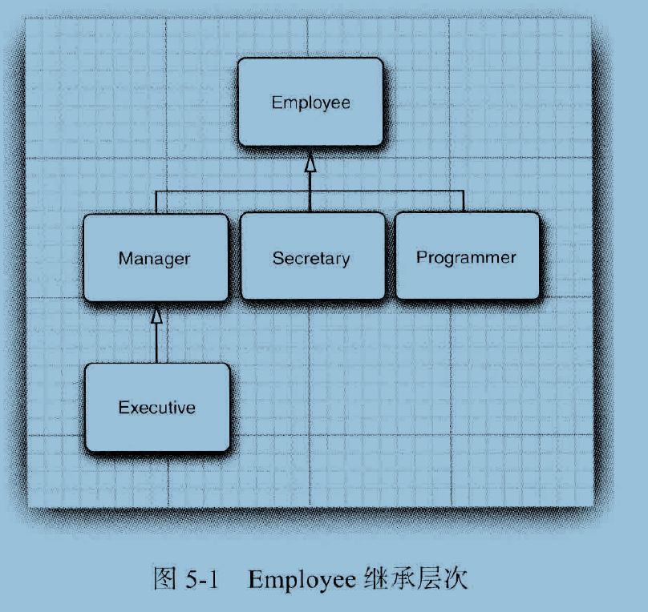
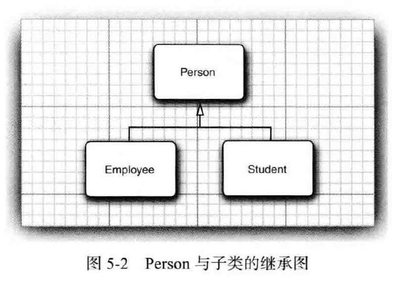

#   继承

-   内容
    -   类、超类和子类
    -   Object：所有类的超类
    -   泛型数组列表
    -   对象包装器与自动装箱
    -   参数数量可变的方法
    -   枚举类
    -   反射
    -   继承的设计技巧

利用继承，可以基于已存在的类构造一个新类，继承已存在的类就是复用这些类的方法和域。

反射是指在程序运气期间发现更多的类及其属性的能力。

1.   类、超类和子类

回忆 Employee 类，员工与经理的待遇存在一些差异，但也与很多相同的地方，员工仅领取薪水，而经理则还有奖金，这种情形需要使用继承，需要为经理定义一个新类 Manager ，以便增加一些新功能，但是可以重用 Employee 类中已经编写的部分代码。

从理论上讲，在 Manager 与 Employee 之间存在着明显的 "is-a"(是)关系，每个经理都是一名员工："is-a"关系是继承的一个明显特征。

### 定义子类

由继承 Employee 类来定义 Manager 类的格式，关键字 extends 表示继承：
```Java
public class Manager extends Employee {}
```

关键字 extends 表明正在构造的新类派生与一个已存在的类，已存在的类称为 超类、基类或父类，新类称为 子类、派生类。

子类比超类拥有的功能更加丰富， Manager 比 Employee 封装了更多的数据，拥有更多的功能。

在 Manager 类中，增加了一个用于存储奖金信息的域，以及一个用于设置这个域的新方法：
```Java
public class Manager extends Employee {
    private double bonus;
    public void setBonos(double bonus) {
        this.bonus = bonus;
    }
}
```

这没什么特别之处，只是， Manager 对象可以使用 setBonos 方法，但是 Employee 对象不行。不过，尽管在 Manager 类中没有显式的定义 getName 和 getHireDay等方法，但Manager 对象却可以使用它们，这是因为 Manager 类自动的继承了超类 Employee 中的这些方法。

在通过扩展超类定义子类的时候，仅需指出子类与超类的不同之处，在设计类的时候，应该将通用的方法放在超类中，而将具有特殊用途的方法放在子类中。

### 覆盖方法

超类中有些方法对子类 Manager 并不一定适用，具体来说， Manager 类中的 getSalary 方法应该返回薪水和奖金的总和，为此，需要提供一个新的方法来覆盖超类中的这个方法：
```Java
public class Manager extends Employee {
    public double getSalary() {
        //....
    }
}
```

那么该如何实现这个方法呢?

Manager 类是不能直接访问超类的私有域，只有 Employee 类的方法才能访问私有部分。

如果 Manager 类的方法一定要访问私有域，就必须借助于公有的接口， Employee 类中的公有方法 getSalary 正是这样。

正确的书写格式：
```Java
public double getSalary(){
    double baseSalary = super.getSalary();
    return baseSalary + bonus;
}
```

`super` 关键字的作用域是超类，`this`关键字的作用域是本身。

### 子类构造器

为 Manager 类提供一个构造器：
```Java
public Manager(String name, double salary, int year, int month, int day) {
super(name, salary, year , month, day) ;
bonus = 0;
}
```
`super` 关键字是 调用超类 `Employee 中含有 name、salary、year、month和day参数的构造器`的简写形式

如果子类的构造器没有显式的调用超类的构造器，则将自动的调用超类默认(没有参数)的构造器。

Manager使用：books.coreVolume.s1s04.ManagerTest

### 继承层次

继承并不仅限一个层次。由一个公共超类派生出来的所有类的集合称为继承层次，如图：



在继承层次中，从某个特定的类到其祖先的路径被称为该类的继承链。

通常，一个祖先类可以拥有多个子孙继承链。

### 多态

有一个用来判断是否应该设计为继承关系的简单规则，这就是 "is-a"规则，他表明子类的每个对象也是超类的对象。例如，每个经理都是员工，因此，将 Manager 设计为 Employee 类的子类是显而易见的，反之不然，并不是每个员工都是经理。

"is-a"规则的另一种表述法师置换法则，表明程序中出现超类对象的任何地方都可以用子类对象置换。

在Java里，对象变量时多态的。一个 Employee 变量既可以引用一个 Employee 类对象，也可以引用一个 Employee 类的任何一个子类的对象(例如：Employee、Executive等)。

在`Manager使用`中，已经看到了置换法则的优点：
```Java
staff[0] = boss;
```
在这个例子中，变量 `staff[0]` 与 boss 引用同一个对象，但编译器将 staff[0] 看成 Employee 对象，这意味着可以这样调用：`boss.setBonus(5000)`，但是不能这样调用：`staff[0].setBonus(5000)` 

这是因为 staff[0] 声明的类型是 Employee ，而 setBonus 不是 Employee 类的方法。

也不能将一个超类的引用赋给子类变量，例如，下面的赋值的非法的：`Manager m = staff[i];`，原因是，不是所有的员工都是经理，如果赋值成功，m 有可能引用了一个不是经理的 Employee 对象，当在后面调用 m.setBonus(..) 时就有可能发生运行时错误。

### 理解方法调用

### 阻止继承：final类和方法

不被允许扩展的类被称为 final 类，如果在定义类的时候使用 final 修饰符就表明这个类是 final 类，例如，假设希望阻止定义 Executive 类的子类，就可以定义在类的时候，使用 final 修饰符声明，声明格式如下表示：
```Java
public final class Executive extends Manager {}
```

类中特定的方法也可以被声明为 final ，如果这样做，子类就不能覆盖这个方法(final类中的所有方法自动成为 final 方法)

将方法或类声明为 final 主要目的是：确保他们不会再子类中改变语义。

### 强制类型转换

将一个类型强制转换成另一个类型的过程被称为类型转换，在Java中是这样：
```Java
double x = 3.405;
int nx = (int) x;
```

将表达式 x 的值转换成证书类型，舍弃了小数部分。

正如有时候需要将浮点型数值转换成整型数值一样，有时候也可能需要将某个类的对象引用转换成另一个类的对象引用，对象引用的转换语法与数值表达式的类型转换类似，仅需要用一堆圆括号将目标类名括起来，并放置在需要转换的对象引用之前就可以额，例如：
```Java
Manager boss = (Manager) staff[0]:
```

进行类型转换的唯一原因是：在暂时忽视对象的实际类型之后，使用对象的全部功能。

将一个值存入变量时，编译器将检查是否允许该操作，将一个子类的引用赋给一个超类变量，编译器是允许的，但将一个超类的引用赋给一个子类变量，必须进行类型转换，这样才能通过运行时的检查。

-   只能在继承层次内进行类型转换
-   在将超类转换成子类之前，应该使用 instanceod 进行检查

### 抽象类

如果自下而上在类的继承层次结构中上移，位于上层的类更具有通用性，甚至可能更加抽象。从某种角度看，祖先类更加通用，程序员只将他作为其他类的基类，而不作为想使用的特定的实例类。

考虑一下对 Employee 类层次的扩展，一名员工是一个人，一名学生也是一个人，下面将类 Person 和类 Student 添加到类的层次结构中，如图：



为什么要花费精力进行这样高层次的抽象呢?每个人都有一些诸如姓名这样的属性，学生和员工都有姓名属性，因此可以将 getName 方法放置在位于 继承 关系较高层次的通用超类中。

现在，再添加一个 getDescription 方法，他可以返回对一个人的简短描述，例如：
```
an employee with a salary of $50,000.00
a student majoring in computer science
```

在 Employee 类和 Student 类中实现这个方法很容易，但是在 Person 类中应该提供什么内容呢?除了姓名之外，Person 类一无所知，当然，可以让 Person.getDescription 返回一个空字符串，然而，还有一个更好的方法，就是使用 `abstract` 关键字，这样就完全不需要实现这个方法了。

```Java
public abstract String getDescription();
```

为了提高程序的清晰度，包含一个或多个抽象方法的类本身必须被声明为抽象的。
```Java
public abstract class Person {
    public abstract String getDescription()；
}
```
除了抽象方法之外，抽象类还可以包含具体数据和具体方法，例如，Person类还保存着姓名和一个返回姓名的具体方法：
```Java
public abstract class Person {
    private String name;
    public Person(St ring name) {
        this.name = name ;
    }
    public abstract String getDescription()；
    public String getName() {
        return name;
    }
}
```

抽象方法充当着占位的角色，他们的具体实现在子类中，扩展抽象类可以有两种选择，一种是在抽象类中定义部分抽象类方法或不定义抽象类方法，这样就必须将子类也标记为抽象类，另一种是定义全部的抽象方法，这样一来，子类就不是抽象的了。

类即使不含有抽象方法，也可以将类声明为抽象类。

抽象类不能被实例化，也就是说，如果将一个类声明为 `abstract` ，就不能创建这个类的对象。

可以定义一个抽象类的对象变量，但是它只能引用非抽象子类的对象，例如：
```Java
Person p = new Student("Vinee Vu" , "Economics");
```
这里的 p 是一个抽象类 Person 的变量，Person 引用了一个非抽象子类 Student的实例。

抽象类实例：books.coreVolume.s1s04.PersonTest

如果省略 Person 超类中的抽象方法，那么变量 p 就不能调用 getDescription 方法了，编译器只允许调用在类中声明的方法。

### 受保护访问

最好将类中的域标记为 private，而方法标记为 public ，任何声明为 private 的内容对其他类都是不可见的，这对于子类来说也是一样的。

但是，在有些时候，希望超类中的某些方法允许被子类访问，或允许子类的方法访问超类的某个域，可以将这些方法或域声明为 protected 。

例如，将超类 Employee 中的 hireDay 声明为 protected ，而不是私有的， Manager 中的方法就可以直接访问他。

-   Java用于控制可见性的4个访问修饰符
    -   private：仅对本类可见
    -   public：对所有类可见
    -   protected：对本包和所有子类可见
    -   对本报可见---默认，不需要修饰符

2.   Object：所有类的超类

Object 类是 Java中所有类的始祖，在Java中每个类都是由它扩展而来的，但是并不需要这样写：`public class Employee extends Object`。

如果没有明确的指出超类，Object就被认为是这个类的超类。

可以使用 Object 类型的变量引用任何类型的对象：
```Java
Object obj = new Employee("Harry Hacker", 35000);
```

当然，Object 类型的变量只能用于作为各种值得通用持有者，要想对其中的内容进行具体的操作，还需要清楚对象的原始类型，并进行相应的类型转换：
```Java
Employee e = (Employee) obj ;
```

在Java中，只有基本类型不是对象，例如，数值、字符和布尔类型的值都不是对象，所有的数组类型，不管是对象数组还是基本类型的数组都扩展了 Object 类。

### equals 方法

Object 类中的 equals 方法用于检测一个对象是否等于另一个对象。在 Object 类中，这个方法将判断两个对象是否具有相同的引用，如果两个对象具有相同的引用，他们一定是相等的，从这点上看，将其作为默认操作也是合乎情理的。然而，对于多数类来说，这种判断并没有什么意义，例如，采用这种方式比较两个 PrintStream 对象是否相等就完全没有意义。然而，经常需要检测两个对象状态的相等性，如果两个对象的状态相等，就认为这两个对象时相等的。

例如，如果两个员工对象的姓名、薪水和雇佣日期都一样，就认为他们是相等的(实际上比较ID更有意义，这里来演示一下)

```Java
@Override
public boolean equals(Object obj) {

    if (this == obj) return true;

    if (obj == null) return false;

    if (getClass() != obj.getClass()) return false;

    Employee o = (Employee)obj;

    return this.name.equals(o.name) && this.salary == o.salary && this.hireDay.equals(o.hireDay);
}
```

### 相等测试与继承

Java语言规范要求 equals 方法具有下面的特性：

1):自反性：对于任何非空引用x，x.equals(x)应该返回 true

2):对称性：对于任何引用 x 和 y，当且仅当 y.equals(x) 返回 true，x.equals(y)也应该返回 true

3):传递性：对于任何引用x、y和z，如果 x.equals(y)返回 true，y.equals(z) 返回 true，x.equals(z) 也应该返回 true。

4):一致性：如果 x 和 y 引用的对象没有发生变化，反复调用 x.equals(y) 应该返回同样的结果

5):对于任意非空引用 x，x.equals(null) 应该返回 false

equals 方法建议：

1):显式参数命名为 otherObject，稍后需要将他转换成另一个叫做 other 的变量

2):检测 this 与 otherObject 是否引用同一个对象：`if (this = otherObject) return true;`

3):检测 otherObject 是否为 null，如果为 null，返回 false，这项检测是很有必要：`if (otherObject = null ) return false;`

4):比较 this 与 otherObject 是否属于同一个类，如果 equals 的语义在每个子类中有所改变，就使用 getClass 检测：`if (getClass() != otherObject.getCIass()) return false;`

如果所有的子类都拥有统一的语义，就使用 instanceof 检测：`if (!(otherObject instanceof ClassName)) return false;`

5):将 otherObject 转换为相应的类类型变量：`ClassName other = (ClassName) otherObject`

6):现在开始对所有需要比较的域进行比较了

### hashCode 方法

散列码是由对象到处的一个整型值，散列码是没有规律的，如果 x 和 y 是两个不同的对象，x.hashCode() 与 y.hashCode() 基本上不会相同。

由于 hashCode 方法定义在 Object 类中，因此每个对象都有一个默认的散列码，其值为对象的存储地址。

如果重新定义 equals 方法，就必须重新定义 hashCode 方法，以便用户可以将对象插入到散列表中。

equals 与 hashCode 的定义必须一致：如果 x.equals(y) 返回 true，那么 x.hashCode() 就必须与 y.hashCode() 具有相同的值。

### toString 方法

toString 方法用于返回表示对象值的字符串。

绝大多数(但不是全部)的toString方法都遵循这样的样式：类的名字，随后是一对方括号括起来的域值，例如：
```Java
public String toString()
{
return "Employee[name=" + name + ", salary:" + salary + ",hireDay=" + hireDay "]";
```

随处可见 toString 方法的主要原因是：只要对象与一个字符串通过操作符 "+" 连接起来，Java编译就会自动的调用 toString 方法，以便获得这个对象的字符串描述

3.   泛型数组列表

ArrayList 是一个采用类型参数的泛型类，为了指定数组列表保存的元素对象类型，需要用一对尖括号将类名括起来加在后面，例如，ArrayList<Employee>。

声明和构造一个保存Employee对象的数组列表，例如：`ArrayList<Employee> staff = new ArrayList<Eniployee>();`

可以结合 new 操作符使用菱形语法，编译器会检查新值是什么，如果赋值给一个变量，或传递到某个方法，或者从某个方法返回，编译器会检查这个变量、参数或方法的泛型类型，然后将这个类型放在<>中。

4.   对象包装器与自动装箱

有时，需要将 int 这样的基本类型转换为对象，所有的基本类型都有一个与之对应的类。例如，Integer 类对应基本类型 int，通常，这些类称为包装器，这些对象包装器类有用很明显的名字：Integer、Long、Float、Double、Short、Byte、Character、Void和Boolean(前6个派生于公共的超类 Number)。对象包装器类是不可变的，即一旦构造了包装器，就不允许更改包装在其中的值，同时，对象包装器类还是 final，因此不能定义他们的子类。

如果想定义一个整型数组列表，而尖括号中的类型参数不允许是基本类型，也就是说，不允许写成`ArrayList<int>`，这里就用到了 Integer对象包装器类，可以声明一个 Integer对象的数组列表：`ArrayList<Integer> list = new ArrayList<>()；`

下面这个调用`list.add(3);`将自动地变换成：`list.add(Integer.value0f(3));`这种变换称为自动装箱。

相反将一个 Integer 对象赋给一个 int 值时，将会自动拆箱，也就是说，编译器将下列语句：`int n = list.get(i);` 翻译成 `int n = list.get(i).intValue();`

由于包装器类引用可以为 null，所以自动装箱有可能会抛出一个 NullPointerException 异常：
```Java
Integer n = null;
System.out.println(2 * n); // Throws NullPointerException
```

如果在一个条件表达式中混合使用 Integer 和 Double 类型，Integer 值就会拆箱，提升为 double，再装箱为 Double：
```Java
Integer n = 1;
Double x = 2.0;
System.out.println(true ? n : x); // Prints 1.0
```
装箱和拆箱是编译器认可的，而不是虚拟机。编译器在生成类的字节码时，插入必要的方法调用，虚拟机只是执行这些字节码。

5.   参数数量可变的方法

.....

6.   枚举类

定义一个枚举类型，例如：
```Java
public enum Size { SMALL, MEDIUM, LARGE, EXTRA_JARGE };
```

实际上，这个声明定义的类型是一个类。在比较两个枚举类型的值时，直接使用 "=="就可以了。

可以在枚举类型中添加一些构造器、方法和域，当然，构造器只是在构造枚举常量的时候被调用，例如：
```Java
public enum Size {
    SMALL("S"), MEDIU("M") , LARGE("L") , EXTRA_LARGE("XL");
    private String abbreviation;
    private Size(String abbreviation) { this,abbreviation = abbreviation; }
    public String getAbbreviation() { return abbreviation; }
}
```

所有的枚举类型都是 enum 类的子类，他们继承了这个类的许多方法，其中最有用的一个是 toString，这个方法能够返回枚举常量名。

每个枚举类型都有一个静态的 values 方法，他将返回一个包含全部枚举值得数组。

枚举示例：books.coreVolume.s1s04.EnumTest

7.   反射

反射库可以编写能够动态操作Java代码的程序。

能够分析类能力的程序称为反射，反射机制的功能极其强大，例如：
-   在运行时分析类的能力
-   在运行时查看对象，例如，编写一个 toString 方法供所有类使用
-   实现通用的数组操作代码
-   利用 Method 对象。

### Class 类

在程序运行期间，Java运行时系统始终为所有的对象维护一个被称为运行时的类型标识。这个信息跟踪着每个对象所属的类，虚拟机利用运行时类型信息选择相应的方法执行。

可以通过专门的Java类访问这些信息，保存这些信息的类被称为 Class。Object 类中的 getClass() 方法将会返回一个 Class类型的实例。
```Java
Employee e;
Class cl = e.getClass();
```

一个 Class 对象表示一个特定类的属性，最常用的方法是 `getName`，这个方法返回类的名字，例如，这条语句：`System.out.println(e.getClass().getName() + " " + e.getName());`

如果 e 是一个员工，则会打印输出：`Employee Harry Hacker`，如果 e 是经理，则打印输出：`Manager Harry Hacker`

可以调用静态方法 forName 获得类名对应的 Class对象。
```Java
String className = "java.util.Random";
Class cl = Class.forName(className) ;
```

只要 className 是类名或接口名时就可以。

`newInstance()` 方法可以动态的创建一个类的实例，例如：`e.getClass().newlnstance();`

创建了一个与e具有相同类类型的实例。`newInstance` 方法调用默认的构造器初始化新创建的对象，如果这个类没有默认的构造器，就会抛出一个异常。

将 `forName` 与 `newInstance` 配合起来使用，可以根据存储在字符串中的类名创建一个对象：
```Java
String s = "java.util.Random";
Object m = Class.forName(s).newlnstance();
```

### 捕获异常

当程序运行过程中发生错误时，就会"抛出异常"。抛出异常比终止程序要灵活得多，这是因为可以提供一个"捕获"异常的处理器对异常情况进行处理。

异常有两种类型：未检查异常和已检查异常。对于已检查异常，编译器将会检查是否提供了处理器，然后，有很多常见的异常，例如，访问 null 引用，都属于为检查异常。编译器不会查看是否为这些错误提供了处理器，毕竟，应该精心编写代码来避免这些错误的发生，而不是将精力花在编写异常处理器上。

如果竭尽全力还是发生了异常，编译器就要求提供一个处理器。`Class.forName` 方法就是一个抛出已检查异常的例子。

将可能抛出已检测异常的一个或多个方法调用代码放在 try 块中，然后在 catch 子句中提供处理器代码：
```Java
try {
    ///statements that might throw exceptions
} catch (Exception e) {
    //handler action
}
```

下面是一个示例：
```Java
try {
    String name = . . .; // get class name
    Class cl = Class.forName(name) ; // might throw exception
    //dosomething with d
} catch (Exception e) {
    e.printStackTrace();
}
```

如果类名不存在，则将跳过 `try` 块中的剩余代码，程序直接进入 `catch` 子句。如果 `try` 块中没有抛出任何异常，那么会跳出 `catch` 子句的处理器代码。

### 利用反射分析类的能力

介绍一下反射机制最重要的内容----检查类的结构

在 java.lang.reflect 包中有三个类 Field、Method和Constructor 分别用于描述类的域、方法和构造器，这三个类都有一个叫做 getName的方法，用来返回项目的名称。

Field类有一个 getType 方法，用来返回描述域所属类型的 Class对象。

Method和Constructor 类有能够报告参数类型的方法。

Class 类中的`getFields`、`getMethods` 和`getConstructors` 方法将分别返回类提供的 `public` 域、方法和构造器数组， 其中包括超类的公有成员。`Class` 类的`getDeclareFields`、`getDeclareMethods` 和`getDeclaredConstructors` 方法将分别返回类中声明的全部域、方法和构造器， 其中包括私有和受保护成员，但不包括超类的成员。

查看类中所有方法和构造器的签名以及全部域名：books.coreVolume.s1s04.ReflectionTest

### 在运行时使用反射分析对象

查看数据域的实际内容，查看对象域的关键方法是 Field 类中 get 方法。

任意类使用的通用 toString 方法：books.coreVolume.s1s04.ObjctAnalyzerTest

### 使用反射编写泛型数组代码

Java数组会记住每个元素的类型，即创建数组时 new 表达式中使用的元素类型。将一个 Employee[] 临时地转换成 Object[] 数组，然后再把他转换回来是可以的，但一个从开始就是 Object[] 的数组却永远不能转换成 Employee[] 数组。

为了编写这类通用的数组代码，需要能够创建与原数组类型相同的新数组，为此，需要java.lang.reflect包中的Array类的一些方法，其中最关键的是Array类中的静态方法 newInstance，他能够构造新数组，在调用他时必须提供两个参数，一个是数组的元素类型，一个是数组的长度：`Object newArray = Array.newlnstance(componentType, newLength);`

要获得新数组元素类型，就需要进行以下工作：
-   首先获得 a 数组的类对象
-   确认他是一个数组
-   使用 Class 类(只能定义表示数组的类对象)的 getComponentType 方法确定数组对于的类型。

扩充数组的方法：books.coreVolume.s1s04.CopyOfTest

8.   继承的设计技巧

-   将公共操作和域放在超类
-   不要使用受保护的域
-   使用继承实现 "is-a" 关系
-   除非所有继承的方法都有意义，否则不要使用继承
-   在覆盖方法时，不要改变预期的行为
-   使用多态，而非类型信息
-   不要过多的使用反射


##  备注
-   理解方法调用
