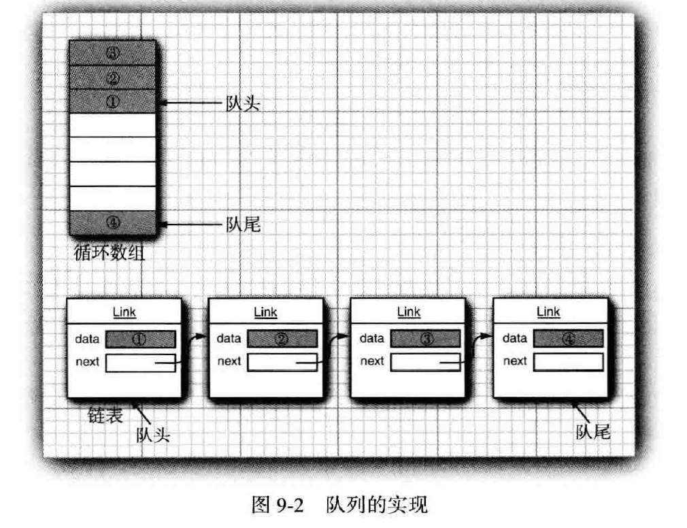

#   集合

-   内容
    -   Java集合框架
    -   具体的集合
    -   映射
    -   视图与包装器
    -   算法
    -   遗留的集合

利用Java类库帮助我们在程序设计中实现传统的数据结构。

1.   Java集合框架

介绍Jav集合框架的基本设计，展示使用它们的方法。

### 将集合的接口与实现分离

Java集合类库将接口与实现分离，举个例子：队列。

队列接口是可以在队列的尾部添加元素，在队列的头部删除元素，并且可以查找队列中元素的个数。当需要收集对象，并按照"先进先出"的规则检索对象时就应该使用队列，如：


队列结构的最简形式可能类似下面这样：
```Java
public interface Queue<E> // a simplified form of the interface in thestandard library
{
    void add(E element) ;
    E remove();
    int size()；
}
```

这个接口并没有说明队列是如何实现的，队列通常有两种实现方式：一种是使用循环数组，另一种是使用链表。



每个实现都可以通过一个实现了 Queue 接口的类表示：
```Java
public class CircularArrayQueue<E> implements Queue<E> // not an actual library class
{
    private int head;
    private int tail;
    CircularArrayQueue(int capacity) { . . . }
    public void add(E element) { . . . }
    public E remove() { . . . }
    public int size() { . . . }
    private E[] elements;
}

public class LinkedListQueue<E> iipleients Queue<E> // not an actual library class
{
    private Link head;
    private Link tail;
    LinkedListQueue() { . . . }
    public void add(E element) { . . .}
    public E remove() { . . . }
    public int size() { . . . }
}

```

当在程序中使用队列时，一旦构建了集合就不需要知道究竟使用了那种实现，因此，只有在构建集合对象时，使用具体的类才有意义，可以使用接口类型存放集合的引用。
```Java
Queue<Customer> expresslane = new CircularArrayQueue<>(100) :
expressLane.add(new Customer("Harry"));
```

利用这种方式，一旦改变了想法，可以轻松使用另一种不同的实现，接口本身并不能说明那种实现的效率究竟如何。

研究API文档时，会发现另外一组名字以 Abstract 开头的类，例如，AbstractQueue，这些类是为类库实现者而设计的。

### Collection 接口

在Java类库中，集合类的基本接口是 Collection 接口，这个接口有两个基本方法：
```Java
public interface Collection<E> {
    boolean add(E element);
    Iterator<E> iterator()；
}
```

### 迭代器

Iterator 接口包含4个方法：
```Java
public interface Iterator<E>
{
E next();
boolean hasNext();
void remove();
default void forEachRemaining(Consumer<? super E> action) ;
}
```

next方法可以逐个访问集合中的每个元素，但是需要在调用next之前调用 hasNext 方法判断是否还有下一个。

用 “for each” 循环可以更加简单实现这个目的。

“for each” 循环可以与任何实现了 Iterable 接口的对象一起工作，这个接口只包含一个抽象方法：
```Java
public interface Iterable<E> {
    Iterator<E> iterator();
}
```

Collection 接口扩展了 Iterable 接口。

元素被访问的顺序取决于集合类型，Java迭代器是在两个元素之间。

Iterator 接口的 remove 方法将会删除上次调用 next 方法时返回的元素，对next方法和remove方法的调用具有互相依赖性，如果调用remove之前没有调用next将是不合法的。

### 泛型使用方法

由于 Collection 与 Iterator 都是泛型接口，可以编写操作任何集合类型的实用方法。

Java类库的设计者认为：有些实用方法中的某些方法非常有用，应该将它们提供给用户使用，这样，类库的使用者就不必自己重新构建这些方法了，例如：
```Java
int size()
boolean isEmpty()
boolean contains(Object obj)
boolean containsAl1 (Col1ection<?> c)
boolean equals(Object other)
boolean addAll (Collection<? extends E> from)
boolean remove(Object obj)
boolean removeAll (Col1ection<?> c)
void clear()
boolean retainAl1(Col1ection<?> c)
Object [] toArray()
<T> T[] toArray(T[] arrayToFill)
```

这些方法中，有许多方法的功能非常明确。

为了防实现者更容易实现这个接口，Java类库提供了一个类 AbstractCollection ，他将基础方法 size 和 iterator 抽象化了，但是在此提供了例行方法。

此时，一个具体的集合类可以扩展 AbstractCollection 类了，现在要由具体的集合类提供 iterator 方法，而 contains 方法已有 AbstractCollection 超类提供了。

### 集合框架中的接口

Java集合框架为不同类型的集合定义了大量接口，例如：


集合有两个基本接口：Collection 和 Map。

List 是一个有序集合，元素会增加到容器中的特定位置。

Set 接口等同于 Collection 接口，不过其方法的行为更有严谨的定义，add 方法不允许增加重复的元素，并不是所有的集合都是集。

2.   具体的集合


### 链表

链表解决了数组在中间位置删除/插入一个元素时要付出很大的代价的问题。

链表是将每个对象存放在独立的结点中，每个结点还存放着序列中下一个结点的引用。

在Java语言中，所有链表实际上都是双向链接的---即每个结点还存放着指向前驱结点的引用。


从链表中间删除一个元素是一个很轻松的操作，即需要更新被删除元素附近的链接，如图：


链表是一个有序集合，每个对象的位置都十分重要。LinkedList.add方法将对象添加到链表的尾部。

只有对自然有序的集合使用迭代器添加元素才有实际意义。

如果链表有n个元素，有n+1个位置可以添加新元素，这些位置与迭代器的n+1个可能的位置相对应。

如果链表迭代器发现他的集合被另一个迭代器修改了，或是被该集合自身的方法修改了，就会抛出异常。

每次查找一个元素都要从列表的头部重新开始搜索，LinkedList 对象根本不做任何缓存位置信息的操作。

使用链表的唯一理由是尽可能的减少在列表中间插入或删除元素所付出的代价。

如果需要对集合进行随机访问，就是用数组或 ArrayList，而不要使用链表。

### 数组列表

List 接口用于描述一个有序集合，并且集合中每个元素的位置十分重要，有两种访问方式：一种是用迭代器，另一种是用 get 和 set 方法随机的访问每个元素，后者不适合链表，但对数组却很有用。

集合类库提供了一种大家熟悉的ArrayList类，这个类也实现了List接口，封装了一个动态再分配的对象数组。

### 散列集

如果不在意元素的顺序，可以有几种能够快速查找元素的数据结构，其缺点是无法控制元素出现的次序，他们将按照有利于其操作目的的原则组织数据。

散列表为每个对象计算一个整数，称为散列码，散列码是由对象的实例域产生的一个整数，准则的说，具有不同数据域的对象将产生不同的散列码。

在Java中，散列表用链表数组实现，每个列表被称为桶，如图：


要想查找表中对象的位置，就要先计算他的散列码，然后与桶的总数取余，所得到的结果就是保存这个元素的桶的索引。

散列表可以用于实现几个重要的数据结构，其中最简单的是set类型。set是没有重复元素的元素集合。

Java 集合类库提供了一个 HashSet类，他实现了基于散列表的集。

### 树集

TreeSet 类与散列集十分类似，不过，树集是一个有序集合，可以以任意顺序将元素插入到集合中，在对集合进行遍历时，每个值将自动的按照排序后的顺序呈现。

排序是用树结构完成的(红黑树)

### 队列与双端队列

队列可以有效的在尾部添加一个元素，在头部删除一个元素。有两个端头的队列，即双端队列，可以有效的在头部和尾部同时添加或删除元素，不支持在队列中间添加元素。

在Java SE 6 中引入了 Deque 接口，并由 ArrayDepue 和 LinkedList 类实现。

### 优先级队列

优先级队列中的元素可以按照任意的顺序插入，却总是按照排序的顺序进行检索，也就是说，无论何时调用 remove 方法，总会获得当前优先级队列中最小的元素。

优先级队列并没有对所有的元素进行排序，他使用一个优雅且高效的数据结构，即堆。

堆是一个可以自我调整的二叉树，对树执行添加和删除操作，可以让最小的元素移动到根，而不必花费时间对元素进行排序。

使用优先级队列的典型示例是任务调度，每个任务有一个优先级，任务以随机顺序添加到队列中，每当启动一个新的任务时，都将优先级最高的任务从队列中删除。

3.   映射

知道某些键的信息，并想要查找与之对应的元素，映射数据结构就是为此设计的，映射用来存放键/值对，如果提供了键，就能够查找到值。

### 基本映射操作

Java类库为映射提供了两个通用的实现：HashMap和TreeMap，这两个类都实现了 Map 接口。

散列映射对键进行散列，树映射用键的整体顺序对元素进行排序，并将其组织成搜索树，散列或比较函数只能作用于键，与键关联的值不能进行散列或比较。

### 更新映射项

正常情况下，可以得到与一个键关联的原值，完成更新，再放回更新后的值，不过，必须考虑一个特殊情况，即键第一次出现，调用 get 会发生异常。

一个简单的补救，可以使用 getOrDefault 方法：
```Java
counts.put(word, counts.getOrDefault(word, 0)+ 1);
```

另一种方式是首先调用 putlfAbsent 方法，只有当键原先存在时才会放入一个值：
```Java
counts.putlfAbsent(word, 0);
counts.put(word, counts.get(word)+ 1);
```

### 映射视图

集合框架不认为映射本身是一个集合，不过，可以得到映射的视图(view)---这是实现了 Collection 接口或某个子接口的对象。

有3中视图：键集、值集合以及键/值对集。

```Java
Set<K> keySet()
Collection<V> values()
Set<Map.Entry<K, V>> entrySet()
```

会分别返回3个视图。

keySet 不是 HashSet 或 TreeSet，而是实现了 Set 接口的另外每个类的对象。

如果想同时查看键和值，可以通过枚举条目来避免查找值，例如：
```Java
for (Map.Entry<String, Employee〉entry : staff.entrySet()) {
    String k = entry.getKey();
    Employee v = entry.getValue();
}
```

### 弱散列映射

当对应的键不再使用了，但是值还在，这个时候垃圾回收器还不能删除他，因为他是活动对象，可以使用 WeakHashMap 解决。

### 链接散列集与映射

LinkedHashSet 和LinkedHashMap 类用来记住插人元素项的顺序。这样就可以避免在散歹IJ表
中的项从表面上看是随机排列的。当条目插入到表中时，就会并人到双向链表中。

### 枚举集与映射

EmimSet 是一个枚举类型元素集的高效实现。由于枚举类型只有有限个实例， 所以
EnumSet 内部用位序列实现。如果对应的值在集中， 则相应的位被置为1

### 标识散列映射

类IdentityHashMap 有特殊的作用。在这个类中，键的散列值不是用hashCode 函数计算
的， 而是用 System.identityHashCode 方法计算的。这是Object.hashCode 方法根据对象的内
存地址来计算散列码时所使用的方式。而且， 在对两个对象进行比较时， IdentityHashMap 类
使用==, 而不使用equals。

4.   视图与包装器

通过使用视图可以获得其他的实现了 Collection 接口和Map 接口的对象。映射类的 keySet 方法就是这样一个示例，他返回一个实现 Set 接口的类对象，这个类的方法对原映射进行操作，这种集合称为视图。

### 轻量级集合包装器

Arrays 类的静态方法asList 将返回一个包装了普通Java 数组的List 包装器。。这个方法可
以将数组传递给一个期望得到列表或集合参数的方法。例如：
```Java
Card[] cardOeck = new Card[52];
List<Card> cardList = Arrays.asList(cardDeck):
```

返回的对象不是ArrayList。它是一个视图对象， 带有访问底层数组的get 和set 方
法。改变数组大小的所有方法（例如， 与迭代器相关的add 和remove 方法）都会抛出一个
Unsupported OperationException 异常。

### 子范围

假设有一个列表staff, 想从中取出第10 个~ 第19 个元素。可以使用subList 方法来获得一个列表的子范围视图。
```Java
List group2 = staff.subList(10, 20);
```

第一个索引包含在内，第二个索引则不包含在内。这与String 类的substring 操作中的参
数情况相同。

可以将任何操作应用于子范围，并且能够自动地反映整个列表的情况。

### 不可修改的视图

Collections 还有几个方法， 用于产生集合的不可修改视图（ unmodifiable views)。这些视
图对现有集合增加了一个运行时的检查。如果发现试图对集合进行修改， 就抛出一个异常，
同时这个集合将保持未修改的状态。

可以使用下面8 种方法获得不可修改视图：
```Java
Collections.unmodifiableCollection
Collections.unmodifiableList
Collections.unmodifiableSet
Collections.unmodifiableSortedSet
Collections.unmodifiableNavigableSet
Collections.unmodifiableMap
Collections.unmodifiableSortedMap
Collections.unmodifiableNavigableMap
```

每个方法都定义于一个接口。

### 同步视图

如果由多个线程访问集合，就必须确保集不会被意外地破坏。

类库的设计者使用视图机制来确保常规集合的线程安全，而不是实现线程安全的集合类。

### 受查视图

"受査"视图用来对泛型类型发生问题时提供调试支持。

### 关于可选操作的说明

通常，视图有一些局限性，即可能只可以读、无法改变大小、只支持删除而不支持插入，这些与映射的键视图情况相同。

5.   算法

Java类库中的算法只包含基本的排序、二分查找等实用算法。

### 排序与混排

Collections 类中的sort 方法可以对实现了List 接口的集合进行排序。

Java集合类库中使用的排序算法比快速排序要慢一些， 快速排序是通用排序算法的传统选
择。但是， 归并排序有一个主要的优点：稳定， 即不需要交换相同的元素。

### 二分查找

如果数组是有序的，就可以直接査看位于数组中间的元素，看一看是否大于要查找的元素。如果是，用同样的方法在数组的前半部分继续查找； 否则， 用同样的方法在数组的后半部分继续查找。这样就可以将查找范围缩减一半。一直用这种方式査找下去。例如， 如果数组中有1024 个元素， 可以在10 次比较后定位所匹配的元素。

Collections 类的binarySearch 方法实现了这个算法。注意， 集合必须是排好序的， 否则
算法将返回错误的答案。

### 简单算法

在Collections 类中包含了几个简单且很有用的算法。前面介绍的查找集合中最大元素的示例就在其中。另外还包括：将一个列表中的元素复制到另外一个列表中； 用一个常量值填充容器；逆置一个列表的元素顺序。

### 批操作

很多操作会"成批"复制或删除元素。

假设希望找出两个集的交集( intersection)，也就是两个集中共有的元素。首先，建立一
个新集来存放结果：
```Java
Set<String> result = new HashSeto(a);
```

在这里， 我们利用了一个事实：每一个集合都有这样一个构造器，其参数是包含初始值的另一个集合。现在来使用retainAll 方法：
```Java
result.retainAll(b);
```

### 集合与数组的转换

如果需要把一个数组转换为集合，Arrays.asList 包装器可以达到这个目的。例如：
```Java
String[] values = . .
HashSet<String> staff = new HashSet(Arrays.asList(values));
```

toArray 方法返回的数组是一个Object[] 数组，不能改变它的类型。实际上， 必须使用toArray 方法的一个变体形式，提供一个所需类型而且长度为0 的数组。这样一来， 返回的数组就会创建为相同的数组类型：
```Java
String[] values = staff.toArray(new String[0]) ;
```

如果愿意，可以构造一个指定大小的数组：

```Java
staff.toArray(new String[staff.size()]);
```
在这种情况下，不会创建新数组。

### 编写自己的算法

这个就...很高级了

----
