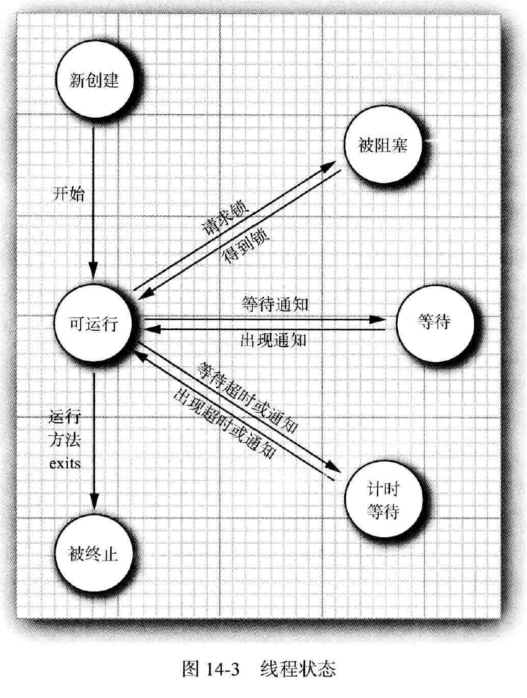
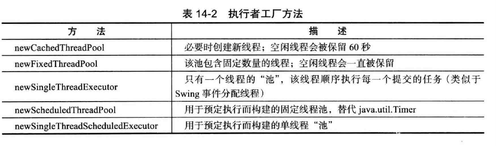

#   并发

-   内容
    -   什么是线程
    -   中断线程
    -   线程状态
    -   线程属性
    -   同步
    -   阻塞队列
    -   线程安全的集合
    -   Callable 与 Future
    -   执行器
    -   同步器

多线程程序在较低的层次上扩展了多任务的概念：一个程序同时执行多个任务。通常，每一个任务称为一个线程，他是线程控制的简称。可以同时运行一个以上线程的程序称为多线程程序。

多进程与多线程的区别在于每个进程拥有自己的一整套变量，而线程则共享数据。

1.   什么是线程

线程是任务执行的基本单元。好像什么都没有直白表达，举个例子自己感受。

2.   中断线程

当线程的run方法执行方法体重的最后一条语句后，并经由执行 return 语句返回时，或者出现了在方法中没有捕获的异常时，线程将终止。

没有可以强制线程终止的方法，interrupt 方法可以用来请求终止线程。

当对一个线程调用 interrupt 方法时，线程的中断状态将被置位。这是每一个线程都具有的 boolean 标志，每个线程都应该不时得检查这个标志，以判断线程是否被中断。

判断线程是否被置位：
```Java
while (!Thread.currentThread().islnterrupted()) {

}
```

但是，如果线程被阻塞，就无法检查中断状态，会产生 InterruptedExceptioii 异常。

没有任何语言方面的需求要求一个被中断的线程应该终止。中断一个线程不过是引起他的注意，被中断的线程可以决定如何响应中断，某些线程是如此重要以至于应该处理完异常后，继续执行，而不理会中断。

更普遍的情况是，线程将简单的中断作为一个终止的请求。

3.   线程状态

线程有如下6中状态：
-   New(新创建）
-   Runnable (可运行）
-   Blocked (被阻塞）
-   Waiting (等待）
-   Timed waiting (计时等待）
-   Terminated ( 被终止）

### 新创建线程

当用new 操作符创建一个新线程时， 如newThread(r)， 该线程还没有开始运行。这意味
着它的状态是new。当一个线程处于新创建状态时， 程序还没有开始运行线程中的代码。在
线程运行之前还有一些基础工作要做。

### 可运行线程

一旦调用start 方法，线程处于runnable 状态。一个可运行的线桿可能正在运行也可能没有运行， 这取决于操作系统给线程提供运行的时间。

一旦一个线程开始运行，它不必始终保持运行。事实上，运行中的线程被中断，目的是为了让其他线程获得运行机会。线程调度的细节依赖于操作系统提供的服务。抢占式调度系统给每一个可运行线程一个时间片来执行任务。当时间片用完， 操作系统剥夺该线程的运行权， 并给另一个线程运行机会

### 被阻塞线程和等待线程

当线程处于被阻塞或等待状态时， 它暂时不活动。它不运行任何代码且消耗最少的资源。直到线程调度器重新激活它。细节取决于它是怎样达到非活动状态的。

-   当一个线程试图获取一个内部的对象锁（而不是javiutiUoncurrent 库中的锁)，而该锁被其他线程持有， 则该线程进人阻塞状态。当所有其他线程释放该锁，并且线程调度器允许本线程持有它的时候，该线程将变成非阻塞状态
-   当线程等待另一个线程通知调度器一个条件时， 它自己进入等待状态
-   有几个方法有一个超时参数。调用它们导致线程进人计时等待（ timed waiting ) 状态。这一状态将一直保持到超时期满或者接收到适当的通知。

下图展示了线程可以具有的状态以及从一个状态到另一个状态可能的转换



### 被终止的线程

线程因如下两个原因之一而被终止：
-   因为run 方法正常退出而自然死亡。
-   因为一个没有捕获的异常终止了nm 方法而意外死亡。

4.   线程属性

下面将讨论线程的各种属性，其中包括：线程优先级、守护线程、线程组以及处理未捕获异常的处理器。

### 线程优先级

在Java 程序设计语言中， 每一个线程有一个优先级。默认情况下， 一+线程继承它的父线程的优先级。可以用setPriority 方法提高或降低任何一个线程的优先级。可以将优先级设置为在MIN_PRIORITY (在Thread 类中定义为1 ) 与MAX_PRIORITY (定义为10 ) 之间的任何值。NORM_PRIORITY 被定义为5。

每当线程调度器有机会选择新线程时， 它首先选择具有较高优先级的线程。但是，线程优先级是高度依赖于系统的。当虚拟机依赖于宿主机平台的线程实现机制时， Java 线程的优先级被映射到宿主机平台的优先级上， 优先级个数也许更多，也许更少。

### 守护线程

可以通过调用：`t.setDaemon(true);` 将线程转换为守护线程。

守护线程的唯一用途是为其他线程提供服务。计时线程就是一个例子，它定时地发送“ 计时器嘀嗒” 信号给其他线程或清空过时的高速缓存项的线程。当只剩下守护线程时， 虚拟机就退出了， 由于如果只剩下守护线程， 就没必要继续运行程序了。

### 未捕获异常处理器

线程的run 方法不能抛出任何受查异常， 但是，非受査异常会导致线程终止。在这种情
况下，线程就死亡了。

但是，不需要任何catch 子句来处理可以被传播的异常。相反， 就在线程死亡之前， 异常被传递到一个用于未捕获异常的处理器。

该处理器必须属于一个实现Thread.UncaughtExceptionHandler 接口的类。这个接口只有—个方法：`void uncaughtException(Thread t , Throwable e)`

可以用setUncaughtExceptionHandler 方法为任何线程安装一个处理器。也可以用Thread类的静态方法setDefaultUncaughtExceptionHandler 为所有线程安装一个默认的处理器。替换处理器可以使用日志API 发送未捕获异常的报告到日志文件。

5.   同步

在大多数实际的多线程应用中， 两个或两个以上的线程需要共享对同一数据的存取。如果两个线程存取相同的对象， 并且每一个线程都调用了一个修改该对象状态的方法，将会发生 `竞争条件`。

### 竞争条件的一个例子

为了避免多线程引起的对共享数据的说误，必须学习如何同步存取。

举个没有使用同步会发生什么的例子。

在下面的测试程序中， 模拟一个有若干账户的银行。随机地生成在这些账户之间转移钱款的交易。每一个账户有一个线程。每一笔交易中， 会从线程所服务的账户中随机转移一定数目的钱款到另一个随机账户。

正如前面所示， 出现了错误。在最初的交易中， 银行的余额保持在$100 000, 这是正确的， 因为共100 个账户， 每个账户$1 000。但是， 过一段时间， 余额总量有轻微的变化。当运行这个程序的时候， 会发现有时很快就出错了， 有时很长的时间后余额发生混乱。这样的状态不会带来信任感， 人们很可能不愿意将辛苦挣来的钱存到这个银行。

银行转账：books.coreVolume.s1s14.UnsynchBankTest

### 竞争条件详解

上面示例中有几个线程更新银行账户余额。一段时间之后， 错误不知不觉地出现了， 总额要么增加， 要么变少。当两个线程试图同时更新同一个账户的时候，这个问题就出现了。

假定两个线程同时执行指令：`accounts[to] += amount;`

问题在于这不是原子操作。该指令可能被处理如下：
-   将accounts[to] 加载到寄存器。
-   增加amount。
-   将结果写回accounts[to]。

现在， 假定第1个线程执行步骤1 和2, 然后， 它被剥夺了运行权。假定第2 个线程被唤醒并修改了accounts 数组中的同一项。然后，第1 个线程被唤醒并完成其第3 步。

这样， 这一动作擦去了第二个线程所做的更新。于是， 总金额不再正确。

真正的问题是transfer 方法的执行过程中可能会被中断。如果能够确保线程在失去控制之前方法运行完成， 那么银行账户对象的状态永远不会出现讹误。

### 锁对象

有两种机制防止代码块受并发访问的干扰。Java 语言提供一个synchronized 关键字达到这一目的， 并且Java SE 5.0 引入了ReentrantLock 类。

synchronized 关键字自动提供一个锁以及相关的“ 条件”， 对于大多数需要显式锁的情况， 这是很便利的。

java.util.concurrent 框架为这些基础机制提供独立的类。

用ReentrantLock 保护代码块的基本结构如下：
```Java
myLock.lock(); // a ReentrantLock object
try {
 //critical section
} finally {
    myLock.unlock()；// make sure the lock is unlocked even if an exception is thrown
}
```

这一结构确保任何时刻只有一个线程进人临界区。一旦一个线程封锁了锁对象， 其他任何线程都无法通过lock 语句。当其他线程调用lock 时，它们被阻塞， 直到第一个线程释放锁对象。

用一个锁来保护Bank 类的transfer 方法：books.coreVolume.s1s14.Bank

注意每一个Bank 对象有自己的ReentrantLock 对象。如果两个线程试图访问同一个Bank 对象， 那么锁以串行方式提供服务。但是， 如果两个线程访问不同的Bank 对象， 每一个线程得到不同的锁对象， 两个线程都不会发生阻塞。本该如此，因为线程在操纵不同的Bank 实例的时候，线程之间不会相互影响。

锁是可重入的， 因为线程可以重复地获得已经持有的锁。锁保持一个持有计数（ hold count )来跟踪对lock 方法的嵌套调用。线程在每一次调用lock 都要调用unlock 来释放锁。由于这一特性， 被一个锁保护的代码可以调用另一个使用相同的锁的方法。

例如，transfer 方法调用getTotalBalance 方法， 这也会封锁bankLock 对象，此时bankLock对象的持有计数为2。当getTotalBalance 方法退出的时候， 持有计数变回1。当transfer 方法退出的时候， 持有计数变为0。线程释放锁。

通常， 可能想要保护需若干个操作来更新或检查共享对象的代码块。要确保这些操作完成后， 另一个线程才能使用相同对象。

### 条件对象

线程进人临界区，却发现在某一条件满足之后它才能执行。要使用一个条件对象来管理那些已经获得了一个锁但是却不能做有用工作的线程。

现在来细化银行的模拟程序。我们避免选择没有足够资金的账户作为转出账户。

在线程再次运行前， 账户余额可能已经低于提款金额。必须确保没有其他线程在本检査余额与转账活动之间修改余额。通过使用锁来保护检査与转账动作来做到这一点：
```Java
public void transfer(int from, int to, int amount) {
    bankLock.1ock();
    try {
        while (accounts[from] < amount) {
        // wait
        // transfer funds
        finally {
            bankLock.unlock();
            }
        }
    }
}
```

现在， 当账户中没有足够的余额时， 应该做什么呢？ 等待直到另一个线程向账户中注入了资金。但是，这一线程刚刚获得了对bankLock 的排它性访问， 因此别的线程没有进行存款操作的机会，这就是就需要条件对象的原因。

例如，在此设置一个条件对象来表达"余额充足"条件：
```Java
class Bank {
    private Condition sufficientFunds;
    public Bank()
    {
        sufficientFunds = bankLock.newCondition();
    }
}
```

如果transfer 方法发现余额不足，它调用：`sufficientFunds.await();`

当前线程现在被阻塞了，并放弃了锁。希望这样可以使得另一个线程可以进行增加账户余额的操作。

等待获得锁的线程和调用await 方法的线程存在本质上的不同。一旦一个线程调用await方法， 它进人该条件的等待集。当锁可用时，该线程不能马上解除阻塞。相反，它处于阻塞状态，直到另一个线程调用同一条件上的signalAll 方法时为止。

当另一个线程转账时， 它应该调用：`sufficientFunds.signalAll();`

这一调用重新激活因为这一条件而等待的所有线程。当这些线程从等待集当中移出时，它们再次成为可运行的，调度器将再次激活它们。同时， 它们将试图重新进人该对象。一旦锁成为可用的，它们中的某个将从await 调用返回， 获得该锁并从被阻塞的地方继续执行。

至关重要的是最终需要某个其他线程调用signalAll 方法。当一个线程调用await 时， 它没有办法重新激活自身。它寄希望于其他线程。如果没有其他线程来重新激活等待的线程，它就永远不再运行了。这将导致令人不快的`死锁`（ deadlock) 现象。如果所有其他线程被阻塞， 最后一个活动线程在解除其他线程的阻塞状态之前就调用await 方法， 那么它也被阻塞。没有任何线程可以解除其他线程的阻塞，那么该程序就挂起了。

在对象的状态有利于等待线程的方向改变时调用signalAll。例如， 当一个账户余额发生改变时， 等待的线程会应该有机会检查余额。在例子中， 当完成了转账时， 调用signalAll 方法。

```Java
public void transfer(int from, int to, int amount) {
    bankLock.lock()；
    try {
        while (accounts[from] < amount)
        sufficientFunds.await()；
        // transfer funds
        sufficientFunds.signalAll()；
    } finally {
        bankLock.unlock();
    }
}
```

注意调用signalAll 不会立即激活一个等待线程。它仅仅解除等待线程的阻塞， 以便这些线程可以在当前线程退出同步方法之后， 通过竞争实现对对象的访问。

### synchronized 关键字

总结一下有关锁和条件的关键之处：
-   锁用来保护代码片段， 任何时刻只能有一个线程执行被保护的代码。
-   锁可以管理试图进入被保护代码段的线程。
-   锁可以拥有一个或多个相关的条件对象。
-   每个条件对象管理那些已经进入被保护的代码段但还不能运行的线程。

Java中的每一个对象都有一个内部锁。如果一个方法用synchronized关键字声明，那么对象的锁将保护整个方法。也就是说，要调用该方法，线程必须获得内部的对象锁

内部对象锁只有一个相关条件。wait 方法添加一个线程到等待集中，notifyAU /notify 方法解除等待线程的阻塞状态。换句话说，调用wait 或notityAll 等价于
```Java
intrinsicCondition.await();
intrinsicCondition.signalAIT();
```

例如，可以用Java 实现Bank 类如下：
```Java
class Bank {
    private double[] accounts;
    public synchronized void transfer(int from，int to, int amount) throws InterruptedException {
        while (accounts[from] < amount)
            wait(); // wait on intrinsic object lock's single condition
        accounts[from] -= amount ;
        accounts[to] += amount ;
        notifyAll()；// notify all threads waiting on the condition
    }
    public synchronized double getTotalBalance() { . . . }
}
```

可以看到， 使用synchronized 关键字来编写代码要简洁得多。当然， 要理解这一代码， 你必须了解每一个对象有一个内部锁， 并且该锁有一个内部条件。由锁来管理那些试图进入synchronized 方法的线程， 由条件来管理那些调用wait 的线程。

内部锁和条件存在一些局限。包括：
-   不能中断一个正在试图获得锁的线程
-   试图获得锁时不能设定超时
-   每个锁仅有单一的条件， 可能是不够的

在代码中应该使用哪一种？ Lock 和Condition 对象还是同步方法？下面是一些建议：
-   最好既不使用Lock/Condition 也不使用synchronized 关键字。在许多情况下你可以使用java.util.concurrent 包中的一种机制，它会为你处理所有的加锁
-   如果synchronized 关键字适合你的程序， 那么请尽量使用它，这样可以减少编写的代码数量，减少出错的几率
-   如果特别需要Lock/Condition 结构提供的独有特性时，才使用Lock/Condition

### 同步阻塞

每一个Java 对象有一个锁。线程可以通过调用同步方法获得锁。还有另一种机制可以获得锁，通过进入一个同步阻塞。当线程进入如下形式的阻塞：
```Java
synchronized (obj) // this is the syntax for a synchronized block
{
// critical section
}
```

于是它获得Obj 的锁。

有时会发现"特殊的"锁， 例如：
```Java
public class Bank {
    private doublet[] accounts;
    private Object lock = new Object();
    public void transfer(int from, int to, int amount) {
        synchronized (lock) // an ad-hoc lock
        {
            accounts[from] -= amount;
            accounts[to] += amount;
        }
        System.out.print1n(..);
    }
}
```

在此， lock 对象被创建仅仅是用来使用每个Java 对象持有的锁。

### 监视器概念

锁和条件是线程同步的强大工具，但是，严格地讲， 它们不是面向对象的。寻找一种方法，可以在不需要程序员考虑如何加锁的情况下，就可以保证多线程的安全性，最成功的解决方案之一是监视器。

用Java 的术语来讲，监视器具有如下特性：
-   监视器是只包含私有域的类
-   每个监视器类的对象有一个相关的锁
-   使用该锁对所有的方法进行加锁
-   该锁可以有任意多个相关条件

Java 设计者以不是很精确的方式采用了监视器概念， Java 中的每一个对象有一个内部的锁和内部的条件。如果一个方法用synchronized 关键字声明，那么，它表现的就像是一个监视器方法。通过调用wait/notifyAU/notify 来访问条件变量。

在下述的3 个方面Java 对象不同于监视器， 从而使得线程的安全性下降：
-   域不要求必须是private
-   方法不要求必须是synchronized
-   内部锁对客户是可用的

### Volatile 域

仅仅为了读写一个或两个实例域就使用同步 ，显得开销过大了。

volatile 关键字为实例域的同步访问提供了一种免锁机制。如果声明一个域为volatile ,那么编译器和虚拟机就知道该域是可能被另一个线程并发更新的。

### final 变置

还有一种情况可以安全地访问一个共享域， 即这个域声明为final 时。

### 原子性

假设对共享变量除了赋值之外并不完成其他操作， 那么可以将这些共享变量声明为volatile。

java.util.concurrent.atomic 包中有很多类使用了很高效的机器级指令（而不是使用锁）来保证其他操作的原子性。例如， Atomiclnteger 类提供了方法incrementAndGet 和
decrementAndGet, 它们分别以原子方式将一个整数自增或自减。

例如，可以安全地生成一个数值序列，如下所示：
```Java
public static AtomicLong nextNumber = new AtomicLong();
// In some thread...
long id = nextNumber .increinentAndGet():
```

incrementAndGet 方法以原子方式将AtomicLong 自增， 并返回自增后的值。也就是说，获得值、增1 并设置然后生成新值的操作不会中断。可以保证即使是多个线程并发地访问同一个实例，也会计算并返回正确的值。

如果认为可能存在大量竞争， 只需要使用LongAdder 而不是AtomicLong。方法名稍有区别。调用increment 让计数器自增，或者调用add 来增加一个量， 或者调用sum 来获取总和。

### 死锁

有可能会因为每一个线程要等待更多的钱款存入而导致所有线程都被阻塞。这样的状态称为死锁

### 线程局部变量

有时可能要避免共享变量，使用ThreadLocal 辅助类为各个线程提供各自的实例。

要为每个线程构造一个实例，可以使用以下代码：
```Java
public static final ThreadLocal<SimpleDateFormat> dateFormat =
ThreadLocal.withInitial(() -> new SimpleDateFormat("yyyy-MM-dd"));
```

### 锁测试与超时

线程在调用lock 方法来获得另一个线程所持有的锁的时候，很可能发生阻塞。应该更加谨慎地申请锁。tryLock 方法试图申请一个锁， 在成功获得锁后返回true, 否则， 立即返回false, 而且线程可以立即离开去做其他事情。
```Java
if (myLock.tryLock()) {
    // now the thread owns the lock
    try { ... }
    finally { myLock.unlock(); }
}
else
// do something else
```

可以调用tryLock 时，使用超时参数，像这样：`if (myLock.tryLock(100, TineUnit.MILLISECONDS))`

TimeUnit 是一枚举类型，可以取的值包括SECONDS、MILLISECONDS, MICROSECONDS
和NANOSECONDS。

如果调用带有用超时参数的tryLock, 那么如果线程在等待期间被中断，将抛出InterruptedException 异常。

如果一个线程被另一个线程通过调用signalAU 或signal 激活，或者超时时限已达到，或者线程被中断， 那么await 方法将返回。

如果等待的线程被中断，await 方法将抛出一个InterruptedException 异常。

### 读/写锁

java.util.concurrent.locks 包定义了两个锁类， 我们已经讨论的ReentrantLock 类和ReentrantReadWriteLock 类。如果很多线程从一个数据结构读取数据而很少线程修改其中数据的话， 后者是十分有用的。在这种情况下， 允许对读者线程共享访问是合适的。当然， 写者线程依然必须是互斥访问的。

使用读/写锁的必要步骤：
-   构造一个ReentrantReadWriteLock 对象：
```
private ReentrantReadWriteLock rwl = new ReentrantReadWriteLock();
```
-   抽取读锁和写锁
```
private Lock readLock = rwl.readLock();
private Lock writeLock = rwl.writeLock(); 
```
-   对所有的获取方法加读锁
```
public double getTotalBalanceO
{
    readLock.lock();
    try { . . . }
    finally { readLock.unlock(); }
}
```
-   对所有的修改方法加写锁
```
public void transfer ( . . . )
{
    writeLock.lock();
    try { . . . }
    finally { writeLock.unlock(); }
}
```

### 为什么弃用stop 和suspend 方法

stop、suspend 和resume 方法已经弃用。stop 方法天生就不安全，经验证明suspend 方法会经常导致死锁。


6.   阻塞队列

上面都是底层构建块，对于实际编程来说，应该尽可能远离底层结构。使用由并发处理的专业人士实现的较高层次的结构要方便得多、要安全得多。

对于许多多线程问题，可以通过使用一个或多个队列以优雅且安全的方式将其形式化。生产者线程向队列插入元素，消费者线程则取出他们。使用队列，可以安全的从一个线程向另一个线程传递数据。

在协调多个线程之间的合作时，阻塞队列是一个有用的工具。工作者线程可以周期性地将中间结果存储在阻塞队列中。其他的工作者线程移出中间结果并进一步加以修改。队列会自动平衡负载。

阻塞队列方法分为以下3 类， 这取决于当队列满或空时它们的响应方式。如果将队列当作线程管理工具来使用， 将要用到put 和take 方法。当试图向满的队列中添加或从空的队列中移出元素时，add、remove 和element 操作抛出异常。当然，在一个多线程程序中， 队列会在任何时候空或满， 因此，一定要使用offer、poll 和peek 方法作为替代。这些方法如果不能完成任务，只是给出一个错误提示而不会抛出异常。

java.util.concurrent 包提供了阻塞队列的几个变种：
-   LinkedBlockingQueue的容量是没有上边界的，但是，也可以选择指定最大容量。LinkedBlockingDeque 是一个双端的版本
-   ArrayBlockingQueue 在构造时需要指定容量，并且有一个可选的参数来指定是否需要公平性
-   PriorityBlockingQueue 是一个带优先级的队列， 而不是先进先出队列。元素按照它们的优先级顺序被移出。该队列是没有容量上限， 但是，如果队列是空的， 取元素的操作会阻塞

books.coreVolume.s1s14.BlockingQueueTest

7.   线程安全的集合

如果多线程要并发地修改一个数据结构， 例如散列表，可以使用线程安全的集合。

### 高效的映射、集和队列

java.util.concurrent 包提供了映射、有序集和队列的高效实现：
-   ConcurrentHashMap
-   ConcurrentSkipListMap
-   ConcurrentSkipListSet
-   ConcurrentLinkedQueue

集合返回弱一致性（ weakly consistent) 的迭代器。这意味着迭代器不一定能反映出它们被构造之后的所有的修改， 但是， 它们不会将同一个值返回两次，也不会拋出ConcurrentModificationException 异常。

### 映射条目的原子更新

传统的做法是使用replace 操作， 它会以原子方式用一个新值替换原值，前提是之前没有其他线程把原值替换为其他值。必须一直这么做， 直到replace 成功：
```Java
do {
    oldValue = map.get(word);
    newValue = oldValue = null ? 1 : oldValue + 1;
} while (!nap.replace(word, oldValue, newValue));
```

或者， 可以使用一个ConcurrentHashMap<String，AtomicLong>， 或者在Java SE 8 中，还可以使用ConcurrentHashMap<String，LongAdder>，代码如下：
```Java
map.putlfAbsent(word, new LongAdder());
map.get(word) .increment();
```

首次增加一个键时通常需要做些特殊的处理。利用merge 方法可以非常方便地做到这一点。这个方法有一个参数表示键不存在时使用的初始值。否则， 就会调用你提供的函数来结合原值与初始值。
```Java
map.merge(word, 1L, (existi ngValue, newValue) -> existingValue + newValue);
// 更简单地可以写为：
map.merge(word, 1L, Long::sum);
```

### 对并发散列映射的批操作

Java SE 8 为并发散列映射提供了批操作，即使有其他线程在处理映射，这些操作也能安全地执行。批操作会遍历映射，处理遍历过程中找到的元素。无须冻结当前映射的快照。除非你恰好知道批操作运行时映射不会被修改， 否则就要把结果看作是映射状态的一个近似。

有3 种不同的操作：
-   搜索（search) 为每个键或值提供一个函数，直到函数生成一个非null 的结果。然后搜索终止，返回这个函数的结果
-   归约（reduce) 组合所有键或值， 这里要使用所提供的一个累加函数
-   forEach 为所有键或值提供一个函数

每个操作都有4 个版本：
-   operationKeys: 处理键
-   operatioriValues : 处理值
-   operation: 处理键和值
-   operatioriEntries: 处理Map.Entry 对象

### 并发集视图

假设你想要的是一个大的线程安全的集而不是映射。静态newKeySet 方法会生成一个Set<K>, 这实际上是ConcurrentHashMap<K, Boolean>的一个包装器。
```Java
Set<String> words = ConcurrentHashMap.<String>newKeySet();
```

### 写数组的拷贝

CopyOnWriteArrayList 和CopyOnWriteArraySet 是线程安全的集合， 其中所有的修改线程对底层数组进行复制。如果在集合上进行迭代的线程数超过修改线程数， 这样的安排是很有用的。当构建一个迭代器的时候， 它包含一个对当前数组的引用。如果数组后来被修改了，迭代器仍然引用旧数组， 但是，集合的数组已经被替换了。因而，旧的迭代器拥有一致的（可能过时的）视图，访问它无须任何同步开销。

### 并行数组算法

在Java SE 8 中， Arrays 类提供了大量并行化操作。静态Arrays.parallelSort 方法可以对一个基本类型值或对象的数组排序

8.   Callable 与 Future

Runnable 封装一个异步运行的任务，可以把它想象成为一个没有参数和返回值的异步方法。Callable 与Runnable 类似， 但是有返回值。Callable 接口是一个参数化的类型， 只有一个方法call。

```Java
public interface Ca11able<V> {
    V call() throws Exception;
}
```

类型参数是返回值的类型。例如， Callable<Integer> 表示一个最终返回Integer 对象的异步计算。

Future 保存异步计算的结果。可以启动一个计算，将Future 对象交给某个线程，然后忘掉它。Future 对象的所有者在结果计算好之后就可以获得它。

Future 接口具有下面的方法：
```Java
public interface Future<V> {
    V get() throws . .
    V get(long timeout, TimeUnit unit) throws . .
    void cancel (boolean maylnterrupt);
    boolean isCancelled();
    boolean isDone();
}
```

FutureTask 包装器是一种非常便利的机制， 可将Callable 转换成Future 和Runnable, 它同时实现二者的接口。

Callable 与 Future：books.coreVolume.s1s14.FutureTest

9.   执行器

构建一个新的线程是有一定代价的， 因为涉及与操作系统的交互。如果程序中创建了大量的生命期很短的线程，应该使用线程池（ thread pool )。一个线程池中包含许多准备运行的空闲线程。将Runnable 对象交给线程池， 就会有一个线程调用run 方法。当run 方法退出时， 线程不会死亡，而是在池中准备为下一个请求提供服务。

另一个使用线程池的理由是减少并发线程的数目。创建大量线程会大大降低性能甚至使虚拟机崩溃。如果有一个会创建许多线程的算法， 应该使用一个线程数“ 固定的” 线程池以限制并发线程的总数。

执行器（ Executor) 类有许多静态工厂方法用来构建线程池，如下：



### 线程池

在使用连接池时应该做的事
-   调用 Executors 类中静态的方法 newCachedThreadPool 或 newFixedThreadPool
-   调用 submit 提交 Runnable 或 Callable 对象
-   如果想要取消一个任务， 或如果提交 Callable 对象 ， 那就要保存好返回的 Future对象
-   当不再提交任何任务时 ， 调用 shutdown

使用了一个线程池来运行任务：books.coreVolume.s1s14.ThreadPoolTest

### 预定执行

ScheduledExecutorService 接口具有为预定执行（ Scheduled Execution ) 或重复执行任务而设计的方法。它是一种允许使用线程池机制的java.util.Timer 的泛化。Executors 类的newScheduledThreadPool 和newSingleThreadScheduledExecutor 方法将返回实现了ScheduledExecutorService 接口的对象。

可以预定Runnable 或Callable 在初始的延迟之后只运行一次。也可以预定一个Runnable对象周期性地运行。

### 控制任务组

有时， 使用执行器有更有实际意义的原因，控制一组相关任务。例如， 可以在执行器中使用shutdownNow 方法取消所有的任务。

### Fork-Join 框架

一些应用可能对每个处理器内核分别使用一个线程，来完成计算密集型任务， 如图像或视频处理。

Java SE 7 中新引入了fork-join 框架很适合这种场景。

假设有一个处理任务， 它可以很自然地分解为子任务， 如下所示：
```Java
if (problemSize < threshold)
    //solve problem directly
else {
    //break problem into subproblems
    //recursively solve each subproblem
    //combine the results
}
```

假设想统计一个数组中有多少个元素满足某个特定的属性。可以将这个数组一分为二，分别对这两部分进行统计， 再将结果相加。

统计一个数组中有多少个元素满足某个特定的属性：books.coreVolume.s1s14.ForkJoinTest

### 可完成Future

假设我们希望从一个Web 页面抽取所有链接来建立一个网络爬虫。下面假设有这样一个方法：
```Java
// Web 页面可用时这会生成这个页面的文本
public void CorapletableFuture<String> readPage(URL url)
// 生成一个HTML 页面中的URL
public static List<URL> getLinks(String page)
```
可以调度当页面可用时再调用这个方法：
```Java
ConipletableFuture<String> contents = readPage(url);
CompletableFuture<List<URL>>links = contents.thenApply(Parser::getlinks) ;
```

thenApply 方法不会阻塞。它会返回另一个future。第一个future 完成时，其结果会提供给getLinks 方法，这个方法的返回值就是最终的结果。

利用可完成fiiture，可以指定你希望做什么， 以及希望以什么顺序执行这些工作。当然，这不会立即发生，不过重要的是所有代码都放在一处。

可以找个示例学习一下，分步操作，前后依赖的场景。

10.   同步器

java.util.concurrent 包包含了几个能帮助人们管理相互合作的线程集。

这些机制具有为线程之间的`共用集结点模式`（common rendezvous patterns ) 提供的“ 预置功能”( canned functionality ) 。如果有一个相互合作的线程集满足这些行为模式之一， 那么应该直接重用合适的库类而不要试图提供手工的锁与条件的集合。


### 信号量

概念上讲， 一个信号量管理许多的许可证（permit)。为了通过信号量，线程通过调用acquire 请求许可。其实没有实际的许可对象，信号量仅维护一个计数。许可的数目是固定的，由此限制了通过的线程数量。其他线程可以通过调用release 释放许可。而且，许可不是必须由获取它的线程释放。事实上，任何线程都可以释放任意数目的许可，这可能会增加许可数目以至于超出初始数目。

### 倒计时门栓

一个倒计时门栓（ CountDownLatch) 让一个线程集等待直到计数变为0。倒计时门栓是一次性的。一旦计数为0, 就不能再重用了。

一个有用的特例是计数值为1 的门栓。实现一个只能通过一次的门。线程在门外等候直到另一个线程将计数器值置为0。

举例来讲， 假定一个线程集需要一些初始的数据来完成工作。工作器线程被启动并在门外等候。另一个线程准备数据。当数据准备好的时候， 调用cmmtDown, 所有工作器线程就可以继续运行了。

然后，可以使用第二个门栓检査什么时候所有工作器线程完成工作。用线程数初始化门栓。每个工作器线程在结束前将门栓计数减1。另一个获取工作结果的线程在门外等待， 一旦所有工作器线程终止该线程继续运行。

### 障栅

CyclicBarrier 类实现了一个集结点（ rendezvous) 称为障栅（ barrier )。考虑大量线程运行在一次计算的不同部分的情形。当所有部分都准备好时，需要把结果组合在一起。当一个线程完成了它的那部分任务后， 我们让它运行到障栅处。一旦所有的线程都到达了这个障栅，障栅就撤销， 线程就可以继续运行。

### 交换器

当两个线程在同一个数据缓冲区的两个实例上工作的时候， 就可以使用交换器( Exchanger) 典型的情况是， 一个线程向缓冲区填人数据， 另一个线程消耗这些数据。当它们都完成以后，相互交换缓冲区。

### 同步队列

同步队列是一种将生产者与消费者线程配对的机制。当一个线程调用SynchronousQueue的put 方法时，它会阻塞直到另一个线程调用take 方法为止，反之亦然。与Exchanger 的情况不同， 数据仅仅沿一个方向传递，从生产者到消费者。

即使SynchronousQueue 类实现了BlockingQueue 接口，概念上讲， 它依然不是一个队列。它没有包含任何元素，它的size 方法总是返回0。

----

复制完毕！