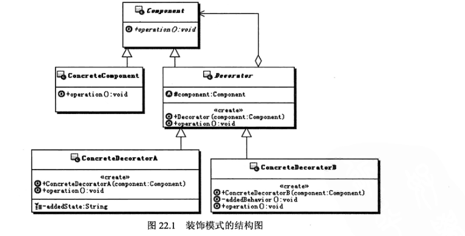

#   装饰模式

-   Component：组件对象的接口，可以给这些对象动态的添加职责
-   ConcreteComponent：具体的组件对象，实现组件对象接口，通常就是被装饰器装饰的原始对象，也就是可以给这个对象添加职责
-   Decorator：所有装饰器的抽象父类，需要定义一个与组件接口一致的接口，并持有一个Component对象，其实就是持有一个被装饰的对象
-   ConcreteDecorator：实际的装饰器对象，实现具体要向被装饰对象添加的功能

本质：动态组合

代码：top.kaoshanji.example.books.yanm100.decorator

-   应用
    -   I/O
    -   AOP
