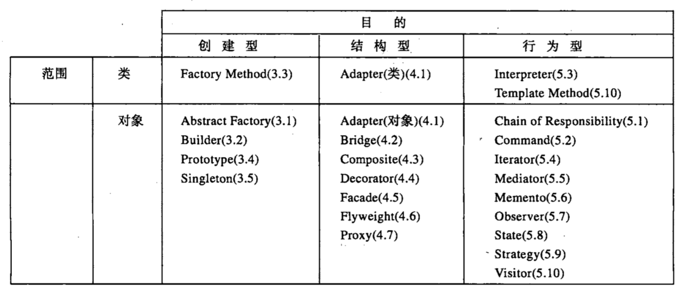
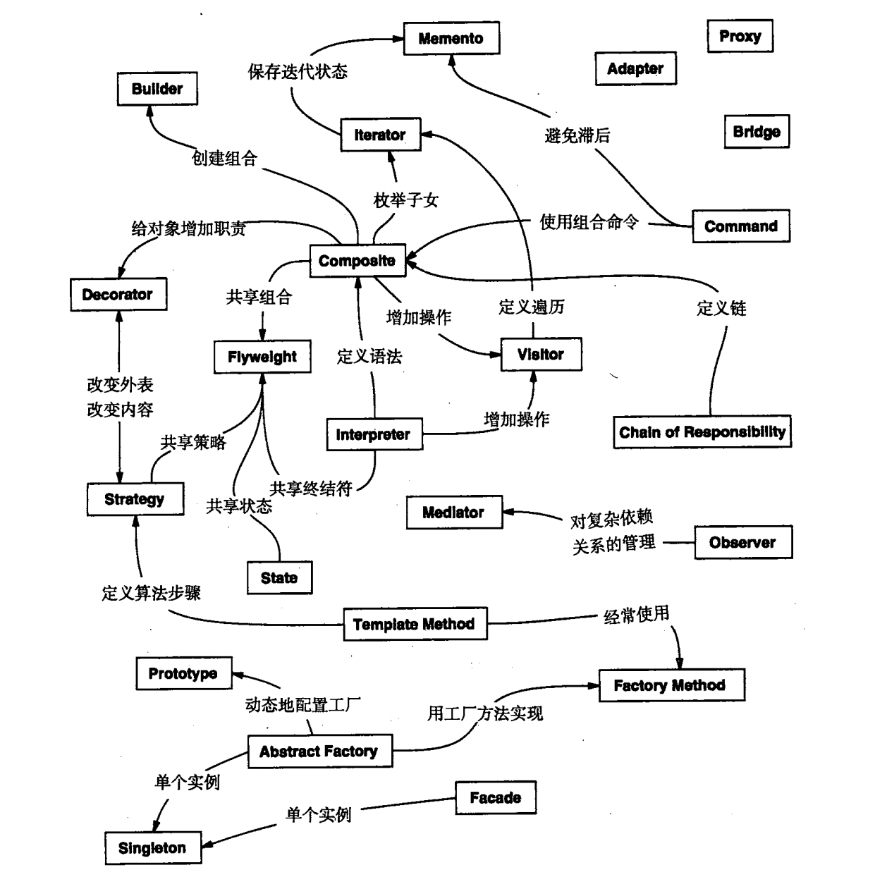
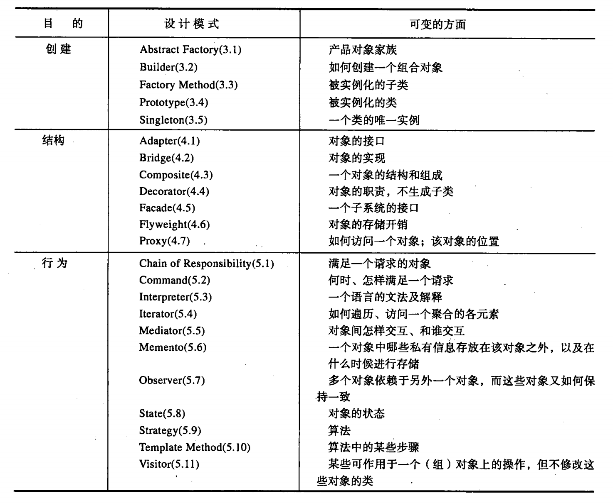

#   内容概述

对设计模式的分类整理是重要的，他为我们使用的各种技术提供了标准的名称和定义。

##  内容:概述

-   根据两条准则对模式进行分类。
    -   第一是目的准则，即模式是用来完成什么工作的，模式依据其目的可以分为创建型、结构型和行为型三种。创建型模式与对象的创建有关，结构型模式处理类或对象的组合，行为型模式对类和对象怎样交互和怎样分配职责进行描述
    -   第二是范围准则，指定模式主要是用于类还是用于对象。类模式处理类和子类之间的关系，这些关系通过继承建立，是静态的，在编译时刻便确定下来了。对象模式处理对象间的关系，这些关系在运行时刻是可以变化的，更具动态性。

-   类和对象
    -   创建类型模式将对象的部分创建工作延迟到子类，而创建型对象模式则将它延迟到另一个对象中。
    -   结构型模式使用继承机制来组合类，而结构型对象模式则描述了对象的组装方式
    -   行为型类模式使用继承描述算法机制和控制流，而行为型对象模式则描述一组对象怎样协作完成单个对象所无法完成的任务

----

##  内容：条目
-   创建型模式
    -   抽象工厂(Abstract Factory)：提供一个创建一系列相关或相互依赖对象的接口，而无需指定他们具体的类
    -   生成器(Builder)：将一个复杂对象的构建与他的表示分离，使得同样的构建过程可以创建不同的表示
    -   工厂方法(Factory Method)：定义一个用于创建对象的接口，让子类决定将哪一个类实例化，使一个类的实例化延迟到其子类
    -   原型(Prototype)：用原型实例指定创建对象的种类，并且通过拷贝这个原型来创建新的对象
    -   单例(Singleton)：保证一个类仅有一个实例，并提供一个访问他的全局访问点
-   结构型模式
    -   适配器(Adapter)：将一个类的接口转换成客户希望的另外一个接口，使得原本由于接口不兼容而不能一起工作的那些类可以一起工作
    -   桥接(Bridge)：将抽象部分与他的实现部分分离，使他们都可以独立的变化
    -   组成(Composite)：将对象组合成树形结构以表示"部分-整体"的层次结构，使得客户对单个对象和复合对象的使用具有一致性
    -   装饰(Decorator)：动态的给一个对象添加一些额外的职责。就扩展功能而言，比生成子类方式更为灵活
    -   外观(Facade)：为子系统中的一组接口提供一个一致的界面，定义了一个高层接口，这个接口使得这一子系统更加容易使用
    -   享元(Flyweight)：运用共享技术有效的支持大量细粒度的对象
    -   代理(Proxy)：为其他对象提供一个代理以`控制`对这个对象的访问
-   行为型模式
    -   责任链(Chain of Responsibility)：使多个对象都有机会处理请求，从而避免请求的发送者和接收者之间的耦合关系，将这些对象连城一条链，并沿着这条链传递该对象，直到有一个对象处理他为止
    -   命令(Command)：将一个请求封装为一个对象，从而使你可用不同的请求对客户进行参数化，对请求排队或记录请求日志，以及支持可取消的操作
    -   解释器(Interpreter)：给定一个语言，定义他的文法的一种表示，并定义一个解释器，该解释器使用该表示来解释语言中的句子
    -   迭代器(Iterator)：提供一种方法顺序访问一个聚合对象中各个元素，而又不需要暴露该对象的内部表示
    -   中介者(Mediator)：用一个中介对象来封装一系列的对象交互。中介者使各对象不需要显式的相互引用，从而使其耦合松散，而且可以独立的改变他们之间的交互
    -   备忘录(Memento)：在不破坏封装性的前提下，捕获一个对象的内部状态，并在该对象之外保存这个状态，这样以后就可将该对象恢复到保存的状态
    -   观察者(Observer)：定义对象间的一种一对多的依赖关系，以便当一个对象的状态发生改变时，所有依赖于他的对象都得到通知并自动刷新
    -   状态(State)：允许一个对象在其内部状态改变时改变他的行为。对象看起来似乎修改了他所属的类
    -   策略(Straregy)：定义一系列的算法，把他们一个个封装起来，并且使他们可相互替换，使得算法的变化可独立于使用他的客户
    -   模板方法(Template Method)：定义一个操作中的算法的骨架，而将一些步骤延迟到子类中，使得子类可以不改变一个算法的结构即可重定义该算法的某些特定步骤
    -   访问者(Visitor)：表示一个作用于某对象结构中的各元素的操作，他使你可以在不改变各元素的类的前提下定义作用于这些元素的新操作

----

##  设计模式之间的关系

----

##  设计模式所支持的设计的可变方面

----

##  设计模式怎样解决设计问题
-   寻找合适的对象
-   决定对象的粒度
-   指定对象接口
-   描述对象的实现
-   运用复用机制
-   关联运行时刻和编译时刻的结构
-   设计应支持变化
    -   通过显式的指定一个类来创建对象：要避免这种情况，应该间接的创建对象
        -   抽象工厂(Abstract Factory)
        -   工厂方法(Factory Method)
        -   原型(Prototype)
    -   对特殊操作的依赖：当为请求指定一个特殊的操作时，完成该请求的方式就固定下来。为避免把代码写死，可以在编译时刻或运行时刻很方便的改变响应请求的方法
        -   职责链(Chain of Responsibility)
        -   命令(Command)
    -   对硬件和软件平台的依赖：设计系统时限制其平台相关性很重要
        -   抽象工厂(Abstract Factory)
        -   桥接(Bridge)
    -   对对象表示或实现的依赖：知道对象怎样表示、保存、定位或实现的客户在对象发生变化时可能也需要变化，对客户隐藏这些信息能阻止连锁变化
        -   抽象工厂(Abstract Factory)
        -   桥接(Bridge)
        -   备忘录(Memento)
        -   代理(Proxy)
    -   算法依赖：依赖于某个特定算法的对象在算法发生变化时不得不变化，因此有可能发生变化的算法应该被孤立起来
        -   生成器(Builder)
        -   迭代器(Iterator)
        -   策略(Straregy)
        -   模板方法(Template Method)
    -   紧耦合：产生单块的系统，很难学习、移植和维护，那便松散
        -   抽象工厂(Abstract Factory)
        -   命令(Command)
        -   外观(Facade)
        -   中介者(Mediator)
        -   观察者(Observer)
        -   职责链(Chain of Responsibility)
    -   通过生成子类来扩充功能：一般的对象组合技术和具体的委托技术，是继承之外组合对象行为的另一种灵活方法
        -   桥接(Bridge)
        -   职责链(Chain of Responsibility)
        -   组成(Composite)
        -   装饰(Decorator)
        -   观察者(Observer)
        -   策略(Straregy)
    -   不能方便的对类进行修改
        -   适配器(Adapter)
        -   装饰(Decorator)
        -   访问者(Visitor)

----

##  设计模式在三类软件中的作用
-   应用程序

内部的复用性、可维护性和可扩展性是要优先考虑的

内部复用性确保不会做多余的设计和实现，设计模式通过减少依赖性来剃光内部复用性

松散耦合也增强了一类对象与其他多个对象协作的可能性

-   工具箱

一个应用经常会使用来自一个或多个被称为工具箱的预定义类库中的类。

工具箱是一组相关的、可复用的类集合，这些类提供了通用的功能。工具箱的一个典型例子就是列表、关联表单、堆栈等类的集合，I/O库是另外一个例子

工具箱只是为你的应用提供功能上的帮助，强调的是代码复用，是面向对象环境下的"子程序库"

-   框架

框架是构成一类特定软件可复用设计的一组相互协作的类

框架规定了你的应用的体系结构，定义了整体结构，类和对象的分割，各部分的主要责任，类和对象怎么协作，以及控制流程。框架预定义了这些设计参数，以便于应用设计者或实现者能集中精力于应用本身的特定细节。

框架记录可其应用领域的共同的设计决策，因而框架更强调设计复用，尽管框架常包括具体的立即可用的子类

框架对于应用的最主要贡献在于他所定义的体系结构。

设计模式有助于获得无需重新设计就可以适用于多种应用的框架体系结构

----

##  选择合适的设计模式

-   考虑设计模式是怎样解决设计问题的
-   浏览模式的意图部分
-   研究模式怎样相互关联
-   研究目的相识的模式
-   检查重新设计的原因
-   考虑你的设计中那些事可变的

----
