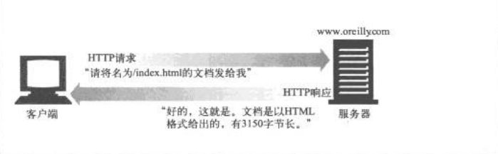

#   HTTP概述

HTTP是现代全球因特网中使用的公共语言。Web浏览器、服务器和相关的Web应用程序都是通过HTTP相互通信的。

`定义`：因特网的多媒体信使。HTTP可以从遍布全世界的Web服务器上将图片、页面、文本文件、电影、音频和程序等等这些信息迅速、便捷、可靠的搬移到人们桌面上的Web浏览器。

HTTP使用的是可靠的数据传输协议，因此即使数据来自地球的另一端，他也能够确保数据在传输的过程中不会损坏或产生混乱

##  访问流程

Web内容都是存储在Web服务器上的，Web服务器所使用的是HTTP协议，因此经常会被称为HTTP服务器。这些HTTP服务器存储了因特网中的数据，如果HTTP客户端发出请求的话，他们会提供数据。

客户端想服务器发送HTTP请求，服务器会在HTTP响应中会送所请求的数据，如下图：

##  为资源命名

Web资源放在Web服务器上，包含计算机能够存储的文件类型，使用MIME类型把文件分类，作为一种通用标准文件基本信息。

每个Web服务器资源都有一个名字，这个名字是统一资源标识符(URI)，客户端就是通过URI访问资源，常用的URI是URL。

##  连接过程：事务

客户端通过HTTP与Web服务器及其资源进行连接是通过`事务`呈现的。

一个HTTP事务由一条(从客户端发往服务器的)请求命令和一个(从服务器发回客户端的)响应结果组成，这种通信是通过名为HTTP报文的格式化数据库进行的

HTTP支持几种不同的请求方法，每条HTTP请求报文都包含一个方法，这个方法会告诉服务器要执行什么动作。

每条HTTP响应报文返回时会携带一个状态码，告知客户端请求是否成功，或者是否需要采取其他动作

##  数据结构：报文

HTTP报文是由一行一行的简单字符组成，报文都是纯文本，不是二进制代码，从客户端到服务端报文称为请求报文，从服务端到客户端称为响应报文

报文组成：
-   起始行
    -   报文的第一行就是起始行，在请求报文中用来说明要做什么，在响应报文中说明出现了什么情况
-   首部字段
    -   起始行后面有0或多个首部字段
    -   每个首部字段都包含一个名字和一个值，两者之间用冒号来分割，以空行结束
-   主体
    -   空行之后就是可选的报文主体，其中包含了所有类型的数据
    -   请求主体中包含了要发送给Web服务器的数据，响应主体中状态了要返回给客户端的数据
    -   起始行和首部都是文本形式且都是结构化的
    -   主体中可以包含任意的二进制数据(如图片、视频、音频和软件)

##  TCP/IP

看看报文是如何通过传输控制协议(TCP)连接从一个地方搬移到另一个地方去

HTTP是个应用层协议，无需关心网络通信的具体细节，他联网的细节都交给了通用、可靠的因特网传输协议TCP/IP

TCP提供了：
-   无差错的数据传输
-   按序传输
-   未分段的数据流

因特网自身就是基于TCP/IP的，是全世界的计算机和网络设备常用的层次化分组交换网络协议集

TCP隐藏了各种网络和硬件的特点及弱点，使各种类型的计算机和网络都能够进行可靠的通信，只要建立了TCP连接，客户端和服务器之间的报文交换就不会丢失、不会被破坏，也不会在接收时出现错序

HTTP协议位于TCP的上层，使用TCP来传输其报文数据。HTTP客户端向服务器发送报文之前，需要用网际协议(IP)地址和端口号在客户端和服务器之间建立一条TCP/IP连接

在TCP中，需要知道服务器的IP地址，以及与服务器上运行的特定软件相关的TCP端口号

##  Web的结构组件

在因特网上有很多Web应用程序进行交互

-   代理
    -   位于客户端和服务器之间的HTTP中间实体
    -   Web安全、应用集成以及性能优化的重要组成模块
-   缓存
    -   HTTP的仓库，使常用页面的副本可以保存在离客户端更近的地方
    -   将经过代理传送的常用文档复制保存起来，下一个请求同一文档的客户端可以使用缓存的文档
-   网关
    -   连接其他应用程序的特殊Web服务器
    -   通常用于将HTTP流量转换成其他的协议
-   隧道
    -   对HTTP通信报文进行盲转发的特殊代理
    -   在两条连接之间对原始数据进行盲转发的HTTP应用程序
    -   HTTP隧道通常用来在一条或多条HTTP连接上发非HTTP数据，转发时不会窥探数据
-   Agent代理
    -   发起自动HTTP请求的半智能Web客户端
    -   Web浏览器
    -   Web机器人
