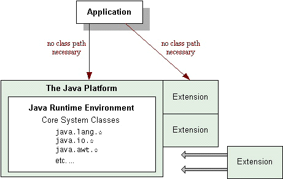

#   扩展机制

扩展机制提供了一种标准的，可扩展的方式，使自定义API可用于在Java平台上运行的所有应用程序。Java扩展也被称为可选包。这条线索可以互换使用这两个术语。

扩展是一组包和类，通过扩展机制扩展了Java平台。该扩展机制使运行时环境能够找到并加载扩展类，而不必在类路径上命名扩展类。在这方面，扩展类与Java平台的核心类相似。这也是扩展取得名称的地方 - 它们实际上扩展了平台的核心API。

由于此机制扩展了平台的核心API，因此应明智地应用其使用。最常见的是它用于很好的标准化接口，例如由Java Community Process定义的接口，尽管它也可能适用于站点范围的接口。

如图所示，扩展充当Java平台的“附加”模块。他们的类和公共API自动可用于平台上运行的任何应用程序。

扩展机制还提供了一种扩展类从远程位置下载以供小程序使用的手段。

扩展名被捆绑为Java归档（JAR）文件，并且此线索假定您熟悉JAR文件格式。如果您无法在JAR文件上加快速度，则可能需要先阅读一些JAR文件文档，然后再继续学习此课程中的课程：

本教程中的JAR文件中的 打包程序课程。
JDK™文档中的 JAR指南。
这条路线有两个教训：

创建和使用扩展
本节将向您介绍如何通过下载远程扩展类来为Java平台添加扩展以及applet如何从扩展机制中受益。

确保扩展安全
本节介绍在您的平台上授予扩展的安全权限和权限。如果您正在编写自己的扩展类，那么您将看到如何使用Java平台的安全体系结构。

##  目录

-   [创建和使用扩展](section020100.md)
    -   [已安装的扩展程序](section020101.md)
    -   [下载扩展](section020102.md)
    -   [了解扩展类加载](section020103.md)
    -   [创建可扩展的应用程序](section020104.md)
-   [确保扩展安全](section020200.md)
    -   [设置扩展的权限](section020201.md)
    -   [在扩展中密封软件包](section020202.md)