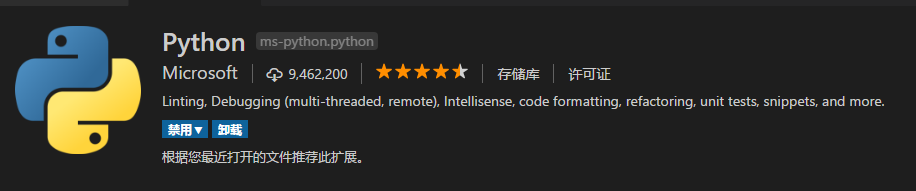

-   [深入Python多进程编程基础](https://mp.weixin.qq.com/s/mpW0Ex9X-0rQEyrt5titgw)
-   [Python性能优化的方法路径](http://blog.soliloquize.org/2018/05/26/Python%E6%80%A7%E8%83%BD%E4%BC%98%E5%8C%96%E7%9A%84%E6%96%B9%E6%B3%95%E8%B7%AF%E5%BE%84/)
-   [使用树状图做层次聚类分析](https://mp.weixin.qq.com/s/1IRiNQSWTDdoxPkcXojiWw)

##  vscode && python
-   安装插件

-   设定变量
    -   文件 --> 首选项 --> 设置
    -   修改 `python.pythonPath` 值为python`安装地址`

##  连接
-   [一个月入门Python爬虫，快速获取大规模数据](https://mp.weixin.qq.com/s/HefzwoamUgMwvjAbX7HZNw)