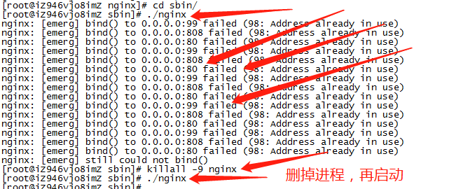

#   如何在CentOS 7上安装Nginx

本教程中的步骤要求用户拥有root权限

##  第一步 - 添加Nginx存储库

要添加CentOS 7 EPEL仓库，请打开终端并使用以下命令：

``` base
sudo yum install epel-release
```

##  第二步 - 安装Nginx

现在Nginx存储库已经安装在您的服务器上，使用以下`yum`命令安装Nginx ：

``` base
sudo yum install nginx
```

在对提示回答yes后，Nginx将在服务器上完成安装。

##  第三步 - 启动Nginx

### 启动
```
cd /usr/sbin
./nginx
```

### 常见命令
```
./nginx  #打开 nginx
nginx -s reload|reopen|stop|quit  #重新加载配置|重启|停止|退出 nginx
nginx -t   #测试配置是否有语法错误

// 查看进程号
$ ps -ef|grep nginx
```

### 查看Nginx并发进程数
```
ps -ef | grep nginx | wc -l
```

### 其他

Nginx不会自行启动。要运行Nginx，请输入：

``` base
sudo systemctl start nginx
```

如果您正在运行防火墙，请运行以下命令以允许HTTP和HTTPS通信：

``` base
sudo firewall-cmd --permanent --zone=public --add-service=http 
sudo firewall-cmd --permanent --zone=public --add-service=https
sudo firewall-cmd --reload

./nginx -s load

```
您将会看到默认的CentOS 7 Nginx网页，这是为了提供信息和测试目的。它应该看起来像这样：

### 成功


如果看到这个页面，那么你的Web服务器现在已经正确安装了。

如果想在系统启动时启用Nginx。请输入以下命令：

``` base
sudo systemctl enable nginx
```
恭喜！Nginx现在已经安装并运行了！

### 异常



查看被占用端口：netstat -lnp|grep 80
