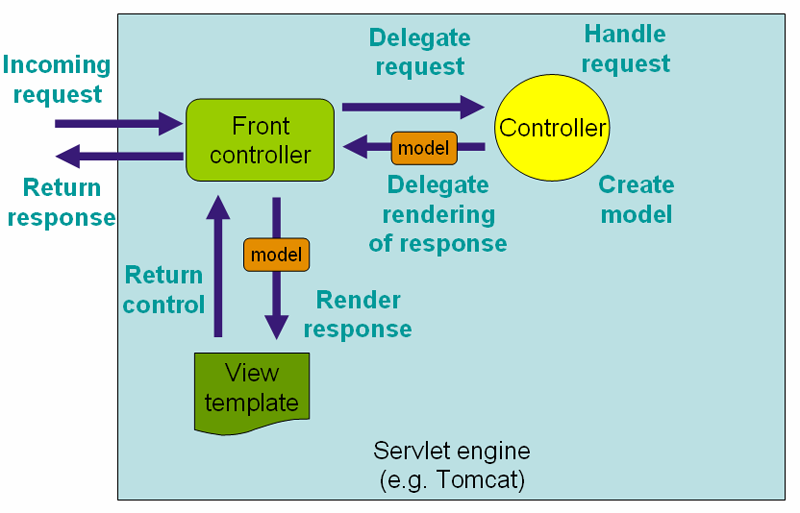

#   Web MVC框架

Spring的Web模块包含许多独特的Web支持功能：
-   明确区分角色。每个角色 - 控制器，验证器，命令对象，表单对象，模型对象DispatcherServlet，处理程序映射，视图解析器等 - 都可以由专用对象来实现。
-   作为JavaBeans的框架和应用程序类的强大而直接的配置。此配置功能包括跨上下文的简单引用，例如从Web控制器到业务对象和验证程序。
-   适应性，非侵入性和灵活性。定义您需要的任何控制器方法签名，可能使用参数注释之一（例如@RequestParam，@RequestHeader，@PathVariable等）以用于给定场景。
-   可重复使用的业务代码，不需要重复。使用现有的业务对象作为命令或表单对象，而不是镜像它们来扩展特定的框架基类。
-   可定制的绑定和验证。将不匹配项视为应用程序级验证错误，以保留违规值，本地化日期和数字绑定等，而不是仅使用手动分析和转换为业务对象的仅字符串表单对象。
-   可定制的处理程序映射和视图解析。处理程序映射和视图分辨率策略的范围从简单的基于URL的配置到复杂的专用解析策略。Spring比使用特定技术的Web MVC框架更灵活。
-   灵活的模型转移。具有名称/值的模型传输Map支持与任何视图技术的轻松集成。
-   可自定义的语言环境，时区和主题解析，支持带有或不带有Spring标签库的JSP，支持JSTL，支持Velocity而不需要额外的桥接等等。
-   一个简单但功能强大的JSP标签库，被称为Spring标签库，可提供对数据绑定和主题等功能的支持。自定义标签允许在标记代码方面具有最大的灵活性
-   Spring 2.0中引入了一个JSP表单标记库，它使JSP页面中的表单变得更加容易
-   Bean的生命周期范围为当前HTTP请求或HTTP Session。 这不是Spring MVC本身的特定功能，而是WebApplicationContextSpring MVC使用的 容器

`Spring Web MVC中的请求处理工作流`

##  [DispatcherServlet](section010100.md)

Spring的Web MVC框架与其他许多Web MVC框架一样，是以请求为驱动的，围绕一个中央Servlet进行设计，该中央Servlet将请求分发给控制器，并提供其他功能来促进Web应用程序的开发。然而`DispatcherServlet`，Spring 不止于此。它与Spring IoC容器完全集成，因此可以使用Spring提供的其他所有功能。

这`DispatcherServlet`是一个实际的`Servlet`（它从`HttpServlet`基类继承），并且正如你的Web应用程序中声明的那样。

##  [Servlet容器初始化](section010200.md)

在Servlet 3.0+环境中，您可以选择以编程方式将Servlet容器配置为替代或与`web.xml`文件结合使用。

##  [Spring MVC 配置](section010300.md)

MVC Java配置和MVC命名空间提供了覆盖`DispatcherServlet`默认值的类似默认配置。目标是让大多数应用程序不必创建相同的配置，并且提供更高级别的构造来配置Spring MVC，这些构造可以作为一个简单的起点，并且几乎不需要事先知道底层配置。

##  [控制器](section010400.md)

控制器提供对通常通过服务接口定义的应用程序行为的访问。控制器解释用户输入并将其转换为由视图呈现给用户的模型。Spring以非常抽象的方式实现了一个控制器，使您能够创建各种各样的控制器。

Spring 2.5中引入了MVC控制器的，基于注解的编程模型，使用注解如`@RequestMapping`，`@RequestParam`，`@ModelAttribute`，等。此注释支持可用于Servlet MVC和Portlet MVC。以这种风格实现的控制器不必扩展特定的基类或实现特定的接口。此外，它们通常不直接依赖于Servlet或Portlet API，尽管您可以轻松配置对Servlet或Portlet设施的访问

##  [处理异常](section010500.md)

Spring `HandlerExceptionResolver`实现处理控制器执行期间发生的意外异常。一个`HandlerExceptionResolver`有点象异常映射的，你可以在Web应用程序描述符定义`web.xml`。但是，它们提供了一种更灵活的方式。例如，它们提供有关在抛出异常时执行哪个处理程序的信息。此外，处理异常的编程方式为您提供了更多的选项，以便在请求转发到另一个URL（与使用Servlet特定的异常映射时相同的最终结果）之前做出适当的响应。

##  [多媒体](section010600.md)

Spring的内置多媒体支持可以在Web应用程序中处理文件上传。您可以使用包中`MultipartResolver`定义的可插入对象来 启用此多部分支持`org.springframework.web.multipart`。

##  [约定优于配置](section010700.md)

对于很多项目，坚持已建立的约定和合理的默认值就是他们（项目）需要的，而Spring Web MVC现在明确支持约定配置。这意味着如果你建立了一组命名约定等等，你可以大大减少设置处理器映射，查看解析器，`ModelAndView`实例等所需的配置数量 。

##  [异步请求处理](section010800.md)

Spring MVC 3.2引入了基于Servlet 3的异步请求处理。像往常一样，控制器方法现在不用像往常一样返回值，而是`java.util.concurrent.Callable`从Spring MVC托管线程返回 并产生返回值。同时主Servlet容器线程退出并释放，并允许处理其他请求。Spring MVC `Callable`在一个单独的线程中使用a `TaskExecutor`和when 的帮助来 调用`Callable`返回时，请求被分派回Servlet容器以使用返回的值继续处理`Callable`。

##  [处理程序映射](section010900.md)

在之前的Spring版本中，用户需要`HandlerMapping`在Web应用程序上下文中定义一个或多个 bean，以将传入的Web请求映射到适当的处理程序。随着注释控制器的引入，您通常不需要这样做，因为它会`RequestMappingHandlerMapping`自动`@RequestMapping`在所有`@Controllerbean` 上查找注释。但是，请记住，所有`HandlerMapping`扩展的类`AbstractHandlerMapping`都具有以下可用于自定义其行为的属性：
-   `interceptors`要使用的拦截器列表
-   `defaultHandler` 当此处理程序映射不会导致匹配的处理程序时，使用默认处理程序。
-   `order`基于order属性的值（参见 `org.springframework.core.Ordered`接口），Spring对上下文中可用的所有处理程序映射进行排序，并应用第一个匹配的处理程序。
-   `alwaysUseFullPath`如果`true`，Spring使用当前Servlet上下文中的完整路径来查找合适的处理程序。如果`false`（默认），则使用当前Servlet映射中的路径。例如，如果一个Servlet使用映射`/testing/*`并且该`alwaysUseFullPath`属性设置为true， `/testing/viewPage.html`则使用Servlet ，而如果该属性设置为false，`/viewPage.html`则使用该属性 。
-   `urlDecode`默认为`true`，从Spring 2.5开始。如果您想比较编码路径，请将此标志设置为`false`。然而，`HttpServletRequest`总是以解码的形式暴露Servlet路径。请注意，与编码路径相比，Servlet路径不匹配。

##  [视图](section011000.md)

Spring提供视图解析器，使您能够在浏览器中呈现模型，而不必将您绑定到特定的视图技术。Spring开箱即可使用JSP，Velocity模板和XSLT视图

对于Spring处理视图的方式来说重要的两个接口是`ViewResolver` 和`View`。所述`ViewResolver`提供视图名称和实际视图之间的映射。该`View`接口解决了请求准备问题，并将请求交给其中一种视图技术

##  [使用Flash属性](section011100.md)

Flash属性为一个请求存储用于另一个请求的属性提供了一种方法。这是重定向时最常需要的 - 例如 Post / Redirect / Get模式。在重定向（通常在会话中）之前，Flash属性会临时保存，以便在重定向后立即将其删除

##  [建立URI](section011200.md)

Spring MVC提供了一种使用`UriComponentsBuilder`和构建和编码URI的机制 `UriComponents`。

##  [语言环境](section011300.md)

Spring的架构大部分支持国际化，就像Spring web MVC框架一样。`DispatcherServlet`使您能够使用客户端的区域设置自动解析消息。这是用`LocaleResolver`对象完成的。

当请求进入时，`DispatcherServlet`查找区域设置解析器，并且如果它找到一个它尝试使用它来设置区域设置。使用该`RequestContext.getLocale()` 方法，您始终可以检索由区域设置解析程序解析的区域设置。

##  [使用主题](section011400.md)

可以应用Spring Web MVC框架主题来设置应用程序的整体外观，从而增强用户体验。主题是静态资源的集合，通常是样式表和图像，它们会影响应用程序的视觉风格。

##  [HTTP缓存](section011500.md)

一个好的HTTP缓存策略可以显着提高Web应用程序的性能和客户的体验。所述`'Cache-Control'`HTTP响应报头主要是为这个负责，使用条件报头，例如沿`'Last-Modified'`和`'ETag'`。

该`'Cache-Control'`HTTP响应头劝告私有的高速缓存（如浏览器），以及他们如何缓存进一步重用HTTP响应的公共高速缓存（例如代理）。

